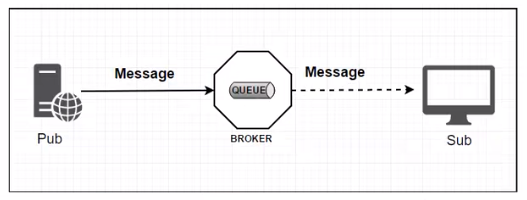
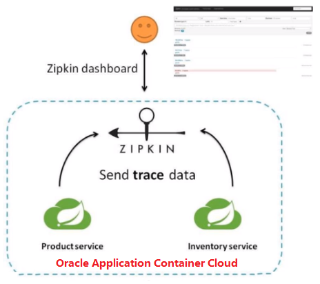
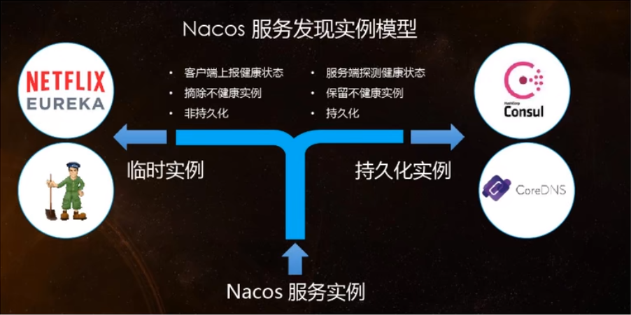

# 基础概念

## 01、微服务架构

微服务架构师一种架构模式，它提倡将单一应用程序划分成一组小的服务，服务之间互相协调、互相配合，为用户提供最终价值。每个服务运行在其独立的进程中，服务与服务间采用轻量级的通信机制互相协作（通常是基于HTTP协议的Restful API）。 每个服务都围绕着具体业务进行构建，并且能够被独立的部署到生产环境、类生产环境等。另外，应当尽量避免统一的、集中式的服务管理机制，对具体一个服务而言，应根据业务上下文，选择合适的语言、工具对其进行构建。

## 02、SpringCloud

> SpringCloud=分布式微服务架构的一站式解决方案，是多种微服务架构落地技术的集合体，速成微服务全家桶


 


## 03、SpringCloud 技术栈


具体实现用到的技术


## 04、boot和cloud的版本选型

Spring Cloud采用了英国伦敦地铁站的名称来命名，并由地铁站名称字母A-Z依次类推的形式来发布迭代版本
SpringCloud是一个由许多子项目组成的综合项目，各子项目有不同的发布节奏。为了管理SpringCloud与各子项目的版本依赖关系，发布了一个清单，其中包括了某个SpringCloud版本对应的子项目版本。为了避免SpringCloud版本号与子项目版本号混淆，SpringCloud版本采用了名称而非版本号的命名，这些版本的名字采用了伦敦地铁站的名字，根据字母表的顺序来对应版本时间顺序。例如Angel是第一个版本, Brixton是第二个版本。当SpringCloud的发布内容积累到临界点或者一个重大BUG被解决后，会发布一个“service releases"版本，简称SRX版本，比如Greenwich.SR2就是SpringCloud发布的Greenwich版本的第2个SRX版本。

cloud Hoxton.SR1

boot 2.2.2.RELEASE

cloud alibaba 2.1.0.RELEASE

java  java8

Maven 3.5及以上

Mysql 5.7及以上

## 05、cloud 组件停更说明

停更不停用

- 被动修复bugs
- 不再接受合并请求
- 不再发布新版本

### cloud升级

- 服务注册中心

  - Eureka停用
  - 可以使用zookeeper作为服务注册中心
  - consul
  - Nacos

- 服务调用

  - Ribbon准备停更,
  - 代替为LoadBalance

- 服务调用2

  - Feign改为OpenFeign

- 服务降级

  - Hystrix停更,改为resilence4j

  - 或者阿里巴巴的Sentienl

- 服务网关

  - Zuul改为gateway

- 服务配置

  - Config改为 Nacos

- 服务总线

  - Bus改为Nacos


# 环境搭建

1. New Project
2. 聚合总父工程名字
3. Maven选版本
4. 工程名字
5. 字符编码
6. 注解生效激活
7. java 编码版本选8
8. File Type 过滤

## 01、新建maven父工程

在pom文件里添加

```xml
    <properties>
        <project.build.sourceEncoding>UTF-8</project.build.sourceEncoding>
        <maven.compiler.source>1.8</maven.compiler.source>
        <maven.compiler.target>1.8</maven.compiler.target>
        <junit.version>4.12</junit.version>
        <log4j.version>1.2.17</log4j.version>
        <lombok.version>1.16.18</lombok.version>
        <mysql.version>5.1.47</mysql.version>
        <druid.version>1.1.16</druid.version>
        <mybatis.spring.boot.version>1.3.0</mybatis.spring.boot.version>
    </properties>

    <!-- 1、只是声明依赖，并不实际引入，子项目按需声明使用的依赖 -->
    <!-- 2、子项目可以继承父项目的 version 和 scope -->
    <!-- 3、子项目若指定了 version 和 scope，以子项目为准 -->
    <dependencyManagement>
        <dependencies>
            <!--spring boot 2.2.2-->
            <dependency>
                <groupId>org.springframework.boot</groupId>
                <artifactId>spring-boot-dependencies</artifactId>
                <version>2.2.2.RELEASE</version>
                <type>pom</type>
                <scope>import</scope>
            </dependency>
            <!--spring cloud Hoxton.SR1-->
            <dependency>
                <groupId>org.springframework.cloud</groupId>
                <artifactId>spring-cloud-dependencies</artifactId>
                <version>Hoxton.SR1</version>
                <type>pom</type>
                <scope>import</scope>
            </dependency>
            <!--spring cloud alibaba 2.1.0.RELEASE-->
            <dependency>
                <groupId>com.alibaba.cloud</groupId>
                <artifactId>spring-cloud-alibaba-dependencies</artifactId>
                <version>2.1.0.RELEASE</version>
                <type>pom</type>
                <scope>import</scope>
            </dependency>

            <dependency>
                <groupId>mysql</groupId>
                <artifactId>mysql-connector-java</artifactId>
                <version>${mysql.version}</version>
            </dependency>
            <dependency>
                <groupId>com.alibaba</groupId>
                <artifactId>druid</artifactId>
                <version>${druid.version}</version>
            </dependency>
            <dependency>
                <groupId>org.mybatis.spring.boot</groupId>
                <artifactId>mybatis-spring-boot-starter</artifactId>
                <version>${mybatis.spring.boot.version}</version>
            </dependency>
            <dependency>
                <groupId>junit</groupId>
                <artifactId>junit</artifactId>
                <version>${junit.version}</version>
            </dependency>
            <dependency>
                <groupId>log4j</groupId>
                <artifactId>log4j</artifactId>
                <version>${log4j.version}</version>
            </dependency>
            <dependency>
                <groupId>org.projectlombok</groupId>
                <artifactId>lombok</artifactId>
                <version>${lombok.version}</version>
                <optional>true</optional>
            </dependency>
        </dependencies>
    </dependencyManagement>

    <build>
        <plugins>
            <plugin>
                <groupId>org.springframework.boot</groupId>
                <artifactId>spring-boot-maven-plugin</artifactId>
                <configuration>
                    <fork>true</fork>
                    <addResources>true</addResources>
                </configuration>
            </plugin>
        </plugins>
    </build>
```

### dependencyManagement

Maven 使用dependencyManagement元素来提供了一种管理依赖版本号的方式。

通常会在一个组织或者项目的最顶层的父pom中看到。

使用pom.xml 中的dependencyManagement元素能让所有在子项目中引用一个依赖而不用显式的列出版本号。

Maven 会沿着父子层次向上走，直到找到一个拥有dependencyManagement元素的项目，然后它就会使用这个dependencyManagement元素中指定的版本号。

这样做的好处就是:如果有多个子项目都引用同一样依赖，则可以避免在每个使用的子项目里都声明一个版本号，这样当想升级或切换到另一个版本时，只需要在

顶层父容器里更新，而不需要一个一个子项目的修改﹔另外如果某个子项目需要另外的一个版本，只需要声明version就可。

<font color='red'>dependencyManagement里只是声明依赖，并不实现引入，因此子项目需要显示的声明需要用的依赖。</font>

## 02、创建子模块


### 1、子模块名字

cloud_provider_payment8001

### 2、pom依赖

```xml
 <dependencies>
        <dependency>
            <groupId>org.springframework.boot</groupId>
            <artifactId>spring-boot-starter-web</artifactId>
        </dependency>
        <dependency>
            <groupId>org.springframework.boot</groupId>
            <artifactId>spring-boot-starter-actuator</artifactId>
        </dependency>
        <dependency>
            <groupId>org.mybatis.spring.boot</groupId>
            <artifactId>mybatis-spring-boot-starter</artifactId>
        </dependency>
        <dependency>
            <groupId>com.alibaba</groupId>
            <artifactId>druid-spring-boot-starter</artifactId>
            <version>1.1.10</version>
        </dependency>
        <dependency>
            <groupId>mysql</groupId>
            <artifactId>mysql-connector-java</artifactId>
        </dependency>
        <dependency>
            <groupId>org.springframework.boot</groupId>
            <artifactId>spring-boot-starter-jdbc</artifactId>
        </dependency>
        <dependency>
            <groupId>org.springframework.boot</groupId>
            <artifactId>spring-boot-devtools</artifactId>
            <scope>runtime</scope>
            <optional>true</optional>
        </dependency>
        <dependency>
            <groupId>org.projectlombok</groupId>
            <artifactId>lombok</artifactId>
            <optional>true</optional>
        </dependency>
    </dependencies>
```

### 3、创建application.yml

```yml
server:
  port: 8001
spring:
  application:
    name: cloud-payment-service
  datasource:
    type: com.alibaba.druid.pool.DruidDataSource                            #当前数据源操作类型
    driver-class-name: com.mysql.jdbc.Driver                            #mysql驱动
    url: jdbc:mysql://localhost:3306/db2022?useUnicode=true&characterEncoding=utf-8&useSSL=false&serverTimezone=GMT%2B8
    username: root
    password: mysql729
mybatis:
  mapper-locations: classpath:mapper/*.xml
  type-aliases-package: com.example.springcloud.pojo                # 所有的entity（pojo）别名类所在包
```

### 4、主启动类

```java
@SpringBootApplication
public class PaymentMain8001 {
    public static void main(String[] args) {
        SpringApplication.run(PaymentMain8001.class, args);
    }
}
```

### 5、业务类

#### 1、sql

```sql
CREATE TABLE `payment`
(
    `id`     bigint(20) NOT NULL AUTO_INCREMENT COMMENT '主键',
    `serial` varchar(200) CHARACTER SET utf8 COLLATE utf8_general_ci DEFAULT NULL COMMENT '支付流水号',
    PRIMARY KEY (`id`) USING BTREE
) ENGINE = InnoDB CHARACTER SET = utf8 COLLATE = utf8_general_ci COMMENT = '支付表' ROW_FORMAT = Dynamic;

INSERT INTO `payment`
VALUES (31, '尚硅谷111');
INSERT INTO `payment`
VALUES (32, 'atguigu002');
INSERT INTO `payment`
VALUES (34, 'atguigu002');
INSERT INTO `payment`
VALUES (35, 'atguigu002');
```

#### 2、实体类

```java
@Data
@AllArgsConstructor
@NoArgsConstructor
public class Payment implements Serializable {
    private Long id;
    private String serial;
}
```

#### 3、通用返回类

```java
@Data
@NoArgsConstructor
@AllArgsConstructor
public class CommonResult<T>{
    private Integer code;
    private String message;
    private T data;

    public CommonResult(Integer code,String message){
        this(code,message,null);
    }
}
```

#### 4、dao层

```java
@Mapper
public interface PaymentDao {
    /**
     * 插入操作
     * @param payment  实体
     * @return 受影响的行数
     */
    int create(Payment payment);

    /**
     * 通过id查订单
     * @param id  订单id
     * @return  订单
     */
    Payment getPaymentById(@Param("id") Long id);
}
```

#### 5、mapper 配置文件类

  **在resource下,创建mapper/PaymentMapper.xml**

```xml
<?xml version="1.0" encoding="UTF-8"?>
<!DOCTYPE mapper PUBLIC "-//mybatis.org//DTD Mapper 3.0//EN" "http://mybatis.org/dtd/mybatis-3-mapper.dtd">
<mapper namespace="com.example.springcloud.dao.PaymentDao">
    <resultMap id="BaseResultMap" type="com.example.springcloud.pojo.Payment">
        <id column="id" property="id" jdbcType="BIGINT"/>
        <id column="serial" property="serial" jdbcType="VARCHAR"/>
    </resultMap>

    <insert id="create" parameterType="Payment" useGeneratedKeys="true" keyProperty="id">
        insert into payment(serial) values (#{serial})
    </insert>

    <select id="getPaymentById" parameterType="Long" resultMap="BaseResultMap">
        select * from payment where id = #{id}
    </select>

</mapper>
```

#### 6、写service和serviceImpl

service

```java
public interface PaymentService {
    /**
     * 插入操作
     * @param payment  实体
     * @return 受影响的行数
     */
    int create(Payment payment);

    /**
     * 通过id查订单
     * @param id  订单id
     * @return  订单
     */
    Payment getPaymentById(@Param("id") Long id);
}
```

serviceImpl

```java
@Service
public class PaymentServiceImpl implements PaymentService {

    @Resource
    private PaymentDao paymentDao;

    @Override
    public int create(Payment payment) {
        return paymentDao.create(payment);
    }

    @Override
    public Payment getPaymentById(Long id) {
        return paymentDao.getPaymentById(id);
    }
}
```

#### 7、controller

```java
@Slf4j
@RestController
@RequiredArgsConstructor(onConstructor_ = @Autowired)
@RequestMapping("/payment")
public class PaymentController {
    private final PaymentService paymentService;

    @PostMapping("/create")
    public CommonResult create(Payment payment){
        int result = paymentService.create(payment);
        log.info("****插入结果*****:"+result);
        if(result > 0){
            return new CommonResult(200,"插入数据库成功",result);
        }
        return new CommonResult(444,"插入数据库失败",result);
    }
    
    @PostMapping("/get/{id}")
    public CommonResult getPaymentById(@PathVariable("id") Long id){
        Payment payment = paymentService.getPaymentById(id);
        log.info("****查询结果*****:"+payment);
        if(payment != null){
            return new CommonResult(200,"查询成功",payment);
        }
        return new CommonResult(444,"没有对应的记录，查询id"+id);
    }
    
}
```

## 03、热部署

### 1.Adding devtools to your project

```xml
        <dependency>
            <groupId>org.springframework.boot</groupId>
            <artifactId>spring-boot-devtools</artifactId>
            <scope>runtime</scope>
            <optional>true</optional>
        </dependency>
```

### 2.Adding plugin to your pom.xml

父类总工程

```xml
    <build>
        <plugins>
            <plugin>
                <groupId>org.springframework.boot</groupId>
                <artifactId>spring-boot-maven-plugin</artifactId>
                <configuration>
                    <fork>true</fork>
                    <addResources>true</addResources>
                </configuration>
            </plugin>
        </plugins>
    </build>
```

### 3.Enabling automatic build


### 4.Updae the value of

在settings里将此勾选


按ctrl+shift+alt+/ 选择register

将此勾选


### 5.重启idea

## 04、order模块

### 1.pom

```xml
<dependencies>
        <dependency>
            <groupId>org.springframework.boot</groupId>
            <artifactId>spring-boot-starter-web</artifactId>
        </dependency>
        <dependency>
            <groupId>org.springframework.boot</groupId>
            <artifactId>spring-boot-starter-actuator</artifactId>
        </dependency>
        <dependency>
            <groupId>org.springframework.boot</groupId>
            <artifactId>spring-boot-devtools</artifactId>
            <scope>runtime</scope>
            <optional>true</optional>
        </dependency>
        <dependency>
            <groupId>org.projectlombok</groupId>
            <artifactId>lombok</artifactId>
            <optional>true</optional>
        </dependency>
        <dependency>
            <groupId>org.springframework.boot</groupId>
            <artifactId>spring-boot-starter-test</artifactId>
            <scope>test</scope>
        </dependency>
    </dependencies>
```

### 2.yml配置文件

```yml
server:
  port: 80
```

### 3.主启动类

```java
@SpringBootApplication
public class OrderMain80 {
    public static void main(String[] args) {
        SpringApplication.run(OrderMain80.class,args);
    }
}
```

### 4.复制paymant模块的实体类（pojo）

### 5.写controller层

 因为这里是消费者类,主要是消费,那么就没有service和dao,需要调用pay模块的方法

 并且这里还没有微服务的远程调用,那么如果要调用另外一个模块,则需要使用基本的api调用

使用RestTemplate调用pay模块

> RestTemplate提供了多种便捷访问远程Http服务的方法，是一种简单便捷的访问restful服务模板类，是Spring提供的用于访问Rest服务的客户端模板工具集

使用：

使用restTemplate访问restful接口非常的简单粗暴无脑。(url, requestMap, ResponseBean.class)这三个参数分别代表REST请求地址、请求参数、HTTP响应转成

被转换成的对象类型。

```java
@Slf4j
@RestController
public class OrderController {
    public static final String PAYMENT_URL = "http://localhost:8001";

    @Resource
    private RestTemplate restTemplate;

    @GetMapping("/consumer/payment/create")
    public CommonResult<Payment> create(Payment payment){
        return restTemplate.postForObject(PAYMENT_URL+"/payment/create",payment, CommonResult.class);
    }

    @GetMapping("/consumer/payment/get/{id}")
    public CommonResult<Payment> getPayment(@PathVariable("id") Long id){
        return restTemplate.getForObject(PAYMENT_URL+"/payment/get/"+id, CommonResult.class);
    }

}
```

## 05、重构

新建一个模块，将重复的代码抽取到一个公共的模块中

### 1.创建commons模块

### 2.抽取公共的pom

```xml
 <dependencies>
        <dependency>
            <groupId>org.springframework.boot</groupId>
            <artifactId>spring-boot-devtools</artifactId>
            <scope>runtime</scope>
            <optional>true</optional>
        </dependency>

        <dependency>
            <groupId>org.projectlombok</groupId>
            <artifactId>lombok</artifactId>
            <optional>true</optional>
        </dependency>
        <dependency>
            <groupId>cn.hutool</groupId>
            <artifactId>hutool-all</artifactId>
            <version>5.7.22</version>
        </dependency>
    </dependencies>
```

### 3.pojo类放入到commons中


### 4.使用maven，将commons打包（install）

其他模块删除pojo，引入commons

```xml
        <dependency>
            <groupId>org.example</groupId>
            <artifactId>cloud-api-commons</artifactId>
            <version>1.0-SNAPSHOT</version>
        </dependency>
```

# 服务注册与发现

前面我们没有服务注册中心,也可以服务间调用,为什么还要服务注册?

当服务很多时,单靠代码手动管理是很麻烦的,需要一个公共组件,统一管理多服务,包括服务是否正常运行,等

Eureka用于**==服务注册==**,目前官网**已经停止更新**

## 1、Eureka

**服务治理**

Spring Cloud封装了Netflix 公司开发的Eureka模块来实现服务治理

在传统的rpc远程调用框架中，管理每个服务与服务之间依赖关系比较复杂，管理比较复杂，所以需要使用服务治理，管理服务于服务之间依赖关系，可以实现

服务调用、负载均衡、容错等，实现服务发现与注册。

**服务注册**

Eureka采用了CS的设计架构，Eureka sever作为服务注册功能的服务器，它是服务注册中心。而系统中的其他做服务，使用 fureka的客户端连接到Eureka 

Server并维持心跳连接。这样系统的维护人员就可以通过Eureka Server来监控系统中各个微服务是否正常运行。

在服务注册与发现中，有一个注册中心。当服务器启动的时候，会把当前自己服务器的信息，比如：服务地址通讯地址等以别名方式注册到注册中心上。另一方(消费者 | 服务提供者)，以该别名的方式去注册中心上获取到实际的服务通讯地址，然后再实现本地RPC调用

RPC远程调用框架核心设计思想：在于注册中心，因为使用注册中心管理每个服务与服务之间的一个依赖关系(服务治理概念)。在任何rpc远程框架中，都会有一个注册中心(存放服务地址相关信息(接口地址)


### Eureka的两个组件：

#### Eureka Server

> Eureka Server 提供服务注册服务

各个微服务节点通过配置启动后，会在EurekaServer中进行注册，这样EurekaServer中的服务注册表中将会存储所有可用服务节点的信息，服务节点的信息可以

在界面中直观看到。

#### Eureka Client

> Eureka Client 通过注册中心进行访问

是一个Java客户端，用于简化Eureka Server的交互，客户端同时也具备一个内置的、使用轮询(round-robin)负载算法的负载均衡器。在应用启动后，将会向

Eureka Server发送心跳(默认周期为30秒)。如果Eureka Server在多个心跳周期内没有接收到某个节点的心跳，EurekaServer将会从服务注册表中把这个服务节点

移除（默认90秒)

### 单机版

EurekaServer端服务注册中心类似物业中心

EurekaClient端cloud-provider-payment8001将注册进EurekaServer 成为服务提供者provider

EurekaClient端cloud-consumer-order80将注册进EurekaServer 成为服务消费者consumer

#### 1.创建cloud-eureka-server7001

#### 2引入pom依赖

eureka最新的依赖变了


#### 3.配置文件

```yml
server:
  port: 7001

# 单机版
eureka:
  instance:
    hostname: localhost  #eureka服务端的实例名字
  client:
    register-with-eureka: false    #表示不向注册中心注册自己
    fetch-registry: false   #表示自己就是注册中心，职责是维护服务实例，并不需要去检索服务
    service-url:
      #设置与eureka server交互的地址查询服务和注册服务都需要依赖这个地址
      defaultZone: http://${eureka.instance.hostname}:${server.port}/eureka/
```

#### 4.主启动类

```java
@SpringBootApplication
@EnableEurekaServer
public class EurekaMain7001 {
    public static void main(String[] args) {
        SpringApplication.run(EurekaMain7001.class,args);
    }
}
```

#### 5.此时就可以启动当前项目了

浏览器输入：localhost:7001


#### 6.其他服务注册到eureka

##### 将payment模块加入eureka

###### 1.在pom中添加依赖

```xml
<!--Eureka-client-->
<dependency>
    <groupId>org.springframework.cloud</groupId>
    <artifactId>spring-cloud-starter-netflix-eureka-client</artifactId>
</dependency>
```

###### 2.主启动类上，加注解。表示当前是eureka客户端

```java
@SpringBootApplication
@EnableEurekaClient
public class PaymentMain8001 {
    public static void main(String[] args) {
        SpringApplication.run(PaymentMain8001.class, args);
    }
}
```

###### 3.修改yml

```yml
eureka:
  client:
    # 表示是否将自己注册进EurekaServer 默认为true
    register-with-eureka: true
    # 是否从EurekaServer 抓取已有的注册信息。默认为true。单节点无所谓，集群必须设置为true才能配合ribbon 使用负载均衡
    fetch-registry: true
    service-url:
      defaultZone: http://localhost:7001/eureka
```

###### 重启


成功注册

##### 将order模块加入eureka

###### 1.在pom中添加依赖

```xml
<!--Eureka-client-->
<dependency>
    <groupId>org.springframework.cloud</groupId>
    <artifactId>spring-cloud-starter-netflix-eureka-client</artifactId>
</dependency>
```

###### 2.主启动类上，加注解。表示当前是eureka客户端

```java
@SpringBootApplication
@EnableEurekaClient
public class OrderMain80 {
    public static void main(String[] args) {
        SpringApplication.run(OrderMain80.class,args);
    }
}
```

###### 3.修改yml

```yml
spring:
  application:
    name: cloud-order-service
eureka:
  client:
    # 表示是否将自己注册进EurekaServer 默认为true
    register-with-eureka: true
    # 是否从EurekaServer 抓取已有的注册信息。默认为true。单节点无所谓，集群必须设置为true才能配合ribbon 使用负载均衡
    fetch-registry: true
    service-url:
      defaultZone: http://localhost:7001/eureka
```

###### 重启


### 集群

#### 集群原理：


```
1,就是pay模块启动时,注册自己,并且自身信息也放入eureka
2.order模块,首先也注册自己,放入信息,当要调用pay时,先从eureka拿到pay的调用地址
3.通过HttpClient调用
并且还会缓存一份到本地,每30秒更新一次
```

<font color='red'>微服务RPC远程服务调用最核心的是什么？</font>

高可用：如果只有一个注册中心，出故障整个系统就瘫痪了。会导致整个微服务环境不可用。

解决办法：搭建Eureka注册中心集群，实现负载均衡+故障容错。

**集群搭建原理：**

互相注册


#### 构建新erueka项目

cloud-eureka-server7002

##### 1.pom文件

和7001一样即可

##### 2.配置文件

在写配置文件之前，修改本机的hosts文件(C:\Windows\System32\drivers\etc)

```
# eureka
127.0.0.1 eureka7001.com
127.0.0.1 eureka7002.com
127.0.0.1 eureka7003.com
```

首先修改之前的7001的eureka项目,因为多个eureka需要互相注册

```yml
server:
  port: 7001
#集群版
eureka:
  instance:
    hostname: eureka7001.com    #eureka服务端的实例名字
  client:
    register-with-eureka: false    #表示不向注册中心注册自己
    fetch-registry: false   #表示自己就是注册中心，职责是维护服务实例，并不需要去检索服务
    service-url:
      #设置与eureka server交互的地址查询服务和注册服务都需要依赖这个地址
#      defaultZone: http://eureka7001.com:7001/eureka/
      defaultZone: http://eureka7002.com:7002/eureka/  #这个是集群版开启 互相注册
```

修改7002

```yml
server:
  port: 7002
#集群版
eureka:
  instance:
    hostname: eureka7002.com    #eureka服务端的实例名字
  client:
    register-with-eureka: false    #表示不向注册中心注册自己
    fetch-registry: false   #表示自己就是注册中心，职责是维护服务实例，并不需要去检索服务
    service-url:
      #设置与eureka server交互的地址查询服务和注册服务都需要依赖这个地址
#      defaultZone: http://eureka7002.com:7002/eureka/
      defaultZone: http://eureka7001.com:7001/eureka/  #这个是集群版开启 互相注册
```

##### 3,主启动类:

 复制7001的即可

##### 4,然后启动7001,7002即可


#### 将pay,order模块注册到eureka集群中:

##### 1,只需要修改配置文件即可:

```yml
eureka:
  client:
    # 表示是否将自己注册进EurekaServer 默认为true
    register-with-eureka: true
    # 是否从EurekaServer 抓取已有的注册信息。默认为true。单节点无所谓，集群必须设置为true才能配合ribbon 使用负载均衡
    fetch-registry: true
    service-url:
      #      defaultZone: http://localhost:7001/eureka   # 单机版
      defaultZone: http://eureka7001.com:7001/eureka,http://eureka7002.com:7002/eureka    # 集群版
```

##### 2,两个模块都修改上面的都一样即可

 然后启动两个模块

 要先启动7001,7002,然后是pay模块8001,然后是order(80)


####  将payment模块也配置为集群模式

##### 1,创建新模块,8002

 名称: cloud-provider-payment8002

##### 2.pom文件

复制8001的

##### 3,yml配置文件

复制8001的

端口修改成8002

服务名称不用改，用一样的

##### 4.主启动类

复制8001的

修改为8002

##### 5,mapper,service,controller都复制一份

为了区分，分别打印端口号：

```java
@Slf4j
@RestController
@RequestMapping("/payment")
public class PaymentController {
    @Autowired
    private PaymentService paymentService;

    @Value("${server.port}")
    private String servicePort;

    @PostMapping("/create")
    public CommonResult<Payment> create(@RequestBody Payment payment){
        int result = paymentService.create(payment);
        log.info("****插入结果*****:"+result);
        if(result > 0){
            return new CommonResult(200,"插入数据库成功,serverPort: "+servicePort,result);
        }
        return new CommonResult(444,"插入数据库失败",result);
    }

    @GetMapping("/get/{id}")
    public CommonResult<Payment> getPaymentById(@PathVariable("id") Long id){
        Payment payment = paymentService.getPaymentById(id);
        if(payment != null){
            return new CommonResult(200,"查询成功,serverPort: "+servicePort,payment);
        }
        return new CommonResult(444,"没有对应的记录，查询id"+id);
    }
}
```

 然后就启动服务即可


 此时访问order模块,发现并没有负载均衡到两个pay,模块中,而是只访问8001


 虽然我们是使用RestTemplate访问的微服务,但是也可以负载均衡的

修改order80的访问地址

```java
 //public static final String PAYMENT_URL = "http://localhost:8001";
    public static final String PAYMENT_URL = "http://CLOUD-PAYMENT-SERVICE";
```

**注意这样还不行,需要让RestTemplate开启负载均衡注解,还可以指定负载均衡算法,默认轮询**

修改RestTemplate的配置 添加@LoadBalanced

```java
@Configuration
public class ApplicationContextConfig {
    @Bean
    @LoadBalanced
    public RestTemplate getRestTemplate(){
        return new RestTemplate();
    }
}
```

Ribben和Eureka 整合后Consumer可以直接调用服务而不用再关心地址和端口号，且改该服务还有负载能力了。

### 修改服务主机名和ip在eureka的web上显示

#### 修改服务主机名

修改yml配置文件

添加instance.instance-id

```yml
eureka:
  client:
    # 表示是否将自己注册进EurekaServer 默认为true
    register-with-eureka: true
    # 是否从EurekaServer 抓取已有的注册信息。默认为true。单节点无所谓，集群必须设置为true才能配合ribbon 使用负载均衡
    fetch-registry: true
    service-url:
#      defaultZone: http://localhost:7001/eureka   # 单机版
      defaultZone: http://eureka7001.com:7001/eureka,http://eureka7002.com:7002/eureka    # 集群版
  instance:
    instance-id: payment8001
```

同样的修改8002的


#### 添加ip显示

修改yml配置文件

添加instance.prefer-ip-address

```yml
eureka:
  client:
    # 表示是否将自己注册进EurekaServer 默认为true
    register-with-eureka: true
    # 是否从EurekaServer 抓取已有的注册信息。默认为true。单节点无所谓，集群必须设置为true才能配合ribbon 使用负载均衡
    fetch-registry: true
    service-url:
#      defaultZone: http://localhost:7001/eureka   # 单机版
      defaultZone: http://eureka7001.com:7001/eureka,http://eureka7002.com:7002/eureka    # 集群版
  instance:
    instance-id: payment8001
    prefer-ip-address: true       # 访问路径可以显示IP地址
```

同样的修改8002的

###  服务发现

> 对于注册进eureka里面的微服务，可以通过服务发现来获得该服务的信息

以payment模块为例

#### 1，引入DiscoveryClient

在controller里面

```java
@Slf4j
@RestController
@RequestMapping("/payment")
public class PaymentController {
    @Autowired
    private PaymentService paymentService;

    @Value("${server.port}")
    private String servicePort;

    @Resource
    private DiscoveryClient discoveryClient;
    
        @GetMapping("/discovery")
    public Object discovery(){
        List<String> services = discoveryClient.getServices();
        for (String element : services) {
            log.info("*****element:  "+element);
        }

        List<ServiceInstance> instances = discoveryClient.getInstances("CLOUD-PAYMENT-SERVICE");
        for (ServiceInstance instance : instances) {
            log.info("instance:"+instance.getInstanceId()+"\t"+instance.getHost()+"\t"+instance.getPort()+"\t"+instance.getUri());
        }
        return this.discoveryClient;
    }
}
```

#### 2,在主启动类上添加一个注解

@EnableDiscoveryClient

```java
@SpringBootApplication
@EnableEurekaClient
@EnableDiscoveryClient
public class PaymentMain8001 {
    public static void main(String[] args) {
        SpringApplication.run(PaymentMain8001.class, args);
    }
}
```

然后重启8001。访问/payment/discovery

### Eureka的自我保护机制

#### 自我保护机制原理

> 保护模式主要用于一组客户端和Eureka Server之间存在网络分区场景下的保护。
> 一旦进入保护模式，Eureka Server将会尝试保护其服务注册表中的信息，不再删除服务注册表中的数据，也就是不会注销任何微服务。

如果在Eureka Server的首页看到以下这段提示，则说明Eureka进入了保护模式:

**即：某时刻某一个微服务不可用了。Eureka不会立刻清理，依旧会对该微服务的信息进行保存。（属于CAP里面的AP分支）**

- 为什么会产生Eureka自我保护机制？

为了防lEurekaClient可以正常运行，但是与EurekaServer网络不通情况下，EurekaServer不会立刻将EurekaClient服务剔除

- 什么是自我保护机制？

默认情况下，如果EurekaServer在一定时间内没有接收到某个微服务实例的心跳，EurekaServer将会注销该实例（默认90秒)。但是当网络分区故障发生(延时、卡

顿、拥挤)时，微服务与EurekaServer之间无法正常通信，以上行为可能变得非常危险了——因为微服务本身其实是健康的，此时本不应该注销这个微服务。

Eureka通过“自我保护模式”来解决这个问题——当EurekaServer节点在短时间内丢失过多客户端时(可能发生了网络分区故障)，那么这个节点就会进入自我保护模

式。

**总结：**

<font color='red'>在自我保护模式中，Eureka Server会保护服务注册表中的信息，不再注销任何服务实例。</font>

它的设计哲学就是宁可保留错误的服务注册信息，也不盲目注销任何可能健康的服务实例。一句话讲解：好死不如赖活着

综上，自我保护模式是一种应对网络异常的安全保护措施。它的架构哲学是宁可同时保留所有微服务（健康的微服务和不健康的微服务都会保留）)也不盲目注销

任何健康的微服务。使用自我保护模式，可以让Eureka集群更加的健壮、稳定。

#### 禁止自我保护

以7001和8001为例

修改7001的yml：

```yml
eureka:
  instance:
    hostname: eureka7001.com    #eureka服务端的实例名字
  client:
    register-with-eureka: false    #表示不向注册中心注册自己
    fetch-registry: false   #表示自己就是注册中心，职责是维护服务实例，并不需要去检索服务
    service-url:
      #设置与eureka server交互的地址查询服务和注册服务都需要依赖这个地址
      defaultZone: http://eureka7001.com:7001/eureka/
#      defaultZone: http://eureka7002.com:7002/eureka/  #这个是集群版开启 互相注册 集群就是指向其他的eureka
  server:
#    关闭自我保护机制，保证不可用服务被及时踢除
    enable-self-preservation: false
    eviction-interval-timer-in-ms: 2000
```

修改8001的yml

```yml
eureka:
  client:
    # 表示是否将自己注册进EurekaServer 默认为true
    register-with-eureka: true
    # 是否从EurekaServer 抓取已有的注册信息。默认为true。单节点无所谓，集群必须设置为true才能配合ribbon 使用负载均衡
    fetch-registry: true
    service-url:
#      defaultZone: http://localhost:7001/eureka   # 单机版
      defaultZone: http://eureka7001.com:7001/eureka,http://eureka7002.com:7002/eureka    # 集群版
  instance:
    instance-id: payment8001
    prefer-ip-address: true       # 访问路径可以显示IP地址
    # Eureka 客户端向服务端发送心跳的时间间隔，单位为秒（默认为30秒）
    lease-renewal-interval-in-seconds: 1
    # Eureka 客户端在收到最后一次心跳后等待的时间上限，单位为秒（默认为90秒），超时将剔除服务
    lease-expiration-duration-in-seconds: 2
```

先关闭8001


**此时启动erueka和pay.此时如果直接关闭了pay,那么erueka会直接删除其注册信息**

## 2、Zookeeper

zookeeper是一个分布式协调工具，可以实现注册中心功能

关闭Linux服务器防火墙后启动zookeeper服务器

Zookeeper服务器取代Eureka服务器，zk作为服务注册中心

### 1.安装zookeeper并启动

[centos不能联网]: https://blog.csdn.net/m0_49683806/article/details/123356006?spm=1001.2014.3001.5502	"centos不能联网"
[zookeeper安装]: https://blog.csdn.net/m0_49683806/article/details/124626742?spm=1001.2014.3001.5502	"zookeeper安装"

### 2.创建新的pay模块

单独用于注册到zk中

名字：cloud-provider-zookeeper-payment8004

#### 1.pom依赖

```xml
    <dependencies>
        <!--springboot 整合 zookeeper 客户端-->
        <dependency>
            <groupId>org.springframework.cloud</groupId>
            <artifactId>spring-cloud-starter-zookeeper-discovery</artifactId>
        </dependency>

        <dependency>
            <groupId>org.example</groupId>
            <artifactId>cloud-api-commons</artifactId>
            <version>${project.version}</version>
        </dependency>
        <dependency>
            <groupId>org.springframework.boot</groupId>
            <artifactId>spring-boot-starter-web</artifactId>
        </dependency>
        <dependency>
            <groupId>org.springframework.boot</groupId>
            <artifactId>spring-boot-starter-actuator</artifactId>
        </dependency>
        <dependency>
            <groupId>org.springframework.boot</groupId>
            <artifactId>spring-boot-devtools</artifactId>
            <scope>runtime</scope>
            <optional>true</optional>
        </dependency>
        <dependency>
            <groupId>org.projectlombok</groupId>
            <artifactId>lombok</artifactId>
            <optional>true</optional>
        </dependency>

        <dependency>
            <groupId>org.springframework.boot</groupId>
            <artifactId>spring-boot-starter-test</artifactId>
        </dependency>
    </dependencies>
```

#### 2.yml配置文件

```yml
# 8004 表示注册到zookeeper服务器的支付服务提供者端口号
server:
  port: 8004

# 服务别名----注册到zookeeper 到注册中心的名称
spring:
  application:
    name: cloud-provider-payment
  cloud:
    zookeeper:
      connect-string: 192.168.160.128:2181
```

#### 3,主启动类

```java
@SpringBootApplication
// 该注解用于向使用consul或者zookeeper 作为注册中心时的注册服务
@EnableDiscoveryClient
public class PaymentMain8004 {
    public static void main(String[] args) {
        SpringApplication.run(PaymentMain8004.class,args);
    }
}
```

#### 4,controller

```java
@Slf4j
@RestController
@RequestMapping("/payment")
public class PaymentController {
    @Value("${server.port}")
    private String serverPort;

    @RequestMapping("/zk")
    public String paymentZk(){
        return "Springcloud with zookeeper:  "+serverPort +"\t"+ UUID.randomUUID();
    }

}
```

#### 5,启动

**此时启动,会报错,因为jar包与我们的zk版本不匹配**

修改pom文件，改成与我们zk相匹配的jar包

eg：


再次重启：


此时8004就已经注册到zk中了。

#### 6.测试

- 验证测试：浏览器 - http://localhost:8004/payment/zk


- 验证测试2 ：接着用zookeeper客户端操作
- 

```shell
[zk: localhost:2181(CONNECTED) 5] ls /services/cloud-provider-payment
[9e03f796-9672-4136-ae32-84f0de4ccacc]
[zk: localhost:2181(CONNECTED) 6] ls /services/cloud-provider-payment/9e03f796-9672-4136-ae32-84f0de4ccacc
[]
[zk: localhost:2181(CONNECTED) 7] get /services/cloud-provider-payment/9e03f796-9672-4136-ae32-84f0de4ccacc
{"name":"cloud-provider-payment","id":"9e03f796-9672-4136-ae32-84f0de4ccacc","address":"DESKTOP-3058MDQ.lan","port":8004,"sslPort":null,"payload":{"@class":"org.springframework.cloud.zookeeper.discovery.ZookeeperInstance","id":"application-1","name":"cloud-provider-payment","metadata":{}},"registrationTimeUTC":1658057554392,"serviceType":"DYNAMIC","uriSpec":{"parts":[{"value":"scheme","variable":true},{"value":"://","variable":false},{"value":"address","variable":true},{"value":":","variable":false},{"value":"port","variable":true}]}}
```

json格式化`get /services/cloud-provider-payment/a4567f50-6ad9-47a3-9fbb-7391f41a9f3d`的结果：

```json
{
    "name": "cloud-provider-payment",
    "id": "9e03f796-9672-4136-ae32-84f0de4ccacc",
    "address": "DESKTOP-3058MDQ.lan",
    "port": 8004,
    "sslPort": null,
    "payload": {
        "@class": "org.springframework.cloud.zookeeper.discovery.ZookeeperInstance",
        "id": "application-1",
        "name": "cloud-provider-payment",
        "metadata": {}
    },
    "registrationTimeUTC": 1658057554392,
    "serviceType": "DYNAMIC",
    "uriSpec": {
        "parts": [
            {
                "value": "scheme",
                "variable": true
            },
            {
                "value": "://",
                "variable": false
            },
            {
                "value": "address",
                "variable": true
            },
            {
                "value": ":",
                "variable": false
            },
            {
                "value": "port",
                "variable": true
            }
        ]
    }
}
```

**ZooKeeper的服务节点是临时节点，没有Eureka那含情脉脉。**

### 3.创建order消费模块注册到zk

#### 1,创建项目

名字: cloud-consum-zookeeper-order80

#### 2,pom

```xml
 <dependencies>
        <!--springboot 整合 zookeeper 客户端-->
        <dependency>
            <groupId>org.springframework.cloud</groupId>
            <artifactId>spring-cloud-starter-zookeeper-discovery</artifactId>
        </dependency>

        <dependency>
            <groupId>org.example</groupId>
            <artifactId>cloud-api-commons</artifactId>
            <version>${project.version}</version>
        </dependency>
        <dependency>
            <groupId>org.springframework.boot</groupId>
            <artifactId>spring-boot-starter-web</artifactId>
        </dependency>
        <dependency>
            <groupId>org.springframework.boot</groupId>
            <artifactId>spring-boot-starter-actuator</artifactId>
        </dependency>
        <dependency>
            <groupId>org.springframework.boot</groupId>
            <artifactId>spring-boot-devtools</artifactId>
            <scope>runtime</scope>
            <optional>true</optional>
        </dependency>
        <dependency>
            <groupId>org.projectlombok</groupId>
            <artifactId>lombok</artifactId>
            <optional>true</optional>
        </dependency>

        <dependency>
            <groupId>org.springframework.boot</groupId>
            <artifactId>spring-boot-starter-test</artifactId>
        </dependency>
    </dependencies>
```

#### 3,配置文件

```yml
server:
  port: 80

# 服务别名----注册到zookeeper 到注册中心的名称
spring:
  application:
    name: cloud-consumer-order
  cloud:
    zookeeper:
      connect-string: 127.0.0.1:2181  # 192.168.160.128:2181
```

#### 4,主启动类

```java
@SpringBootApplication
// 该注解用于向使用consul或者zookeeper 作为注册中心时的注册服务
@EnableDiscoveryClient
public class OrderZKMain80 {
    public static void main(String[] args) {
        SpringApplication.run(OrderZKMain80.class,args);
    }
}
```

#### 5,配置类

```java
@Configuration
public class ApplicationContextConfig {
    @Bean
    @LoadBalanced
    public RestTemplate getRestTemplate(){
        return new RestTemplate();
    }
}
```

#### 6,业务类

```java
@Slf4j
@RestController
@RequestMapping("/payment")
public class OrderZKController {
    public static final String INVOKE_URL = "http://cloud-provider-payment";

    @Resource
    private RestTemplate restTemplate;

    @GetMapping(value = "/consumer/payment/zk")
    public String paymentInfo()
    {
        String result = restTemplate.getForObject(INVOKE_URL+"/payment/zk",String.class);
        return result;
    }
}
```

#### 7,启动

可以发现已经注册


#### 8、集群版的zk注册

只需修改配置文件

这个connect-string指定多个zk地址即可

connect-string: 1.2.3.4,2.3.4.5

## 3、consul

### 简介

[Consul官网](https://www.consul.io/)

[Consul下载地址](https://www.consul.io/downloads)

> What is Consul?
>
> Consul is a service mesh solution providing a full featured control plane with service discovery, configuration, and segmentation functionality. Each of these features can be used individually as needed, or they can be used together to build a full service mesh. Consul requires a data plane and supports both a proxy and native integration model. Consul ships with a simple built-in proxy so that everything works out of the box, but also supports 3rd party proxy integrations such as Envoy. link
>
> Consul是一个服务网格解决方案，它提供了一个功能齐全的控制平面，具有服务发现、配置和分段功能。这些特性中的每一个都可以根据需要单独使用，也可以一起用于构建全服务网格。Consul需要一个数据平面，并支持代理和本机集成模型。Consul船与一个简单的内置代理，使一切工作的开箱即用，但也支持第三方代理集成，如Envoy。

#### 基本概念

Consul是一套开源的分布式服务发现和配置管理系统，由HashiCorp公司用Go语言开发。

提供了微服务系统中的服务治理、配置中心、控制总线等功能。这些功能中的每一个都可以根据需要单独使用，也可以一起使用以构建全方位的服务网格，总之

Consul提供了一种完整的服务网格解决方案。

它具有很多优点。包括:基于raft协议，比较简洁;支持健康检查,同时支持HTTP和DNS协议支持跨数据中心的WAN集群提供图形界面跨平台，支持Linux、Mac、Windows

#### 功能

- 服务发现
  - 提供http和dns两种发现方式
- 健康检测
  - 支持多种方式，http、tcp、docker、shell脚本定制化
- kv存储
  - key、value的存储方式
- 多数据中心
  - consul支持多数据中心
- 可视化web界面

[怎么玩](https://www.springcloud.cc/spring-cloud-consul.html)

### 安装并运行consul

[官网安装说明](https://learn.hashicorp.com/consul/getting-started/install.html)

windows版解压缩后，得consul.exe，打开cmd

查看版本` consul -v` :


```shell
D:\studytools\springcloud\consul>consul -v
Consul v1.12.3
Revision 2308c75e
Protocol 2 spoken by default, understands 2 to 3 (agent will automatically use protocol >2 when speaking to compatible agents)
```

开发模式启动`consul agent -dev`：

浏览器输入 - http://localhost:8500/ - 打开Consul控制页。


### 服务提供者注册进consul

#### 1.新建Module支付服务provider8006

名字cloud-provider-consul-payment8006

#### 2.pom依赖

```xml
<dependencies>
        <!--springboot 整合 consul 客户端-->
        <dependency>
            <groupId>org.springframework.cloud</groupId>
            <artifactId>spring-cloud-starter-consul-discovery</artifactId>
        </dependency>
        <!-- 引入自己定义的api通用包，可以使用Payment支付Entity -->
        <dependency>
            <groupId>org.example</groupId>
            <artifactId>cloud-api-commons</artifactId>
            <version>${project.version}</version>
        </dependency>
        <dependency>
            <groupId>org.springframework.boot</groupId>
            <artifactId>spring-boot-starter-web</artifactId>
        </dependency>
        <dependency>
            <groupId>org.springframework.boot</groupId>
            <artifactId>spring-boot-starter-actuator</artifactId>
        </dependency>
        <dependency>
            <groupId>org.springframework.boot</groupId>
            <artifactId>spring-boot-devtools</artifactId>
            <scope>runtime</scope>
            <optional>true</optional>
        </dependency>
        <dependency>
            <groupId>org.projectlombok</groupId>
            <artifactId>lombok</artifactId>
            <optional>true</optional>
        </dependency>

        <dependency>
            <groupId>org.springframework.boot</groupId>
            <artifactId>spring-boot-starter-test</artifactId>
        </dependency>
    </dependencies>
```

#### 3.yml配置

```yml
# consul 服务端口号
server:
  port: 8006

spring:
  application:
    name: cloud-provider-payment
  cloud:
    # consul注册中心地址
    consul:
      host: localhost
      port: 8500
      discovery:
        #hostname 127.0.0.1
        service-name: ${spring.application.name}
```

#### 4.主启动类

```java
@SpringBootApplication
@EnableDiscoveryClient
public class PaymentMain8006 {
    public static void main(String[] args) {
        SpringApplication.run(PaymentMain8006.class,args);
    }
}
```

#### 5.业务类controller

```java
@Slf4j
@RestController
@RequestMapping("/payment")
public class PaymentController {

    @Value("${server.port}")
    private String serverPort;

    @RequestMapping("/consul")
    public String paymentZk(){
        return "SpringCloud with consul:  "+serverPort +"\t"+ UUID.randomUUID();
    }
}
```

#### 6.验证测试


### 服务消费者注册进consul

#### 1.新建Module消费服务order80

名字cloud-consumer-consul-order80

#### 2.pom依赖

```xml
<dependencies>
        <!--springboot 整合 consul 客户端-->
        <dependency>
            <groupId>org.springframework.cloud</groupId>
            <artifactId>spring-cloud-starter-consul-discovery</artifactId>
        </dependency>
        <!-- 引入自己定义的api通用包，可以使用Payment支付Entity -->
        <dependency>
            <groupId>org.example</groupId>
            <artifactId>cloud-api-commons</artifactId>
            <version>${project.version}</version>
        </dependency>
        <dependency>
            <groupId>org.springframework.boot</groupId>
            <artifactId>spring-boot-starter-web</artifactId>
        </dependency>
        <dependency>
            <groupId>org.springframework.boot</groupId>
            <artifactId>spring-boot-starter-actuator</artifactId>
        </dependency>
        <dependency>
            <groupId>org.springframework.boot</groupId>
            <artifactId>spring-boot-devtools</artifactId>
            <scope>runtime</scope>
            <optional>true</optional>
        </dependency>
        <dependency>
            <groupId>org.projectlombok</groupId>
            <artifactId>lombok</artifactId>
            <optional>true</optional>
        </dependency>

        <dependency>
            <groupId>org.springframework.boot</groupId>
            <artifactId>spring-boot-starter-test</artifactId>
        </dependency>
    </dependencies>
```

#### 3.yml配置

```yml
# consul 服务端口号
server:
  port: 80

spring:
  application:
    name: cloud-consul-order
  cloud:
    # consul注册中心地址
    consul:
      host: localhost
      port: 8500
      discovery:
        #hostname 127.0.0.1
        service-name: ${spring.application.name}
```

#### 4.主启动类

```java
@SpringBootApplication
@EnableDiscoveryClient
public class PaymentMain8006 {
    public static void main(String[] args) {
        SpringApplication.run(PaymentMain8006.class,args);
    }
}
```

#### 5配置类

```java
@Configuration
public class ApplicationContextConfig {
    @Bean
    @LoadBalanced
    public RestTemplate getRestTemplate(){
        return new RestTemplate();
    }
}
```

#### 6.业务类controller

```java
@Slf4j
@RestController
@RequestMapping("/consumer")
public class OrderConsulController {
    public static final String INVOKE_URL = "http://cloud-provider-payment";

    @Resource
    private RestTemplate restTemplate;

    @GetMapping(value = "/payment/consul")
    public String paymentInfo()
    {
       return restTemplate.getForObject(INVOKE_URL+"/payment/consul",String.class);
    }

}
```

#### 7.验证测试

运行consul，cloud-provider-consul-payment8006，cloud-consumer-consul-order80

http://localhost:8500/ 主页会显示出consul，cloud-providerconsul-payment8006，cloud-consumerconsul-order80三服务。


## 三个注册中心异同点

| 组件名    | 语言 | CAP  | 服务健康检查 | 对外暴露接口 | Spring Cloud集成 |
| --------- | ---- | ---- | ------------ | ------------ | ---------------- |
| Eureka    | Java | AP   | 可配支持     | HTTP         | 已集成           |
| Consul    | Go   | CP   | 支持         | HTTP/DNS     | 已集成           |
| Zookeeper | Java | CP   | 支持         | 客户端       | 已集成           |

CAP：

- C：Consistency (强一致性)
- A：Availability (可用性)
- P：Partition tolerance （分区容错性)

CAP理论关注粒度是数据，而不是整体系统设计的策略


**最多只能同时较好的满足两个。**

CAP理论的核心是：<font color='red'>一个分布式系统不可能同时很好的满足一致性，可用性和分区容错性这三个需求。</font>

因此，根据CAP原理将NoSQL数据库分成了满足CA原则、满足CP原则和满足AP原则三大类:

- CA - 单点集群，满足—致性，可用性的系统，通常在可扩展性上不太强大。
- CP - 满足一致性，分区容忍必的系统，通常性能不是特别高。
- AP - 满足可用性，分区容忍性的系统，通常可能对一致性要求低一些。

### AP架构（Eureka）

当网络分区出现后，为了保证可用性，系统B<font color='red'>可以返回旧值</font>，保证系统的可用性。

<font color='red'>结论：违背了一致性C的要求，只满足可用性和分区容错，即AP</font>


### CP架构（ZooKeeper/Consul）

当网络分区出现后，为了保证一致性，就必须拒接请求，否则无法保证一致性。

<font color='red'>结论：违背了可用性A的要求，只满足一致性和分区容错，即CP。</font>


CP 与 AP 对立同一的矛盾关系。

# 服务调用

## Ribben负载均衡

Spring Cloud Ribbon是基于Netflix Ribbon实现的一套<font color='orange'>客户端</font><font color='red'> 负载均衡的工具</font>。

简单的说，Ribbon是Netflix发布的开源项目，主要功能是提供<font color='red'>客户端的软件负载均衡算法和服务调用</font>。Ribbon客户端组件提供一系列完善的配置项如连接超时，重试等。

简单的说，就是在配置文件中列出Load Balancer(简称LB)后面所有的机器，Ribbon会自动的帮助你基于某种规则(如简单轮询，随机连接等）去连接这些机器。我们很容易使用Ribbon实现自定义的负载均衡算法。

> ribbon
>
> 英 [ˈrɪbən] 美 [ˈrɪbən]
>
> n. (用于捆绑或装饰的)带子;丝带;带状物;狭长的东西;绶带;勋带

[Github - Ribbon](https://github.com/Netflix/ribbon/wiki/Getting-Started)

Ribbon目前也进入维护模式。

Ribbon未来可能被Spring Cloud LoadBalacer替代。

**LB负载均衡(Load Balance)是什么**

简单的说就是将用户的请求平摊的分配到多个服务上，从而达到系统的HA (高可用)。

常见的负载均衡有软件Nginx，LVS，硬件F5等。

**Ribbon本地负载均衡客户端  <font color='red'>VS</font> Nginx服务端负载均衡区别**

Nginx是服务器负载均衡，客户端所有请求都会交给nginx，然后由nginx实现转发请求。即负载均衡是由服务端实现的。

Ribbon本地负载均衡，在调用微服务接口时候，会在注册中心上获取注册信息服务列表之后缓存到 JVM本地，从而在本地实现RPC远程服务调用技术。

**集中式LB**

即在服务的消费方和提供方之间使用独立的LB设施(可以是硬件，如F5, 也可以是软件，如nginx)，由该设施负责把访问请求通过某种策略转发至服务的提供方;

**进程内LB**

将LB逻辑集成到消费方，消费方从服务注册中心获知有哪些地址可用，然后自己再从这些地址中选择出一个合适的服务器。

Ribbon就属于进程内LB，它只是一个类库，集成于消费方进程，消费方通过它来获取到服务提供方的地址。

<font color='red'>一句话 负载均衡 + RestTemplate调用</font>

### Ribbon的负载均衡和Rest调用


总结：Ribbon其实就是一个软负载均衡的客户端组件，它可以和其他所需请求的客户端结合使用，和Eureka结合只是其中的一个实例。

Ribbon在工作时分成两步：

- 第一步先选择EurekaServer ,它优先选择在同一个区域内负载较少的server。
- 第二步再根据用户指定的策略，在从server取到的服务注册列表中选择一个地址。

其中Ribbon提供了多种策略：比如轮询、随机和根据响应时间加权。

#### 使用Ribbon:

##### 1,默认我们使用eureka的新版本时,它默认集成了ribbon:

这是因为spring-cloud-starter-netflix-eureka-client自带了spring-cloud-starter-ribbon引用。


##### 2,我们也可以手动引入ribbon

**放到order模块中,因为只有order访问pay时需要负载均衡**

先前工程项目没有引入spring-cloud-starter-ribbon也可以使用ribbon。

```xml
<dependency>
    <groupld>org.springframework.cloud</groupld>
    <artifactld>spring-cloud-starter-netflix-ribbon</artifactid>
</dependency>
```

##### RestTemplate的使用

[RestTemplate Java Doc](https://docs.spring.io/spring-framework/docs/5.2.2.RELEASE/javadoc-api/org/springframework/web/client/RestTemplate.html)

getForObject() / getForEntity() - GET请求方法

getForObject()：返回对象为响应体中数据转化成的对象，基本上可以理解为Json。

getForEntity()：返回对象为ResponseEntity对象，包含了响应中的一些重要信息，比如响应头、响应状态码、响应体等。

```java
@GetMapping("/payment/getForEntity/{id}")
public CommonResult<Payment> getPayment2(@PathVariable("id") Long id)
{
    ResponseEntity<CommonResult> entity = restTemplate.getForEntity(PAYMENT_URL+"/payment/get/"+id,CommonResult.class);

    if(entity.getStatusCode().is2xxSuccessful()){
        return entity.getBody();//getForObject()
    }else{
        return new CommonResult<>(444,"操作失败");
    }
}
```

**postForObject() / postForEntity()** - POST请求方法

### Ribbon默认自带的负载规则

lRule：根据特定算法中从服务列表中选取一个要访问的服务


- com.netflix.loadbalancer.RoundRobinRule     轮询
- com.netflix.loadbalancer.RandomRule      随机
- com.netflix.loadbalancer.RetryRule         先按照RoundRobinRule的策略获取服务，如果获取服务失败则在指定时间内会进行重
- WeightedResponseTimeRule      对RoundRobinRule的扩展，响应速度越快的实例选择权重越大，越容易被选择
- BestAvailableRule      会先过滤掉由于多次访问故障而处于断路器跳闸状态的服务，然后选择一个并发量最小的服务
- AvailabilityFilteringRule     先过滤掉故障实例，再选择并发较小的实例
- ZoneAvoidanceRule     默认规则,复合判断server所在区域的性能和server的可用性选择服务器

### Ribbon负载规则替换

#### 1.修改cloud-consumer-order80

#### 2.注意配置细节

官方文档明确给出了警告:

这个自定义配置类不能放在@ComponentScan所扫描的当前包下以及子包下，

否则我们自定义的这个配置类就会被所有的Ribbon客户端所共享，达不到特殊化定制的目的了。（**也就是说不要将Ribbon配置类与主启动类同包**）

#### 3.新建package - myrule

#### 4.在com.example.myrule下新建MySelfRule规则类

```java
import com.netflix.loadbalancer.IRule;
import com.netflix.loadbalancer.RandomRule;
import org.springframework.context.annotation.Bean;
import org.springframework.context.annotation.Configuration;

@Configuration
public class MySelfRule {

    @Bean
    public IRule myRule(){
        return new RandomRule();
    }
}
```


#### 5.主启动类添加@RibbonClient

**表示,访问CLOUD_PAYMENT_SERVICE的服务时,使用我们自定义的负载均衡算法**

```java
import com.example.myrule.MySelfRule;
import org.springframework.boot.SpringApplication;
import org.springframework.boot.autoconfigure.SpringBootApplication;
import org.springframework.cloud.netflix.eureka.EnableEurekaClient;
import org.springframework.cloud.netflix.ribbon.RibbonClient;

@SpringBootApplication
@EnableEurekaClient
@RibbonClient(name = "CLOUD-PAYMENT-SERVICE",configuration = MySelfRule.class)
public class OrderMain80 {
    public static void main(String[] args) {
        SpringApplication.run(OrderMain80.class,args);
    }
}
```

#### 6.测试

开启cloud-eureka-server7001，cloud-consumer-order80，cloud-provider-payment8001，cloud-provider-payment8002

浏览器-输入http://localhost/consumer/payment/get/31

返回结果中的serverPort在8001与8002两种间反复横跳。

### Ribbon默认负载轮询算法原理

**默认负载轮训算法: rest接口第几次请求数 % 服务器集群总数量 = 实际调用服务器位置下标，每次服务重启动后rest接口计数从1开始**。

List<Servicelnstance> instances = discoveryClient.getInstances("CLOUD-PAYMENT-SERVICE");

如:

- List [0] instances = 127.0.0.1:8002
- List [1] instances = 127.0.0.1:8001

8001+ 8002组合成为集群，它们共计2台机器，集群总数为2，按照轮询算法原理：

- 当总请求数为1时：1%2=1对应下标位置为1，则获得服务地址为127.0.0.1:8001
- 当总请求数位2时：2%2=0对应下标位置为0，则获得服务地址为127.0.0.1:8002
- 当总请求数位3时：3%2=1对应下标位置为1，则获得服务地址为127.0.0.1:8001
- 当总请求数位4时：4%2=0对应下标位置为0，则获得服务地址为127.0.0.1:8002
- 如此类推…

### RoundRobinRule源码分析

```java
public interface IRule{
    /*
     * choose one alive server from lb.allServers or
     * lb.upServers according to key
     * 
     * @return choosen Server object. NULL is returned if none
     *  server is available 
     */

    //重点关注这方法
    public Server choose(Object key);
    
    public void setLoadBalancer(ILoadBalancer lb);
    
    public ILoadBalancer getLoadBalancer();    
}
```

```java
package com.netflix.loadbalancer;

import com.netflix.client.config.IClientConfig;
import org.slf4j.Logger;
import org.slf4j.LoggerFactory;

import java.util.List;
import java.util.concurrent.atomic.AtomicInteger;

/**
 * The most well known and basic load balancing strategy, i.e. Round Robin Rule.
 *
 * @author stonse
 * @author Nikos Michalakis <nikos@netflix.com>
 *
 */
public class RoundRobinRule extends AbstractLoadBalancerRule {

    private AtomicInteger nextServerCyclicCounter;
    private static final boolean AVAILABLE_ONLY_SERVERS = true;
    private static final boolean ALL_SERVERS = false;

    private static Logger log = LoggerFactory.getLogger(RoundRobinRule.class);

    public RoundRobinRule() {
        nextServerCyclicCounter = new AtomicInteger(0);
    }

    public RoundRobinRule(ILoadBalancer lb) {
        this();
        setLoadBalancer(lb);
    }

    //重点关注这方法。
    public Server choose(ILoadBalancer lb, Object key) {
        if (lb == null) {
            log.warn("no load balancer");
            return null;
        }

        Server server = null;
        int count = 0;
        while (server == null && count++ < 10) {
            List<Server> reachableServers = lb.getReachableServers();
            List<Server> allServers = lb.getAllServers();
            int upCount = reachableServers.size();
            int serverCount = allServers.size();

            if ((upCount == 0) || (serverCount == 0)) {
                log.warn("No up servers available from load balancer: " + lb);
                return null;
            }

            int nextServerIndex = incrementAndGetModulo(serverCount);
            server = allServers.get(nextServerIndex);

            if (server == null) {
                /* Transient. */
                Thread.yield();
                continue;
            }

            if (server.isAlive() && (server.isReadyToServe())) {
                return (server);
            }

            // Next.
            server = null;
        }

        if (count >= 10) {
            log.warn("No available alive servers after 10 tries from load balancer: "
                    + lb);
        }
        return server;
    }

    /**
     * Inspired by the implementation of {@link AtomicInteger#incrementAndGet()}.
     *
     * @param modulo The modulo to bound the value of the counter.
     * @return The next value.
     */
    private int incrementAndGetModulo(int modulo) {
        for (;;) {
            int current = nextServerCyclicCounter.get();
            int next = (current + 1) % modulo;//求余法
            if (nextServerCyclicCounter.compareAndSet(current, next))
                return next;
        }
    }

    @Override
    public Server choose(Object key) {
        return choose(getLoadBalancer(), key);
    }

    @Override
    public void initWithNiwsConfig(IClientConfig clientConfig) {
    }
}
```

### Ribbon之手写轮询算法

自己试着写一个类似RoundRobinRule的本地负载均衡器。

- 7001/7002集群启动
- 8001/8002微服务改造- controller

```java
@RestController
@Slf4j
public class PaymentController{

    ...
    
	@GetMapping(value = "/payment/lb")
    public String getPaymentLB() {
        //返回服务接口
        return serverPort;
    }
    ...
}
```

- 80订单微服务改造

1.ApplicationContextConfig去掉注解@LoadBalanced，OrderMain80去掉注解@RibbonClient

```java
import org.springframework.cloud.client.loadbalancer.LoadBalanced;
import org.springframework.context.annotation.Bean;
import org.springframework.context.annotation.Configuration;
import org.springframework.web.client.RestTemplate;

@Configuration
public class ApplicationContextConfig {

    @Bean
    //@LoadBalanced
    public RestTemplate getRestTemplate(){
        return new RestTemplate();
    }

}
```

2.创建LoadBalancer接口

```java
import org.springframework.cloud.client.ServiceInstance;
import java.util.List;

public interface LoadBalancer{
    ServiceInstance instances(List<ServiceInstance> serviceInstances);
}
```

3.MyLB

实现LoadBalancer接口

```java
import org.springframework.cloud.client.ServiceInstance;
import org.springframework.stereotype.Component;

import java.util.List;
import java.util.concurrent.atomic.AtomicInteger;

/**
 */
@Component//需要跟主启动类同包，或者在其子孙包下。
public class MyLB implements LoadBalancer
{

    private AtomicInteger atomicInteger = new AtomicInteger(0);

    public final int getAndIncrement()
    {
        int current;
        int next;

        do {
            current = this.atomicInteger.get();
            next = current >= 2147483647 ? 0 : current + 1;
        }while(!this.atomicInteger.compareAndSet(current,next));
        log.info("*****第几次访问，次数：next:  "+next);
        return next;
    }

    //负载均衡算法：rest接口第几次请求数 % 服务器集群总数量 = 实际调用服务器位置下标  ，每次服务重启动后rest接口计数从1开始。
    @Override
    public ServiceInstance instances(List<ServiceInstance> serviceInstances)
    {
        int index = getAndIncrement() % serviceInstances.size();

        return serviceInstances.get(index);
    }
}
```

4.OrderController

```java
import org.springframework.cloud.client.ServiceInstance;
import org.springframework.cloud.client.discovery.DiscoveryClient;
import com.lun.springcloud.lb.LoadBalancer;

@Slf4j
@RestController
public class OrderController {

    //public static final String PAYMENT_URL = "http://localhost:8001";
    public static final String PAYMENT_URL = "http://CLOUD-PAYMENT-SERVICE";

	...

    @Resource
    private LoadBalancer loadBalancer;

    @Resource
    private DiscoveryClient discoveryClient;

	...

    @GetMapping(value = "/consumer/payment/lb")
    public String getPaymentLB()
    {
        List<ServiceInstance> instances = discoveryClient.getInstances("CLOUD-PAYMENT-SERVICE");

        if(instances == null || instances.size() <= 0){
            return null;
        }

        ServiceInstance serviceInstance = loadBalancer.instances(instances);
        URI uri = serviceInstance.getUri();

        return restTemplate.getForObject(uri+"/payment/lb",String.class);

    }
}
```

5.测试 不停地刷新http://localhost/consumer/payment/lb，可以看到8001/8002交替出现。

## OpenFeign

### 基本概念

[官方文档](https://cloud.spring.io/spring-cloud-static/Hoxton.SR1/reference/htmlsingle/#spring-cloud-openfeign)

[Github地址](https://github.com/spring-cloud/spring-cloud-openfeign)

> Feign is a declarative web service client. It makes writing web service clients easier. To use Feign create an interface and annotate it. It has pluggable annotation support including Feign annotations and JAX-RS annotations. Feign also supports pluggable encoders and decoders. Spring Cloud adds support for Spring MVC annotations and for using the same HttpMessageConverters used by default in Spring Web. Spring Cloud integrates Ribbon and Eureka, as well as Spring Cloud LoadBalancer to provide a load-balanced http client when using Feign. link
>
> Feign是一个声明式WebService客户端。使用Feign能让编写Web Service客户端更加简单。它的使用方法是<font color='red'>定义一个服务接口然后在上面添加注解</font>。Feign也支持可拔插式的编码器和解码器。Spring Cloud对Feign进行了封装，使其支持了Spring MVC标准注解和HttpMessageConverters。Feign可以与Eureka和Ribbon组合使用以支持负载均衡。

<font color='red'>Feign能干什么</font>

Feign旨在使编写Java Http客户端变得更容易。

前面在使用Ribbon + RestTemplate时，利用RestTemplate对http请求的封装处理，形成了一套模版化的调用方法。但是在实际开发中，由于对服务依赖的调用可能不止一处，<font color='orange'>往往一个接口会被多处调用，所以通常都会针对每个微服务自行封装一些客户端类来包装这些依赖服务的调用。</font>所以，Feign在此基础上做了进一步封装，由他来帮助我们定义和实现依赖服务接口的定义。在Feign的实现下，<font color='orange'>我们只需创建一个接口并使用注解的方式来配置它(以前是Dao接口上面标注Mapper注解,现在是一个微服务接口上面标注一个Feign注解即可)</font>，即可完成对服务提供方的接口绑定，简化了使用Spring cloud Ribbon时，自动封装服务调用客户端的开发量。

<font color='red'>Feign集成了Ribbon</font>

利用Ribbon维护了Payment的服务列表信息，并且通过轮询实现了客户端的负载均衡。而与Ribbon不同的是，<font color='orange'>通过feign只需要定义服务绑定接口且以声明式的方法</font>，优雅而简单的实现了服务调用。

<font color='red'>Feign和OpenFeign两者区别</font>

| Feign                                                        | OpenFeign                                                    |
| ------------------------------------------------------------ | ------------------------------------------------------------ |
| Feign是Spring Cloud组件中的一个轻量级RESTful的HTTP服务客户端Feign内置了Ribbon，用来做客户端负载均衡，去调用服务注册中心的服务。Feign的使用方式是：使用Feign的注解定义接口，调用这个接口，就可以调用服务注册中心的服务。 | OpenFeign是Spring Cloud在Feign的基础上支持了SpringMVC的注解，如@RequesMapping等等。OpenFeign的@Feignclient可以解析SpringMVc的@RequestMapping注解下的接口，并通过动态代理的方式产生实现类，实现类中做负载均衡并调用其他服务。 |
| <dependency><br/>    <groupId>org.springframework.cloud</groupId><br/>    <artifactId>spring-cloud-starter-feign</artifactId><br/></dependency> | <dependency><br/>    <groupId>org.springframework.cloud</groupId><br/>    <artifactId>spring-cloud-starter-openfeign</artifactId><br/></dependency> |

> feign
> 英 [feɪn] 美 [feɪn]
> v. 假装，装作，佯装(有某种感觉或生病、疲倦等)

### OpenFeign服务调用

>  接口+注解：微服务调用接口 + @FeignClient

#### 1.新建模块

名字：cloud-consumer-feign-order80

#### 2.POM

```xml
<?xml version="1.0" encoding="UTF-8"?>
<project xmlns="http://maven.apache.org/POM/4.0.0"
         xmlns:xsi="http://www.w3.org/2001/XMLSchema-instance"
         xsi:schemaLocation="http://maven.apache.org/POM/4.0.0 http://maven.apache.org/xsd/maven-4.0.0.xsd">
    <parent>
        <artifactId>LearnCloud</artifactId>
        <groupId>com.lun.springcloud</groupId>
        <version>1.0.0-SNAPSHOT</version>
    </parent>
    <modelVersion>4.0.0</modelVersion>

    <artifactId>cloud-consumer-feign-order80</artifactId>

    <dependencies>
        <!--openfeign-->
        <dependency>
            <groupId>org.springframework.cloud</groupId>
            <artifactId>spring-cloud-starter-openfeign</artifactId>
        </dependency>
        <!--eureka client-->
        <dependency>
            <groupId>org.springframework.cloud</groupId>
            <artifactId>spring-cloud-starter-netflix-eureka-client</artifactId>
        </dependency>
        <!-- 引入自己定义的api通用包，可以使用Payment支付Entity -->
          <dependency>
            <groupId>org.example</groupId>
            <artifactId>cloud-api-commons</artifactId>
            <version>${project.version}</version>
        </dependency>
        <!--web-->
        <dependency>
            <groupId>org.springframework.boot</groupId>
            <artifactId>spring-boot-starter-web</artifactId>
        </dependency>
        <dependency>
            <groupId>org.springframework.boot</groupId>
            <artifactId>spring-boot-starter-actuator</artifactId>
        </dependency>
        <!--一般基础通用配置-->
        <dependency>
            <groupId>org.springframework.boot</groupId>
            <artifactId>spring-boot-devtools</artifactId>
            <scope>runtime</scope>
            <optional>true</optional>
        </dependency>
        <dependency>
            <groupId>org.projectlombok</groupId>
            <artifactId>lombok</artifactId>
            <optional>true</optional>
        </dependency>
        <dependency>
            <groupId>org.springframework.boot</groupId>
            <artifactId>spring-boot-starter-test</artifactId>
            <scope>test</scope>
        </dependency>
    </dependencies>
</project>
```

#### 3.YML

```yml
server:
  port: 80

eureka:
  client:
    register-with-eureka: false
    service-url:
      defaultZone: http://eureka7001.com:7001/eureka/,http://eureka7002.com:7002/eureka/
```

#### 4.主启动

```java
import org.springframework.boot.SpringApplication;
import org.springframework.boot.autoconfigure.SpringBootApplication;
import org.springframework.cloud.openfeign.EnableFeignClients;

@SpringBootApplication
@EnableFeignClients
public class OrderFeignMain80 {
    public static void main(String[] args) {
        SpringApplication.run(OrderFeignMain80.class, args);
    }
}
```

#### 5.业务类

业务逻辑接口+@FeignClient配置调用provider服务

新建PaymentFeignService接口并新增注解@FeignClient

```java
import com.lun.springcloud.entities.CommonResult;
import com.lun.springcloud.entities.Payment;
import org.springframework.cloud.openfeign.FeignClient;
import org.springframework.stereotype.Component;
import org.springframework.web.bind.annotation.GetMapping;
import org.springframework.web.bind.annotation.PathVariable;


@Component
@FeignClient(value = "CLOUD-PAYMENT-SERVICE")
public interface PaymentFeignService
{
    @GetMapping(value = "/payment/get/{id}")
    public CommonResult<Payment> getPaymentById(@PathVariable("id") Long id);

}
```

控制层Controller

```java
import com.example.springcloud.pojo.CommonResult;
import com.example.springcloud.pojo.Payment;
import com.example.springcloud.service.PaymentFeignService;
import lombok.extern.slf4j.Slf4j;
import org.springframework.web.bind.annotation.GetMapping;
import org.springframework.web.bind.annotation.PathVariable;
import org.springframework.web.bind.annotation.RequestMapping;
import org.springframework.web.bind.annotation.RestController;

import javax.annotation.Resource;

@Slf4j
@RestController
@RequestMapping("/consumer")
public class OrderFeignController {

    @Resource
    private PaymentFeignService paymentFeignService;

    /**
     * 通过id查订单
     * @param id  订单id
     * @return  订单
     */
    @GetMapping("/payment/get/{id}")
    public CommonResult<Payment> getPaymentById(@PathVariable("id") Long id){
        return paymentFeignService.getPaymentById(id);
    }
}
```

#### 6.测试

先启动2个eureka集群7001/7002

再启动2个微服务8001/8002

启动OpenFeign启动

http://localhost/consumer/payment/get/1

Feign自带负载均衡配置项


### OpenFeign超时控制

**超时设置，故意设置超时演示出错情况**

1.服务提供方8001/8002故意写暂停程序

```java
@RestController
@Slf4j
@RequestMapping("/payment")
public class PaymentController {
    
    ...
    
    @Value("${server.port}")
    private String serverPort;

    ...
    
    @GetMapping(value = "/feign/timeout")
    public String paymentFeignTimeout()
    {
        // 业务逻辑处理正确，但是需要耗费3秒钟
        try {
            TimeUnit.SECONDS.sleep(3);
        } catch (InterruptedException e) {
            e.printStackTrace();
        }
        return serverPort;
    }
    
    ...
}
```

2.服务消费方80添加超时方法PaymentFeignService

```java
@Component
@FeignClient(value = "CLOUD-PAYMENT-SERVICE")
public interface PaymentFeignService{

    ...

    @GetMapping(value = "/payment/feign/timeout")
    public String paymentFeignTimeout();
}
```

3.服务消费方80添加超时方法OrderFeignController

```java
@RestController
@Slf4j
@RequestMapping("/consumer")
public class OrderFeignController
{
    @Resource
    private PaymentFeignService paymentFeignService;

    ...

    @GetMapping(value = "/payment/feign/timeout")
    public String paymentFeignTimeout()
    {
        // OpenFeign客户端一般默认等待1秒钟
        return paymentFeignService.paymentFeignTimeout();
    }
}
```

4.测试：

多次刷新 http://localhost/consumer/payment/feign/timeout

将会跳出错误Spring Boot默认错误页面，主要异常：feign.RetryableException:Read timed out executing GET http://CLOUD-PAYMENT-SERVCE/payment/feign/timeout。

**OpenFeign默认等待1秒钟，超过后报错**

YML文件里需要开启OpenFeign客户端超时控制

```yml
#设置feign客户端超时时间(OpenFeign默认支持ribbon)(单位：毫秒)
ribbon:
  #指的是建立连接所用的时间，适用于网络状况正常的情况下,两端连接所用的时间
  ReadTimeout: 5000
  #指的是建立连接后从服务器读取到可用资源所用的时间
  ConnectTimeout: 5000
```

### OpenFeign日志增强

**日志打印功能**

Feign提供了日志打印功能，我们可以通过配置来调整日恙级别，从而了解Feign 中 Http请求的细节。

说白了就是<font color='red'>对Feign接口的调用情况进行监控和输出</font>

**日志级别**

- NONE：默认的，不显示任何日志;
- BASIC：仅记录请求方法、URL、响应状态码及执行时间;
- HEADERS：除了BASIC中定义的信息之外，还有请求和响应的头信息;
- FULL：除了HEADERS中定义的信息之外，还有请求和响应的正文及元数据。

**配置日志bean**

```java
import feign.Logger;
import org.springframework.context.annotation.Bean;
import org.springframework.context.annotation.Configuration;

@Configuration
public class FeignConfig{
    @Bean
    Logger.Level feignLoggerLevel()
    {
        return Logger.Level.FULL;
    }
}
```

**YML文件里需要开启日志的Feign客户端**

```yml
logging:
  level:
    # feign日志以什么级别监控哪个接口
    com.example.springcloud.service.PaymentFeignService: debug
```

**后台日志查看**

得到更多日志信息。


# 服务降级

## Hystrix

### 概述

**分布式系统面临的问题**

复杂分布式体系结构中的应用程序有数十个依赖关系，每个依赖关系在某些时候将不可避免地失败。

**服务雪崩**

多个微服务之间调用的时候，假设微服务A调用微服务B和微服务C，微服务B和微服务C又调用其它的微服务，这就是所谓的<font color='red'>“扇出”</font>。如果扇出的链路上某个微服务的调用响应时间过长或者不可用，对微服务A的调用就会占用越来越多的系统资源，进而引起系统崩溃，所谓的“雪崩效应”.

对于高流量的应用来说，单一的后避依赖可能会导致所有服务器上的所有资源都在几秒钟内饱和。比失败更糟糕的是，这些应用程序还可能导致服务之间的延迟增加，备份队列，线程和其他系统资源紧张，导致整个系统发生更多的级联故障。这些都表示需要对故障和延迟进行隔离和管理，以便单个依赖关系的失败，不能取消整个应用程序或系统。

所以，通常当你发现一个模块下的某个实例失败后，这时候这个模块依然还会接收流量，然后这个有问题的模块还调用了其他的模块，这样就会发生级联故障，或者叫雪崩。

**Hystrix是什么**

Hystrix是一个用于处理分布式系统的<font color='red'>延迟</font>和<font color='red'>容错</font>的开源库，在分布式系统里，许多依赖不可避免的会调用失败，比如超时、异常等，Hystrix能够保证在一个依赖出问题的情况下，<font color='red'>不会导致整体服务失败，避免级联故障，以提高分布式系统的弹性</font>。

"断路器”本身是一种开关装置，当某个服务单元发生故障之后，通过断路器的故障监控（类似熔断保险丝)，<font color='red'>向调用方返回一个符合预期的、可处理的备选响应（FallBack)，而不是长时间的等待或者抛出调用方无法处理的异常</font>，这样就保证了服务调用方的线程不会被长时间、不必要地占用，从而避免了故障在分布式系统中的蔓延，乃至雪崩。

>hystrix
>n. 豪猪属;猬草属;豪猪;豪猪亚属

### Hystrix停更进维

**能干嘛**

- 服务降级
- 服务熔断
- 接近实对的监控
- …

**官网资料**

[link](https://github.com/Netflix/Hystrix/wiki/How-To-Use)

**Hystrix官宣，停更进维**

[link](https://github.com/Netflix/Hystrix)

- 被动修bugs
- 不再接受合并请求
- 不再发布新版本

### Hystrix的服务降级熔断限流概念初讲

#### 服务降级

服务器忙，请稍后再试，不让客户端等待并立刻返回一个友好提示，fallback

**哪些情况会触发降级**

- 程序运行导常
- 超时
- 服务熔断触发服务降级
- 线程池/信号量打满也会导致服务降级

#### 服务熔断

类比保险丝达到最大服务访问后，直接拒绝访问，拉闸限电，然后调用服务降级的方法并返回友好提示。

服务的降级 -> 进而熔断 -> 恢复调用链路

#### 服务限流

秒杀高并发等操作，严禁一窝蜂的过来拥挤，大家排队，一秒钟N个，有序进行。

### Hystrix支付微服务构建

#### 订单微服务提供者

将cloud-eureka-server7001改配置成单机版

##### 1.新建模块

名字：cloud-provider-hygtrix-payment8001

##### 2.POM

```xml
<dependencies>
        <!--hystrix-->
        <dependency>
            <groupId>org.springframework.cloud</groupId>
            <artifactId>spring-cloud-starter-netflix-hystrix</artifactId>
        </dependency>
        <!--eureka client-->
        <dependency>
            <groupId>org.springframework.cloud</groupId>
            <artifactId>spring-cloud-starter-netflix-eureka-client</artifactId>
        </dependency>
        <!--web-->
        <dependency>
            <groupId>org.springframework.boot</groupId>
            <artifactId>spring-boot-starter-web</artifactId>
        </dependency>
        <dependency>
            <groupId>org.springframework.boot</groupId>
            <artifactId>spring-boot-starter-actuator</artifactId>
        </dependency>
        <!-- 引入自己定义的api通用包，可以使用Payment支付Entity -->
        <dependency>
            <groupId>org.example</groupId>
            <artifactId>cloud-api-commons</artifactId>
            <version>${project.version}</version>
        </dependency>
        <dependency>
            <groupId>org.springframework.boot</groupId>
            <artifactId>spring-boot-devtools</artifactId>
            <scope>runtime</scope>
            <optional>true</optional>
        </dependency>
        <dependency>
            <groupId>org.projectlombok</groupId>
            <artifactId>lombok</artifactId>
            <optional>true</optional>
        </dependency>
        <dependency>
            <groupId>org.springframework.boot</groupId>
            <artifactId>spring-boot-starter-test</artifactId>
            <scope>test</scope>
        </dependency>
    </dependencies>
```

##### 3.YML

```yml
server:
  port: 8001

spring:
  application:
    name: cloud-provider-hystrix-payment

eureka:
  client:
    register-with-eureka: true
    fetch-registry: true
    service-url:
      #defaultZone: http://eureka7001.com:7001/eureka,http://eureka7002.com:7002/eureka
      defaultZone: http://eureka7001.com:7001/eureka
```

##### 4.主启动

```java
import org.springframework.boot.SpringApplication;
import org.springframework.boot.autoconfigure.SpringBootApplication;
import org.springframework.cloud.netflix.eureka.EnableEurekaClient;

@SpringBootApplication
@EnableEurekaClient
public class PaymentHystrixMain8001{
    public static void main(String[] args) {
            SpringApplication.run(PaymentHystrixMain8001.class, args);
    }
}
```

##### 5.业务类

service

```java
import org.springframework.stereotype.Service;
import java.util.concurrent.TimeUnit;

@Service
public class PaymentService {
  
       /**
     * 正常访问  ok
     * @param id  id
     * @return  字符串
     */
    public String paymentInfo_OK(Integer id) {
        return "线程池:  "+Thread.currentThread().getName()+"  paymentInfo_OK,id:  "+id+"\t"+"O(∩_∩)O哈哈~";
    }

    /**
     * 超时访问  error
     * @param id  id
     * @return  字符串
     */
    public String paymentInfo_TimeOut(Integer id) {
        try { TimeUnit.MILLISECONDS.sleep(3000); } catch (InterruptedException e) { e.printStackTrace(); }
        return "线程池:  "+Thread.currentThread().getName()+" id:  "+id+"\t"+"O(∩_∩)O哈哈~"+"  耗时(秒): 3";
    }
}
```

controller

```java
import com.lun.springcloud.service.PaymentService;
import lombok.extern.slf4j.Slf4j;
import org.springframework.beans.factory.annotation.Value;
import org.springframework.web.bind.annotation.GetMapping;
import org.springframework.web.bind.annotation.PathVariable;
import org.springframework.web.bind.annotation.RestController;

import javax.annotation.Resource;

@Slf4j
@RestController
@RequestMapping("/payment")
public class PaymentController {

    @Resource
    private PaymentService paymentService;

    @Value("${server.port}")
    private String serverPort;

    @GetMapping("/hystrix/ok/{id}")
    public String paymentInfo_OK(@PathVariable("id") Integer id) {
        String result = paymentService.paymentInfo_OK(id);
        log.info("*****result: "+result);
        return result;
    }

    @GetMapping("/hystrix/timeout/{id}")
    public String paymentInfo_TimeOut(@PathVariable("id") Integer id) {
        String result = paymentService.paymentInfo_TimeOut(id);
        log.info("*****result: "+result);
        return result;
    }
}
```

##### 6.正常测试

启动eureka7001

启动cloud-provider-hystrix-payment8001

访问

success的方法 - http://localhost:8001/payment/hystrix/ok/1

每次调用耗费5秒钟 - http://localhost:8001/payment/hystrix/timeout/1

上述module均OK

以上述为根基平台，从正确 -> 错误 -> 降级熔断 -> 恢复。

##### 7.JMeter高并发压测后卡顿

**上述在非高并发情形下，还能勉强满足**

**Jmeter压测测试**

[JMeter官网](https://jmeter.apache.org/index.html)

> The Apache JMeter™ application is open source software, a 100% pure Java application designed to load test functional behavior and measure performance. It was originally designed for testing Web Applications but has since expanded to other test functions.

开启Jmeter，来20000个并发压死8001，20000个请求都去访问paymentInfo_TimeOut服务

1.测试计划中右键添加-> 线程-> 线程组（线程组202102，线程数：200，线程数：100，其他参数默认）

2.刚刚新建线程组202102，右键它-》添加-》取样器-》Http请求-》基本 输入http://localhost:8001/payment/hystrix/ok/1

3.点击绿色三角形图标启动。

看演示结果：拖慢，原因：tomcat的默认的工作线程数被打满了，没有多余的线程来分解压力和处理。

**Jmeter压测结论**

上面还是服务提供者8001自己测试，假如此时外部的消费者80也来访问，那消费者只能干等，最终导致消费端80不满意，服务端8001直接被拖慢。

#### 订单微服务调用支付服务出现卡顿

**看热闹不嫌弃事大，80新建加入**

##### 1.新建模块

名字：cloud-consumer-feign-hystrix-order80

##### 2.POM

```xml
<dependencies>
        <!--openfeign-->
        <dependency>
            <groupId>org.springframework.cloud</groupId>
            <artifactId>spring-cloud-starter-openfeign</artifactId>
        </dependency>
        <!--hystrix-->
        <dependency>
            <groupId>org.springframework.cloud</groupId>
            <artifactId>spring-cloud-starter-netflix-hystrix</artifactId>
        </dependency>
        <!--eureka client-->
        <dependency>
            <groupId>org.springframework.cloud</groupId>
            <artifactId>spring-cloud-starter-netflix-eureka-client</artifactId>
        </dependency>
         <!-- 引入自己定义的api通用包，可以使用Payment支付Entity -->
        <dependency>
            <groupId>org.example</groupId>
            <artifactId>cloud-api-commons</artifactId>
            <version>${project.version}</version>
        </dependency>
        <!--web-->
        <dependency>
            <groupId>org.springframework.boot</groupId>
            <artifactId>spring-boot-starter-web</artifactId>
        </dependency>
        <dependency>
            <groupId>org.springframework.boot</groupId>
            <artifactId>spring-boot-starter-actuator</artifactId>
        </dependency>
        <!--一般基础通用配置-->
        <dependency>
            <groupId>org.springframework.boot</groupId>
            <artifactId>spring-boot-devtools</artifactId>
            <scope>runtime</scope>
            <optional>true</optional>
        </dependency>
        <dependency>
            <groupId>org.projectlombok</groupId>
            <artifactId>lombok</artifactId>
            <optional>true</optional>
        </dependency>
        <dependency>
            <groupId>org.springframework.boot</groupId>
            <artifactId>spring-boot-starter-test</artifactId>
            <scope>test</scope>
        </dependency>
    </dependencies>
```

##### 3,YML

```yml
server:
  port: 80

eureka:
  client:
    register-with-eureka: false
    service-url:
      defaultZone: http://eureka7001.com:7001/eureka/
```

##### 4,主启动

```java
import org.springframework.boot.SpringApplication;
import org.springframework.boot.autoconfigure.SpringBootApplication;
import org.springframework.cloud.netflix.hystrix.EnableHystrix;
import org.springframework.cloud.openfeign.EnableFeignClients;

@SpringBootApplication
@EnableFeignClients
//@EnableHystrix
public class OrderHystrixMain80{
    public static void main(String[] args){
        SpringApplication.run(OrderHystrixMain80.class,args);
    }
}
```

##### 5.业务类

```java
import org.springframework.cloud.openfeign.FeignClient;
import org.springframework.stereotype.Component;
import org.springframework.web.bind.annotation.GetMapping;
import org.springframework.web.bind.annotation.PathVariable;

@Component
@FeignClient(value = "CLOUD-PROVIDER-HYSTRIX-PAYMENT" /*,fallback = PaymentFallbackService.class*/)
public interface PaymentHystrixService{
    @GetMapping("/payment/hystrix/ok/{id}")
    String paymentInfo_OK(@PathVariable("id") Integer id);

    @GetMapping("/payment/hystrix/timeout/{id}")
    String paymentInfo_TimeOut(@PathVariable("id") Integer id);
}
```

controller

```java
import com.lun.springcloud.service.PaymentHystrixService;
import lombok.extern.slf4j.Slf4j;
import org.springframework.web.bind.annotation.GetMapping;
import org.springframework.web.bind.annotation.PathVariable;
import org.springframework.web.bind.annotation.RestController;
import javax.annotation.Resource;

@Slf4j
@RestController
@RequestMapping("/consumer")
public class OrderHystirxController {
    @Resource
    private PaymentHystrixService paymentHystrixService;

    @GetMapping("/payment/hystrix/ok/{id}")
    public String paymentInfo_OK(@PathVariable("id") Integer id) {
        return paymentHystrixService.paymentInfo_OK(id);
    }

    @GetMapping("/payment/hystrix/timeout/{id}")
    public String paymentInfo_TimeOut(@PathVariable("id") Integer id) {
        return paymentHystrixService.paymentInfo_TimeOut(id);
    }
}
```

##### 6.正常测试

http://localhost/consumer/payment/hystrix/ok/1

##### 7.高并发测试

2W个线程压8001

消费端80微服务再去访问正常的Ok微服务8001地址

http://localhost/consumer/payment/hystrix/ok/32

消费者80被拖慢

原因：8001同一层次的其它接口服务被困死，因为tomcat线程池里面的工作线程已经被挤占完毕。

正因为有上述故障或不佳表现才有我们的降级/容错/限流等技术诞生。

### Hystrix,服务降级

超时导致服务器变慢(转圈) - 超时不再等待

出错(宕机或程序运行出错) - 出错要有兜底

解决：

- 对方服务(8001)超时了，调用者(80)不能一直卡死等待，必须有服务降级。
- 对方服务(8001)down机了，调用者(80)不能一直卡死等待，必须有服务降级。
- 对方服务(8001)OK，调用者(80)自己出故障或有自我要求(自己的等待时间小于服务提供者)，自己处理降级。

#### 服务降级支付测fallback(8001)

降级配置 - @HystrixCommand

8001先从自身找问题

设置自身调用超时时间的峰值，峰值内可以正常运行，超过了需要有兜底的方法处埋，作服务降级fallback。

8001fallback

业务类启用 - <font color='red'>@HystrixCommand</font>报异常后如何处理

—旦调用服务方法失败并抛出了错误信息后，会自动调用@HystrixCommand标注好的fallbackMethod调用类中的指定方法

```java
@Service
public class PaymentService {
    /**
     * 超时访问  error
     * @param id  id
     * @return  字符串
     */
    @HystrixCommand(fallbackMethod = "paymentInfo_TimeOutHandler",commandProperties = {
            @HystrixProperty(name = "execution.isolation.thread.timeoutInMilliseconds",value = "3000")
    })
    public String paymentInfo_TimeOut(Integer id) {
        //int age = 10/0;
        int timeNumber = 5;
        try { TimeUnit.SECONDS.sleep(timeNumber); } catch (InterruptedException e) { e.printStackTrace(); }
        return "线程池:  "+Thread.currentThread().getName()+" id:  "+id+"\t"+"O(∩_∩)O哈哈~"+"  耗时(秒): "+timeNumber;
    }

    /**
     * 用来善后的方法
     * @param id  id
     * @return  字符串
     */
    public String paymentInfo_TimeOutHandler(Integer id) {

        return "线程池:  "+Thread.currentThread().getName()+"  8001系统繁忙或者运行报错，请稍后再试,id:  "+id+"\t"+"o(╥﹏╥)o";
    }
}
```

上面故意制造两种异常:

1. int age = 10/0，计算异常
2. 我们能接受3秒钟，它运行5秒钟，超时异常。

当前服务不可用了，做服务降级，兜底的方案都是paymentInfo_TimeOutHandler

**主启动类激活**

添加新注解@EnableCircuitBreaker

```java
import org.springframework.boot.SpringApplication;
import org.springframework.boot.autoconfigure.SpringBootApplication;
import org.springframework.cloud.client.circuitbreaker.EnableCircuitBreaker;
import org.springframework.cloud.netflix.eureka.EnableEurekaClient;

@SpringBootApplication
@EnableEurekaClient
@EnableCircuitBreaker//添加到此处
public class PaymentHystrixMain8001{
    public static void main(String[] args) {
            SpringApplication.run(PaymentHystrixMain8001.class, args);
    }
}
```

#### 服务降级订单测fallback(80)

80订单微服务，也可以更好的保护自己，自己也依样画葫芦进行客户端降级保护

题外话，切记 - 我们自己配置过的热部署方式对java代码的改动明显

但对@HystrixCommand内属性的修改建议重启微服务

YML

```yml
server:
  port: 80

eureka:
  client:
    register-with-eureka: false
    service-url:
      defaultZone: http://eureka7001.com:7001/eureka/

#开启
feign:
  hystrix:
    enabled: true
```

主启动

```java
import org.springframework.boot.SpringApplication;
import org.springframework.boot.autoconfigure.SpringBootApplication;
import org.springframework.cloud.netflix.hystrix.EnableHystrix;
import org.springframework.cloud.openfeign.EnableFeignClients;

@SpringBootApplication
@EnableFeignClients
@EnableHystrix//添加到此处
public class OrderHystrixMain80{
    public static void main(String[] args){
        SpringApplication.run(OrderHystrixMain80.class,args);
    }
}
```

业务类

```java
import com.example.springcloud.service.PaymentHystrixService;
import com.netflix.hystrix.contrib.javanica.annotation.HystrixCommand;
import com.netflix.hystrix.contrib.javanica.annotation.HystrixProperty;
import lombok.extern.slf4j.Slf4j;
import org.springframework.web.bind.annotation.GetMapping;
import org.springframework.web.bind.annotation.PathVariable;
import org.springframework.web.bind.annotation.RequestMapping;
import org.springframework.web.bind.annotation.RestController;
import javax.annotation.Resource;

@Slf4j
@RestController
@RequestMapping("/consumer")
public class OderHystrixController {
    @Resource
    private PaymentHystrixService paymentHystrixService;

    @GetMapping("/payment/hystrix/ok/{id}")
    public String paymentInfo_OK(@PathVariable("id") Integer id) {
        return paymentHystrixService.paymentInfo_OK(id);
    }


    @GetMapping("/payment/hystrix/timeout/{id}")
    @HystrixCommand(fallbackMethod = "paymentTimeOutFallbackMethod",commandProperties = {
            @HystrixProperty(name = "execution.isolation.thread.timeoutInMilliseconds",value = "1500")
    })
    public String paymentInfo_TimeOut(@PathVariable("id") Integer id) {
        return paymentHystrixService.paymentInfo_TimeOut(id);
    }
	
    public String paymentTimeOutFallbackMethod(@PathVariable("id") Integer id) {
        return "我是消费者80,对方支付系统繁忙请10秒钟后再试或者自己运行出错请检查自己,o(╥﹏╥)o";
    }
}
```

#### 全局服务降级DefaultProperties

目前问题1 每个业务方法对应一个兜底的方法，代码膨胀

解决方法

1:1 每个方法配置一个服务降级方法，技术上可以，但是不聪明

1:N 除了个别重要核心业务有专属，其它普通的可以通过@DefaultProperties(defaultFallback = “”)统一跳转到统一处理结果页面

通用的和独享的各自分开，避免了代码膨胀，合理减少了代码量

```java
import com.example.springcloud.service.PaymentHystrixService;
import com.netflix.hystrix.contrib.javanica.annotation.DefaultProperties;
import com.netflix.hystrix.contrib.javanica.annotation.HystrixCommand;
import lombok.extern.slf4j.Slf4j;
import org.springframework.web.bind.annotation.GetMapping;
import org.springframework.web.bind.annotation.PathVariable;
import org.springframework.web.bind.annotation.RequestMapping;
import org.springframework.web.bind.annotation.RestController;

import javax.annotation.Resource;

@Slf4j
@RestController
@RequestMapping("/consumer")
@DefaultProperties(defaultFallback = "paymentGlobalFallBackMethod")
public class OderHystrixController {
    @Resource
    private PaymentHystrixService paymentHystrixService;

    @GetMapping("/payment/hystrix/ok/{id}")
    public String paymentInfo_OK(@PathVariable("id") Integer id) {
        return paymentHystrixService.paymentInfo_OK(id);
    }
    
    @GetMapping("/payment/hystrix/timeout/{id}")
    //@HystrixCommand(fallbackMethod = "paymentTimeOutFallbackMethod",commandProperties = {
    //        @HystrixProperty(name = "execution.isolation.thread.timeoutInMilliseconds",value = "1500")
    //})
    @HystrixCommand     //用全局的fallback方法
    public String paymentInfo_TimeOut(@PathVariable("id") Integer id) {
        return paymentHystrixService.paymentInfo_TimeOut(id);
    }

    public String paymentTimeOutFallbackMethod(@PathVariable("id") Integer id) {
        return "我是消费者80,对方支付系统繁忙请10秒钟后再试或者自己运行出错请检查自己,o(╥﹏╥)o";
    }

    /**
     *下面是全局fallback方法
     */
    public String paymentGlobalFallBackMethod(){
        return "Global异常处理信息，请稍后再试，/(ㄒoㄒ)/~~";
    }
}
```

#### 通配服务降级FeignFallback

**目前问题2** 统一和自定义的分开，代码混乱

**服务降级，客户端去调用服务端，碰上服务端宕机或关闭**

本次案例服务降级处理是在客户端80实现完成的，与服务端8001没有关系，只需要为Feign客户端定义的接口添加一个服务降级处理的实现类即可实现解耦

**未来我们要面对的异常**

- 运行

- 超时
- 宕机

修改cloud-consumer-feign-hystrix-order80

根据cloud-consumer-feign-hystrix-order80已经有的PaymentHystrixService接口，

重新新建一个类(PaymentFallbackService)实现该接口，统一为接口里面的方法进行异常处理

PaymentFallbackService类实现PaymentHystrixService接口

```JAVA
import org.springframework.stereotype.Component;

@Component
public class PaymentFallbackService implements PaymentHystrixService{
    @Override
    public String paymentInfo_OK(Integer id) {
        return "-----PaymentFallbackService fall back-paymentInfo_OK ,o(╥﹏╥)o";
    }

    @Override
    public String paymentInfo_TimeOut(Integer id) {
        return "-----PaymentFallbackService fall back-paymentInfo_TimeOut ,o(╥﹏╥)o";
    }
}
```

YML

```YML
server:
  port: 80

eureka:
  client:
    register-with-eureka: false
    service-url:
      defaultZone: http://eureka7001.com:7001/eureka/

#开启
feign:
  hystrix:
    enabled: true
```

PaymentHystrixService接口

```JAVA
import org.springframework.cloud.openfeign.FeignClient;
import org.springframework.stereotype.Component;
import org.springframework.web.bind.annotation.GetMapping;
import org.springframework.web.bind.annotation.PathVariable;

@Component
@FeignClient(value = "CLOUD-PROVIDER-HYSTRIX-PAYMENT",
        fallback = PaymentFallbackService.class)  //指定PaymentFallbackService类
public interface PaymentHystrixService {
    @GetMapping("/payment/hystrix/ok/{id}")
    String paymentInfo_OK(@PathVariable("id") Integer id);

    @GetMapping("/payment/hystrix/timeout/{id}")
    String paymentInfo_TimeOut(@PathVariable("id") Integer id);
}
```

测试

单个eureka先启动7001

PaymentHystrixMain8001启动

正常访问测试 - http://localhost/consumer/payment/hystrix/ok/31

故意关闭微服务8001

客户端自己调用提示 - 此时服务端provider已经down了，但是我们做了服务降级处理，让客户端在服务端不可用时也会获得提示信息而不会挂起耗死服务器。

### Hystrix服务熔断

断路器，相当于保险丝。

**熔断机制概述**

熔断机制是应对雪崩效应的一种微服务链路保护机制。当扇出链路的某个微服务出错不可用或者响应时间太长时，会进行服务的降级，进而熔断该节点微服务的调用，快速返回错误的响应信息。<font color='red'>当检测到该节点微服务调用响应正常后，恢复调用链路。</font>

在Spring Cloud框架里，熔断机制通过Hystrix实现。Hystrix会监控微服务间调用的状况，当失败的调用到一定阈值，缺省是5秒内20次调用失败，就会启动熔断机制。熔断机制的注解是@HystrixCommand。

[Martin Fowler的相关论文](https://martinfowler.com/bliki/CircuitBreaker.html)


#### 服务熔断案例

[Hutool国产工具类](https://hutool.cn/)

修改cloud-provider-hystrix-payment8001

```java
import cn.hutool.core.util.IdUtil;
import com.netflix.hystrix.contrib.javanica.annotation.HystrixCommand;
import com.netflix.hystrix.contrib.javanica.annotation.HystrixProperty;
import org.springframework.stereotype.Service;
import org.springframework.web.bind.annotation.PathVariable;

import java.util.concurrent.TimeUnit;

@Service
public class PaymentService{    

    ...
    
    //=====服务熔断
    @HystrixCommand(fallbackMethod = "paymentCircuitBreaker_fallback",commandProperties = {
            @HystrixProperty(name = "circuitBreaker.enabled",value = "true"),// 是否开启断路器
            @HystrixProperty(name = "circuitBreaker.requestVolumeThreshold",value = "10"),// 请求次数
            @HystrixProperty(name = "circuitBreaker.sleepWindowInMilliseconds",value = "10000"), // 时间窗口期
            @HystrixProperty(name = "circuitBreaker.errorThresholdPercentage",value = "60"),// 失败率达到多少后跳闸
    })
    public String paymentCircuitBreaker(@PathVariable("id") Integer id) {
        if(id < 0) {
            throw new RuntimeException("******id 不能负数");
        }
        String serialNumber = IdUtil.simpleUUID();

        return Thread.currentThread().getName()+"\t"+"调用成功，流水号: " + serialNumber;
    }
    public String paymentCircuitBreaker_fallback(@PathVariable("id") Integer id) {
        return "id 不能负数，请稍后再试，/(ㄒoㄒ)/~~   id: " +id;
    }

}
```

> The precise way that the circuit opening and closing occurs is as follows:
>
> 1. Assuming the volume across a circuit meets a certain threshold :
>
>    ` HystrixCommandProperties.circuitBreakerRequestVolumeThreshold()`
>
> 2. And assuming that the error percentage, as defined above exceeds the error percentage defined in : `HystrixCommandProperties.circuitBreakerErrorThresholdPercentage()`
>
> 3. Then the circuit-breaker transitions from CLOSED to OPEN.
>
> 4. While it is open, it short-circuits all requests made against that circuit-breaker.
>
> 5. After some amount of time (`HystrixCommandProperties.circuitBreakerSleepWindowInMilliseconds()`), the next request is let through. If it fails, the command stays OPEN for the sleep window. If it succeeds, it transitions to CLOSED and the logic in 1) takes over again.
>
> [link](https://github.com/Netflix/Hystrix/issues/674)

HystrixCommandProperties配置类

```java
package com.netflix.hystrix;

...

public abstract class HystrixCommandProperties {
    private static final Logger logger = LoggerFactory.getLogger(HystrixCommandProperties.class);

    /* defaults */
    /* package */ static final Integer default_metricsRollingStatisticalWindow = 10000;// default => statisticalWindow: 10000 = 10 seconds (and default of 10 buckets so each bucket is 1 second)
    private static final Integer default_metricsRollingStatisticalWindowBuckets = 10;// default => statisticalWindowBuckets: 10 = 10 buckets in a 10 second window so each bucket is 1 second
    private static final Integer default_circuitBreakerRequestVolumeThreshold = 20;// default => statisticalWindowVolumeThreshold: 20 requests in 10 seconds must occur before statistics matter
    private static final Integer default_circuitBreakerSleepWindowInMilliseconds = 5000;// default => sleepWindow: 5000 = 5 seconds that we will sleep before trying again after tripping the circuit
    private static final Integer default_circuitBreakerErrorThresholdPercentage = 50;// default => errorThresholdPercentage = 50 = if 50%+ of requests in 10 seconds are failures or latent then we will trip the circuit
    private static final Boolean default_circuitBreakerForceOpen = false;// default => forceCircuitOpen = false (we want to allow traffic)
    /* package */ static final Boolean default_circuitBreakerForceClosed = false;// default => ignoreErrors = false 
    private static final Integer default_executionTimeoutInMilliseconds = 1000; // default => executionTimeoutInMilliseconds: 1000 = 1 second
    private static final Boolean default_executionTimeoutEnabled = true;

    ...
}
```

controller

```java
@Slf4j
@RestController
@RequestMapping("/payment")
public class PaymentController
{
    @Resource
    private PaymentService paymentService;

    ...
    
    //====服务熔断
    @GetMapping("/circuit/{id}")
    public String paymentCircuitBreaker(@PathVariable("id") Integer id){
        String result = paymentService.paymentCircuitBreaker(id);
        log.info("****result: "+result);
        return result;
    }
}
```

**测试**

自测 cloud-provider-hystrix-payment8001

正确 - http://localhost:8001/payment/circuit/31

错误 - http://localhost:8001/payment/circuit/-1

多次错误，再来次正确，但显示的是错误的

重点测试 - 多次错误，然后慢慢正确，发现刚开始不满足条件，就算是正确的访问地址也不能进行

#### 服务熔断总结

**大神结论**

[Martin Fowler的相关论文](https://martinfowler.com/bliki/CircuitBreaker.html)


**熔断类型**

- 熔断打开：请求不再进行调用当前服务，内部设置时钟一般为MTTR(平均故障处理时间)，当打开时长达到所设时钟则进入半熔断状态。
- 熔断关闭：熔断关闭不会对服务进行熔断。
- 熔断半开：部分请求根据规则调用当前服务，如果请求成功且符合规则则认为当前服务恢复正常，关闭熔断。

**官网断路器流程图**


**官网步骤**

>The precise way that the circuit opening and closing occurs is as follows:
>
>1. Assuming the volume across a circuit meets a certain threshold :
>
>   ` HystrixCommandProperties.circuitBreakerRequestVolumeThreshold()`
>
>2. And assuming that the error percentage, as defined above exceeds the error percentage defined in : `HystrixCommandProperties.circuitBreakerErrorThresholdPercentage()`
>
>3. Then the circuit-breaker transitions from CLOSED to OPEN.
>
>4. While it is open, it short-circuits all requests made against that circuit-breaker.
>
>5. After some amount of time (`HystrixCommandProperties.circuitBreakerSleepWindowInMilliseconds()`), the next request is let through. If it fails, the command stays OPEN for the sleep window. If it succeeds, it transitions to CLOSED and the logic in 1) takes over again.
>
>[link](https://github.com/Netflix/Hystrix/issues/674)

**断路器在什么情况下开始起作用**

```java
//=====服务熔断
@HystrixCommand(fallbackMethod = "paymentCircuitBreaker_fallback",commandProperties = {
    @HystrixProperty(name = "circuitBreaker.enabled",value = "true"),// 是否开启断路器
    @HystrixProperty(name = "circuitBreaker.requestVolumeThreshold",value = "10"),// 请求次数
    @HystrixProperty(name = "circuitBreaker.sleepWindowInMilliseconds",value = "10000"), // 时间窗口期
    @HystrixProperty(name = "circuitBreaker.errorThresholdPercentage",value = "60"),// 失败率达到多少后跳闸
})
public String paymentCircuitBreaker(@PathVariable("id") Integer id) {
    ...
}
```

**错误百分比阀值**

- <font color='red'>快照时间窗</font>：断路器确定是否打开需要统计一些请求和错误数据，而统计的时间范围就是快照时间窗，默认为最近的10秒。
- <font color='red'>请求总数阀值</font>：在快照时间窗内，必须满足请求总数阀值才有资格熔断。默认为20，意味着在10秒内，如果该hystrix命令的调用次数不足20次7,即使所有的请求都超时或其他原因失败，断路器都不会打开。
- <font color='red'>错误百分比阀值</font>：当请求总数在快照时间窗内超过了阀值，比如发生了30次调用，如果在这30次调用中，有15次发生了超时异常，也就是超过50%的错误百分比，在默认设定50%阀值情况下，这时候就会将断路器打开。

**断路器开启或者关闭的条件**

- 到达以下阀值，断路器将会开启：
  - 当满足一定的阀值的时候（默认10秒内超过20个请求次数)
  - 当失败率达到一定的时候（默认10秒内超过50%的请求失败)

- 当开启的时候，所有请求都不会进行转发

- 一段时间之后（默认是5秒)，这个时候断路器是半开状态，会让其中一个请求进行转发。如果成功，断路器会关闭，若失败，继续开启。

**断路器打开之后**

1：再有请求调用的时候，将不会调用主逻辑，而是直接调用降级fallback。通过断路器，实现了自动地发现错误并将降级逻辑切换为主逻辑，减少响应延迟的效果。

2：原来的主逻辑要如何恢复呢？

对于这一问题，hystrix也为我们实现了自动恢复功能。

当断路器打开，对主逻辑进行熔断之后，hystrix会启动一个休眠时间窗，在这个时间窗内，降级逻辑是临时的成为主逻辑，当休眠时间窗到期，断路器将进入半开状态，释放一次请求到原来的主逻辑上，如果此次请求正常返回，那么断路器将继续闭合，主逻辑恢复，如果这次请求依然有问题，断路器继续进入打开状态，休眠时间窗重新计时。

**All配置**

```java
@HystrixCommand(fallbackMethod = "fallbackMethod", 
                groupKey = "strGroupCommand", 
                commandKey = "strCommand", 
                threadPoolKey = "strThreadPool",
                
                commandProperties = {
                    // 设置隔离策略，THREAD 表示线程池 SEMAPHORE：信号池隔离
                    @HystrixProperty(name = "execution.isolation.strategy", value = "THREAD"),
                    // 当隔离策略选择信号池隔离的时候，用来设置信号池的大小（最大并发数）
                    @HystrixProperty(name = "execution.isolation.semaphore.maxConcurrentRequests", value = "10"),
                    // 配置命令执行的超时时间
                    @HystrixProperty(name = "execution.isolation.thread.timeoutinMilliseconds", value = "10"),
                    // 是否启用超时时间
                    @HystrixProperty(name = "execution.timeout.enabled", value = "true"),
                    // 执行超时的时候是否中断
                    @HystrixProperty(name = "execution.isolation.thread.interruptOnTimeout", value = "true"),
                    
                    // 执行被取消的时候是否中断
                    @HystrixProperty(name = "execution.isolation.thread.interruptOnCancel", value = "true"),
                    // 允许回调方法执行的最大并发数
                    @HystrixProperty(name = "fallback.isolation.semaphore.maxConcurrentRequests", value = "10"),
                    // 服务降级是否启用，是否执行回调函数
                    @HystrixProperty(name = "fallback.enabled", value = "true"),
                    // 是否启用断路器
                    @HystrixProperty(name = "circuitBreaker.enabled", value = "true"),
                    // 该属性用来设置在滚动时间窗中，断路器熔断的最小请求数。例如，默认该值为 20 的时候，如果滚动时间窗（默认10秒）内仅收到了19个请求， 即使这19个请求都失败了，断路器也不会打开。
                    @HystrixProperty(name = "circuitBreaker.requestVolumeThreshold", value = "20"),
                    
                    // 该属性用来设置在滚动时间窗中，表示在滚动时间窗中，在请求数量超过 circuitBreaker.requestVolumeThreshold 的情况下，如果错误请求数的百分比超过50, 就把断路器设置为 "打开" 状态，否则就设置为 "关闭" 状态。
                    @HystrixProperty(name = "circuitBreaker.errorThresholdPercentage", value = "50"),
                    // 该属性用来设置当断路器打开之后的休眠时间窗。 休眠时间窗结束之后，会将断路器置为 "半开" 状态，尝试熔断的请求命令，如果依然失败就将断路器继续设置为 "打开" 状态，如果成功就设置为 "关闭" 状态。
                    @HystrixProperty(name = "circuitBreaker.sleepWindowinMilliseconds", value = "5000"),
                    // 断路器强制打开
                    @HystrixProperty(name = "circuitBreaker.forceOpen", value = "false"),
                    // 断路器强制关闭
                    @HystrixProperty(name = "circuitBreaker.forceClosed", value = "false"),
                    // 滚动时间窗设置，该时间用于断路器判断健康度时需要收集信息的持续时间
                    @HystrixProperty(name = "metrics.rollingStats.timeinMilliseconds", value = "10000"),
                    
                    // 该属性用来设置滚动时间窗统计指标信息时划分"桶"的数量，断路器在收集指标信息的时候会根据设置的时间窗长度拆分成多个 "桶" 来累计各度量值，每个"桶"记录了一段时间内的采集指标。
                    // 比如 10 秒内拆分成 10 个"桶"收集这样，所以 timeinMilliseconds 必须能被 numBuckets 整除。否则会抛异常
                    @HystrixProperty(name = "metrics.rollingStats.numBuckets", value = "10"),
                    // 该属性用来设置对命令执行的延迟是否使用百分位数来跟踪和计算。如果设置为 false, 那么所有的概要统计都将返回 -1。
                    @HystrixProperty(name = "metrics.rollingPercentile.enabled", value = "false"),
                    // 该属性用来设置百分位统计的滚动窗口的持续时间，单位为毫秒。
                    @HystrixProperty(name = "metrics.rollingPercentile.timeInMilliseconds", value = "60000"),
                    // 该属性用来设置百分位统计滚动窗口中使用 “ 桶 ”的数量。
                    @HystrixProperty(name = "metrics.rollingPercentile.numBuckets", value = "60000"),
                    // 该属性用来设置在执行过程中每个 “桶” 中保留的最大执行次数。如果在滚动时间窗内发生超过该设定值的执行次数，
                    // 就从最初的位置开始重写。例如，将该值设置为100, 滚动窗口为10秒，若在10秒内一个 “桶 ”中发生了500次执行，
                    // 那么该 “桶” 中只保留 最后的100次执行的统计。另外，增加该值的大小将会增加内存量的消耗，并增加排序百分位数所需的计算时间。
                    @HystrixProperty(name = "metrics.rollingPercentile.bucketSize", value = "100"),
                    
                    // 该属性用来设置采集影响断路器状态的健康快照（请求的成功、 错误百分比）的间隔等待时间。
                    @HystrixProperty(name = "metrics.healthSnapshot.intervalinMilliseconds", value = "500"),
                    // 是否开启请求缓存
                    @HystrixProperty(name = "requestCache.enabled", value = "true"),
                    // HystrixCommand的执行和事件是否打印日志到 HystrixRequestLog 中
                    @HystrixProperty(name = "requestLog.enabled", value = "true"),

                },
                threadPoolProperties = {
                    // 该参数用来设置执行命令线程池的核心线程数，该值也就是命令执行的最大并发量
                    @HystrixProperty(name = "coreSize", value = "10"),
                    // 该参数用来设置线程池的最大队列大小。当设置为 -1 时，线程池将使用 SynchronousQueue 实现的队列，否则将使用 LinkedBlockingQueue 实现的队列。
                    @HystrixProperty(name = "maxQueueSize", value = "-1"),
                    // 该参数用来为队列设置拒绝阈值。 通过该参数， 即使队列没有达到最大值也能拒绝请求。
                    // 该参数主要是对 LinkedBlockingQueue 队列的补充,因为 LinkedBlockingQueue 队列不能动态修改它的对象大小，而通过该属性就可以调整拒绝请求的队列大小了。
                    @HystrixProperty(name = "queueSizeRejectionThreshold", value = "5"),
                }
               )
public String doSomething() {
	...
}
```

#### 工作流程最后总结

**服务限流** - 后面高级篇讲解alibaba的Sentinel说明

[官方解释](https://github.com/Netflix/Hystrix/wiki/How-it-Works)

**官网图例**

步骤说明

1. 创建HystrixCommand （用在依赖的服务返回单个操作结果的时候）或HystrixObserableCommand（用在依赖的服务返回多个操作结果的时候）对象。

2. 命令执行。

3. 其中 HystrixCommand实现了下面前两种执行方式

   - execute()：同步执行，从依赖的服务返回一个单一的结果对象或是在发生错误的时候抛出异常。
   - queue()：异步执行，直接返回一个Future对象，其中包含了服务执行结束时要返回的单一结果对象。

4. 而 HystrixObservableCommand实现了后两种执行方式：

   - obseve()：返回Observable对象，它代表了操作的多个统果，它是一个Hot Observable （不论“事件源”是否有“订阅者”，都会在创建后对事件进行发布，所以对于Hot Observable的每一个“订阅者”都有可能是从“事件源”的中途开始的，并可能只是看到了整个操作的局部过程）。
   - toObservable()：同样会返回Observable对象，也代表了操作的多个结果，但它返回的是一个Cold Observable（没有“订间者”的时候并不会发布事件，而是进行等待，直到有“订阅者"之后才发布事件，所以对于Cold Observable 的订阅者，它可以保证从一开始看到整个操作的全部过程）。

5. 若当前命令的请求缓存功能是被启用的，并且该命令缓存命中，那么缓存的结果会立即以Observable对象的形式返回。

6. 检查断路器是否为打开状态。如果断路器是打开的，那么Hystrix不会执行命令，而是转接到fallback处理逻辑(第8步)；如果断路器是关闭的，检查是否有可

   用资源来执行命令(第5步)。

7. 线程池/请求队列信号量是否占满。如果命令依赖服务的专有线程地和请求队列，或者信号量（不使用线程的时候）已经被占满，那么Hystrix也不会执行

   命令，而是转接到fallback处理理辑(第8步) 。

8. Hystrix会根据我们编写的方法来决定采取什么样的方式去请求依赖服务。

   - HystrixCommand.run()：返回一个单一的结果，或者抛出异常。
   - HystrixObservableCommand.construct()：返回一个Observable对象来发射多个结果，或通过onError发送错误通知。

9. Hystix会将“成功”、“失败”、“拒绝”、“超时” 等信息报告给断路器，而断路器会维护一组计数器来统计这些数据。断路器会使用这些统计数据来决定是否要将断

   路器打开，来对某个依赖服务的请求进行"熔断/短路"。

10. 当命令执行失败的时候，Hystix会进入fallback尝试回退处理，我们通常也称波操作为“服务降级”。而能够引起服务降级处理的情况有下面几种：

    - 
    - 第4步∶当前命令处于“熔断/短路”状态，断洛器是打开的时候。
    - 第5步∶当前命令的钱程池、请求队列或者信号量被占满的时候。
    - 第6步∶HystrixObsevableCommand.construct()或HytrixCommand.run()抛出异常的时候。

11. 当Hystrix命令执行成功之后，它会将处理结果直接返回或是以Observable的形式返回。

**tips**：如果我们没有为命令实现降级逻辑或者在降级处理逻辑中抛出了异常，Hystrix依然会运回一个Obsevable对象，但是它不会发射任结果数惯，而是通过

onError方法通知命令立即中断请求，并通过onError方法将引起命令失败的异常发送给调用者。

### 服务监控HystrixDashboard

#### 概述

除了隔离依赖服务的调用以外，Hystrix还提供了准实时的调用监控(Hystrix Dashboard)，Hystrix会持续地记录所有通过Hystrix发起的请求的执行信息，并以统计报表和图形的形式展示给用户，包括每秒执行多少请求多少成功，多少失败等。

Netflix通过hystrix-metrics-event-stream项目实现了对以上指标的监控。Spring Cloud也提供了Hystrix Dashboard的整合，对监控内容转化成可视化界面。

#### 实践

##### 1.新建模块

名字：cloud-consumer-hystrix-dashboard9001

##### 2.POM

```xml
<dependencies>
        <dependency>
            <groupId>org.springframework.cloud</groupId>
            <artifactId>spring-cloud-starter-netflix-hystrix-dashboard</artifactId>
        </dependency>
        <dependency>
            <groupId>org.springframework.boot</groupId>
            <artifactId>spring-boot-starter-actuator</artifactId>
        </dependency>

        <dependency>
            <groupId>org.springframework.boot</groupId>
            <artifactId>spring-boot-devtools</artifactId>
            <scope>runtime</scope>
            <optional>true</optional>
        </dependency>
        <dependency>
            <groupId>org.projectlombok</groupId>
            <artifactId>lombok</artifactId>
            <optional>true</optional>
        </dependency>
        <dependency>
            <groupId>org.springframework.boot</groupId>
            <artifactId>spring-boot-starter-test</artifactId>
            <scope>test</scope>
        </dependency>
    </dependencies>
```

##### 3.YML

```YML
server:
  port: 9001
```

##### 4.HystrixDashboardMain9001+新注解@EnableHystrixDashboard

```JAVA
import org.springframework.boot.SpringApplication;
import org.springframework.boot.autoconfigure.SpringBootApplication;
import org.springframework.cloud.netflix.hystrix.dashboard.EnableHystrixDashboard;

@SpringBootApplication
@EnableHystrixDashboard
public class HystrixDashboardMain9001{
    public static void main(String[] args) {
        SpringApplication.run(HystrixDashboardMain9001.class, args);
    }
}
```

##### 5.所有Provider微服务提供类(8001/8002/8003)都需要监控依赖配置

```XML
<dependency>
    <groupId>org.springframework.boot</groupId>
    <artifactId>spring-boot-starter-actuator</artifactId>
</dependency>
```

##### 6.启动cloud-consumer-hystrix-dashboard9001该微服务后续将监控微服务8001

浏览器输入http://localhost:9001/hystrix


#### Hystrix图形化Dashboard监控实战

**修改cloud-provider-hystrix-payment8001**

注意：新版本Hystrix需要在主启动类PaymentHystrixMain8001中指定监控路径

```java
import com.netflix.hystrix.contrib.metrics.eventstream.HystrixMetricsStreamServlet;
import org.springframework.boot.SpringApplication;
import org.springframework.boot.autoconfigure.SpringBootApplication;
import org.springframework.boot.web.servlet.ServletRegistrationBean;
import org.springframework.cloud.client.circuitbreaker.EnableCircuitBreaker;
import org.springframework.cloud.netflix.eureka.EnableEurekaClient;
import org.springframework.context.annotation.Bean;

@SpringBootApplication
@EnableEurekaClient
@EnableCircuitBreaker
public class PaymentHystrixMain8001 {
    public static void main(String[] args) {
        SpringApplication.run(PaymentHystrixMain8001.class,args);
    }

    /**
     *此配置是为了服务监控而配置，与服务容错本身无关，springcloud升级后的坑
     *ServletRegistrationBean因为springboot的默认路径不是"/hystrix.stream"，
     *只要在自己的项目里配置上下面的servlet就可以了
     *否则，Unable to connect to Command Metric Stream 404
     */
    @Bean
    public ServletRegistrationBean getServlet() {
        HystrixMetricsStreamServlet streamServlet = new HystrixMetricsStreamServlet();
        ServletRegistrationBean registrationBean = new ServletRegistrationBean(streamServlet);
        registrationBean.setLoadOnStartup(1);
        registrationBean.addUrlMappings("/hystrix.stream");
        registrationBean.setName("HystrixMetricsStreamServlet");
        return registrationBean;
    }
}
```

监控测试

启动1个eureka

启动8001，9001

观察监控窗口

9001监控8001 - 填写监控地址 - http://localhost:8001/hystrix.stream 到 http://localhost:9001/hystrix页面的输入框。


测试地址

http://localhost:8001/payment/circuit/31

http://localhost:8001/payment/circuit/-1

测试通过

先访问正确地址，再访问错误地址，再正确地址，会发现图示断路器都是慢慢放开的。


**如何看?**

- 7色


- 1圈

实心圆：共有两种含义。它通过颜色的变化代表了实例的健康程度，它的健康度从绿色<黄色<橙色<红色递减。

该实心圆除了颜色的变化之外，它的大小也会根据实例的请求流量发生变化，<font color='red'>流量越大该实心圆就越大</font>。所以通过该实心圆的展示，就可以在大量的实例中<font color='red'>快速的发现故障实例和高压力实例。</font>

- 1线

曲线：用来记录2分钟内流量的相对变化，可以通过它来观察到流量的上升和下降趋势。

- 整图说明


- 整图说明2


# 服务网关

## GateWay

### 核心简介

[上一代zuul 1.x官网](https://github.com/Netflix/zuul/wiki)

[Gateway官网](https://cloud.spring.io/spring-cloud-static/spring-cloud-gateway/2.2.1.RELEASE/reference/html/)

#### 概述

Cloud全家桶中有个很重要的组件就是网关，在1.x版本中都是采用的Zuul网关;

但在2.x版本中，zuul的升级一直跳票，SpringCloud最后自己研发了一个网关替代Zuul，那就是SpringCloud Gateway—句话：gateway是原zuul1.x版的替代


Gateway是在Spring生态系统之上构建的API网关服务，基于Spring 5，Spring Boot 2和Project Reactor等技术。

Gateway旨在提供一种简单而有效的方式来对API进行路由，以及提供一些强大的过滤器功能，例如:熔断、限流、重试等。

SpringCloud Gateway是Spring Cloud的一个全新项目，基于Spring 5.0+Spring Boot 2.0和Project Reactor等技术开发的网关，它旨在为微服务架构提供—种简单有效的统一的API路由管理方式。

SpringCloud Gateway作为Spring Cloud 生态系统中的网关，目标是替代Zuul，在Spring Cloud 2.0以上版本中，没有对新版本的Zul 2.0以上最新高性能版本进行集成，仍然还是使用的Zuul 1.x非Reactor模式的老版本。而为了提升网关的性能，SpringCloud Gateway是基于WebFlux框架实现的，而WebFlux框架底层则使用了高性能的Reactor模式通信框架Netty。

Spring Cloud Gateway的目标提供统一的路由方式且基于 Filter链的方式提供了网关基本的功能，例如:安全，监控/指标，和限流。

**作用**

- 方向代理
- 鉴权
- 流量控制
- 熔断
- 日志监控
- …

#### 微服务架构中网关的位置


#### 有Zuul 1了怎么又出来Gateway？

##### 我们为什么选择Gateway?

1.netflix不太靠谱，zuul2.0一直跳票，迟迟不发布。

- 一方面因为Zuul1.0已经进入了维护阶段，而且Gateway是SpringCloud团队研发的，是亲儿子产品，值得信赖。而且很多功能Zuul都没有用起来也非常的简单便捷。
- Gateway是基于异步非阻塞模型上进行开发的，性能方面不需要担心。虽然Netflix早就发布了最新的Zuul 2.x，但Spring Cloud貌似没有整合计划。而且Netflix相关组件都宣布进入维护期；不知前景如何?
- 多方面综合考虑Gateway是很理想的网关选择。

2.SpringCloud Gateway具有如下特性

- 基于Spring Framework 5，Project Reactor和Spring Boot 2.0进行构建；
- 动态路由：能够匹配任何请求属性；
- 可以对路由指定Predicate (断言)和Filter(过滤器)；
- 集成Hystrix的断路器功能；
- 集成Spring Cloud 服务发现功能；
- 易于编写的Predicate (断言)和Filter (过滤器)；
- 请求限流功能；
- 支持路径重写。

3.SpringCloud Gateway与Zuul的区别

- 在SpringCloud Finchley正式版之前，Spring Cloud推荐的网关是Netflix提供的Zuul。
- Zuul 1.x，是一个基于阻塞I/O的API Gateway。
- Zuul 1.x基于Servlet 2.5使用阻塞架构它不支持任何长连接(如WebSocket)Zuul的设计模式和Nginx较像，每次I/О操作都是从工作线程中选择一个执行，请求线程被阻塞到工作线程完成，但是差别是Nginx用C++实现，Zuul用Java实现，而JVM本身会有第-次加载较慢的情况，使得Zuul的性能相对较差。
- Zuul 2.x理念更先进，想基于Netty非阻塞和支持长连接，但SpringCloud目前还没有整合。Zuul .x的性能较Zuul 1.x有较大提升。在性能方面，根据官方提供的基准测试,Spring Cloud Gateway的RPS(每秒请求数)是Zuul的1.6倍。
- Spring Cloud Gateway建立在Spring Framework 5、Project Reactor和Spring Boot2之上，使用非阻塞API。
- Spring Cloud Gateway还支持WebSocket，并且与Spring紧密集成拥有更好的开发体验

##### Zuul1.x模型

Springcloud中所集成的Zuul版本，采用的是Tomcat容器，使用的是传统的Serviet IO处理模型。

Servlet的生命周期？servlet由servlet container进行生命周期管理。

- container启动时构造servlet对象并调用servlet init()进行初始化；
- container运行时接受请求，并为每个请求分配一个线程（一般从线程池中获取空闲线程）然后调用service)；
- container关闭时调用servlet destory()销毁servlet。


上述模式的<font color='red'>缺点：</font>

Servlet是一个简单的网络IO模型，当请求进入Servlet container时，Servlet container就会为其绑定一个线程，在并发不高的场景下这种模型是适用的。但是一旦高并发(如抽风用Jmeter压)，线程数量就会上涨，而线程资源代价是昂贵的（上线文切换，内存消耗大）严重影响请求的处理时间。在一些简单业务场景下，不希望为每个request分配一个线程，只需要1个或几个线程就能应对极大并发的请求，这种业务场景下servlet模型没有优势。

所以Zuul 1.X是基于servlet之上的一个阻塞式处理模型，即Spring实现了处理所有request请求的一个servlet (DispatcherServlet)并由该servlet阻塞式处理处理。所以SpringCloud Zuul无法摆脱servlet模型的弊端。

##### Gateway模型

WebFlux是什么？[官方文档](https://docs.spring.io/spring/docs/current/spring-framework-reference/web-reactive.html#spring-webflux)

传统的Web框架，比如说: Struts2，SpringMVC等都是基于Servlet APl与Servlet容器基础之上运行的。

但是在<font color='red'>Servlet3.1之后有了异步非阻塞的支持</font>。而WebFlux是一个典型非阻塞异步的框架，它的核心是基于Reactor的相关API实现的。相对于传统的web框架来说，它可以运行在诸如Netty，Undertow及支持Servlet3.1的容器上。非阻塞式+函数式编程(Spring 5必须让你使用Java 8)。

Spring WebFlux是Spring 5.0 引入的新的响应式框架，区别于Spring MVC，它不需要依赖Servlet APl，它是完全异步非阻塞的，并且基于Reactor来实现响应式流规范。

> Spring Cloud Gateway requires the Netty runtime provided by Spring Boot and Spring Webflux. It does not work in a traditional Servlet Container or when built as a WAR.[link](https://cloud.spring.io/spring-cloud-static/spring-cloud-gateway/2.2.1.RELEASE/reference/html/#gateway-starter)

### 三大核心概念

#### Route(路由) 

路由是构建网关的基本模块,它由ID,目标URI,一系列的断言和过滤器组成,如断言为true则匹配该路由；

#### Predicate(断言) 

参考的是Java8的java.util.function.Predicate，开发人员可以匹配HTTP请求中的所有内容(例如请求头或请求参数),如果请求与断言相匹配则进行路由；

#### Filter(过滤) 

指的是Spring框架中GatewayFilter的实例,使用过滤器,可以在请求被路由前或者之后对请求进行修改。

#### 总体


web请求，通过一些匹配条件，定位到真正的服务节点。并在这个转发过程的前后，进行一些精细化控制。

predicate就是我们的匹配条件；而fliter，就可以理解为一个无所不能的拦截器。有了这两个元素，再加上目标uri，就可以实现一个具体的路由了

### Gateway工作流程

[官网总结](https://cloud.spring.io/spring-cloud-static/spring-cloud-gateway/2.2.1.RELEASE/reference/html/#gateway-how-it-works)


> Clients make requests to Spring Cloud Gateway. If the Gateway Handler Mapping determines that a request matches a route, it is sent to the Gateway Web Handler. This handler runs the request through a filter chain that is specific to the request. The reason the filters are divided by the dotted line is that filters can run logic both before and after the proxy request is sent. All “pre” filter logic is executed. Then the proxy request is made. After the proxy request is made, the “post” filter logic is run. [link](https://cloud.spring.io/spring-cloud-static/spring-cloud-gateway/2.2.1.RELEASE/reference/html/#gateway-how-it-works)

客户端向Spring Cloud Gateway发出请求。然后在Gateway Handler Mapping 中找到与请求相匹配的路由，将其发送到GatewayWeb Handler。

Handler再通过指定的过滤器链来将请求发送到我们实际的服务执行业务逻辑，然后返回。

过滤器之间用虚线分开是因为过滤器可能会在发送代理请求之前(“pre”)或之后(“post"）执行业务逻辑。

Filter在“pre”类型的过滤器可以做参数校验、权限校验、流量监控、日志输出、协议转换等，在“post”类型的过滤器中可以做响应内容、响应头的修改，日志的输出，流量监控等有着非常重要的作用。

**核心逻辑**：路由转发 + 执行过滤器链。

### 入门配置

#### 1.新建模块

名字：cloud-gateway-gateway9527

#### 2.POM

网关这不需要引入web和actuator

```xml
<dependencies>
        <!--gateway-->
        <dependency>
            <groupId>org.springframework.cloud</groupId>
            <artifactId>spring-cloud-starter-gateway</artifactId>
        </dependency>
        <!--eureka-client-->
        <dependency>
            <groupId>org.springframework.cloud</groupId>
            <artifactId>spring-cloud-starter-netflix-eureka-client</artifactId>
        </dependency>
        <!-- 引入自己定义的api通用包，可以使用Payment支付Entity -->
        <dependency>
            <groupId>org.example</groupId>
            <artifactId>cloud-api-commons</artifactId>
            <version>${project.version}</version>
        </dependency>
        <!--一般基础配置类-->
        <dependency>
            <groupId>org.springframework.boot</groupId>
            <artifactId>spring-boot-devtools</artifactId>
            <scope>runtime</scope>
            <optional>true</optional>
        </dependency>
        <dependency>
            <groupId>org.projectlombok</groupId>
            <artifactId>lombok</artifactId>
            <optional>true</optional>
        </dependency>
        <dependency>
            <groupId>org.springframework.boot</groupId>
            <artifactId>spring-boot-starter-test</artifactId>
            <scope>test</scope>
        </dependency>
    </dependencies>
```

#### 3.YML

```yml
server:
  port: 9527

spring:
  application:
    name: cloud-gateway

eureka:
  instance:
    hostname: cloud-gateway-service
  client: #服务提供者provider注册进eureka服务列表内
    service-url:
      register-with-eureka: true
      fetch-registry: true
      defaultZone: http://eureka7001.com:7001/eureka
```

#### 4.主启动类

```java
import org.springframework.boot.SpringApplication;
import org.springframework.boot.autoconfigure.SpringBootApplication;
import org.springframework.cloud.netflix.eureka.EnableEurekaClient;

@SpringBootApplication
@EnableEurekaClient
public class GateWayMain9527{
    public static void main(String[] args) {
        SpringApplication.run(GateWayMain9527.class, args);
    }
}
```

#### 5.业务类

无

#### 6.9527网关如何做路由映射?

cloud-provider-payment8001看看controller的访问地址

- get
- lb

我们目前不想暴露8001端口，希望在8001外面套一层9527

#### 7.YML新增网关配置

```yml
server:
  port: 9527

spring:
  application:
    name: cloud-gateway
#############################新增网关配置###########################
  cloud:
    gateway:
      routes:
        - id: payment_routh #payment_route    #路由的ID，没有固定规则但要求唯一，建议配合服务名
          uri: http://localhost:8001          #匹配后提供服务的路由地址
          #uri: lb://cloud-payment-service #匹配后提供服务的路由地址
          predicates:
            - Path=/payment/get/**         # 断言，路径相匹配的进行路由

        - id: payment_routh2 #payment_route    #路由的ID，没有固定规则但要求唯一，建议配合服务名
          uri: http://localhost:8001          #匹配后提供服务的路由地址
          #uri: lb://cloud-payment-service #匹配后提供服务的路由地址
          predicates:
            - Path=/payment/lb/**         # 断言，路径相匹配的进行路由
####################################################################

eureka:
  instance:
    hostname: cloud-gateway-service
  client: #服务提供者provider注册进eureka服务列表内
    service-url:
      register-with-eureka: true
      fetch-registry: true
      defaultZone: http://eureka7001.com:7001/eureka
```

#### 8.测试

启动7001

启动8001-cloud-provider-payment8001

启动9527网关

访问说明

- 添加网关前 - http://localhost:8001/payment/get/31
- 添加网关后 - http://localhost:9527/payment/get/31
- 两者访问成功，返回相同结果

#### 9.YML配置说明

##### Gateway网关路由有两种配置方式

**在配置文件yml中配置，见上一章节**

**代码中注入RouteLocator的Bean**

官方案例 - [link](https://cloud.spring.io/spring-cloud-static/spring-cloud-gateway/2.2.1.RELEASE/reference/html/#modifying-the-way-remote-addresses-are-resolved)

```java
RemoteAddressResolver resolver = XForwardedRemoteAddressResolver
    .maxTrustedIndex(1);

...

.route("direct-route",
    r -> r.remoteAddr("10.1.1.1", "10.10.1.1/24")
        .uri("https://downstream1")
.route("proxied-route",
    r -> r.remoteAddr(resolver, "10.10.1.1", "10.10.1.1/24")
        .uri("https://downstream2")
)

```

百度国内新闻网址，需要外网 - http://news.baidu.com/guonei

**自己写一个**

业务需求 - 通过9527网关访问到外网的百度新闻网址

**编码**

cloud-gateway-gateway9527 业务实现

```java
import org.springframework.cloud.gateway.route.RouteLocator;
import org.springframework.cloud.gateway.route.builder.RouteLocatorBuilder;
import org.springframework.context.annotation.Bean;
import org.springframework.context.annotation.Configuration;

@Configuration
public class GateWayConfig{
    @Bean
    public RouteLocator customRouteLocator(RouteLocatorBuilder routeLocatorBuilder){
        RouteLocatorBuilder.Builder routes = routeLocatorBuilder.routes();

        routes.route("path_route_atguigu",
                r -> r.path("/guonei")
                        .uri("http://news.baidu.com/guonei")).build();

        return routes.build();
    }
}
```

**测试**

浏览器输入http://localhost:9527/guonei，返回http://news.baidu.com/guonei相同的页面。

### 通过微服务名实现动态路由

默认情况下Gateway会根据注册中心注册的服务列表，以注册中心上微服务名为路径创建**动态路由进行转发，从而实现动态路由的功能**（不写死一个地址）。

**启动**

- eureka7001
- payment8001/8002

**POM**

```xml
<!--eureka-client-->
<dependency>
    <groupId>org.springframework.cloud</groupId>
    <artifactId>spring-cloud-starter-netflix-eureka-client</artifactId>
</dependency>
```

**YML**

需要注意的是uri的协议为lb，表示启用Gateway的负载均衡功能。

lb://serviceName是spring cloud gateway在微服务中自动为我们创建的负载均衡uri。

```yml
server:
  port: 9527

spring:
  application:
    name: cloud-gateway
#############################新增网关配置###########################
  cloud:
    gateway:
      discovery:
        locator:
          enabled: true #开启从注册中心动态创建路由的功能，利用微服务名进行路由
      routes:
        - id: payment_routh #payment_route    #路由的ID，没有固定规则但要求唯一，建议配合服务名
          #uri: http://localhost:8001          #匹配后提供服务的路由地址
          uri: lb://cloud-payment-service #匹配后提供服务的路由地址
          predicates:
            - Path=/payment/get/**         # 断言，路径相匹配的进行路由

        - id: payment_routh2 #payment_route    #路由的ID，没有固定规则但要求唯一，建议配合服务名
          #uri: http://localhost:8001          #匹配后提供服务的路由地址
          uri: lb://cloud-payment-service #匹配后提供服务的路由地址
          predicates:
            - Path=/payment/lb/**         # 断言，路径相匹配的进行路由
####################################################################

eureka:
  instance:
    hostname: cloud-gateway-service
  client: #服务提供者provider注册进eureka服务列表内
    service-url:
      register-with-eureka: true
      fetch-registry: true
      defaultZone: http://eureka7001.com:7001/eureka
```

**测试**

浏览器输入 - http://localhost:9527/payment/lb

结果

不停刷新页面，8001/8002两个端口切换。

### Predicate的使用

[官方文档](https://cloud.spring.io/spring-cloud-static/spring-cloud-gateway/2.2.1.RELEASE/reference/html/#gateway-request-predicates-factories)

**Route Predicate Factories这个是什么**

> Spring Cloud Gateway matches routes as part of the Spring WebFlux HandlerMapping infrastructure. Spring Cloud Gateway includes many built-in route predicate factories. All of these predicates match on different attributes of the HTTP request. You can combine multiple route predicate factories with logical and statements.  [link](https://cloud.spring.io/spring-cloud-static/spring-cloud-gateway/2.2.1.RELEASE/reference/html/#gateway-request-predicates-factories)

Spring Cloud Gateway将路由匹配作为Spring WebFlux HandlerMapping基础架构的一部分。

Spring Cloud Gateway包括许多内置的Route Predicate工厂。所有这些Predicate都与HTTP请求的不同属性匹配。多个RoutePredicate工厂可以进行组合。

Spring Cloud Gateway创建Route 对象时，使用RoutePredicateFactory 创建 Predicate对象，Predicate 对象可以赋值给Route。Spring Cloud Gateway包含许多内置的Route Predicate Factories。
所有这些谓词都匹配HTTP请求的不同属性。多种谓词工厂可以组合，并通过逻辑and。

> **predicate**
>
> 美: ['predɪkeɪt] 英: ['predɪkət]
>
> **v.** 断言；使基于；使以…为依据；表明
>
> **adj.** 述语的；谓项的
>
> **n.** 谓语（句子成分，对主语加以陈述，如 John went home 中的 went home）

常用的Route Predicate Factory

1. The After Route Predicate Factory
2. The Before Route Predicate Factory
3. The Between Route Predicate Factory
4. The Cookie Route Predicate Factory
5. The Header Route Predicate Factory
6. The Host Route Predicate Factory
7. The Method Route Predicate Factory
8. The Path Route Predicate Factory
9. The Query Route Predicate Factory
10. The RemoteAddr Route Predicate Factory
11. The weight Route Predicate Factory


讨论几个Route Predicate Factory

**The After Route Predicate Factory**

```yml
spring:
  application:
    name: cloud-gateway
  #############################新增网关配置###########################
  cloud:
    gateway:
      discovery:
        locator:
          enabled: true #开启从注册中心动态创建路由的功能，利用微服务名进行路由
      routes:
        - id: payment_routh2 #payment_route    #路由的ID，没有固定规则但要求唯一，建议配合服务名
          #uri: http://localhost:8001          #匹配后提供服务的路由地址
          uri: lb://cloud-payment-service #匹配后提供服务的路由地址
          predicates:
            - Path=/payment/lb/**         # 断言，路径相匹配的进行路由
            - After=2022-07-19T12:12:00.736+08:00[Asia/Shanghai]
```

可以通过下述方法获得上述格式的时间戳字符串

```java
import java.time.ZonedDateTime;

public class T2{
    public static void main(String[] args)
    {
        ZonedDateTime zbj = ZonedDateTime.now(); // 默认时区
        System.out.println(zbj);

       //2022-07-19T11:12:00.736+08:00[Asia/Shanghai]
    }
}
```

**The Between Route Predicate Factory**

```yml
spring:
  application:
    name: cloud-gateway
  #############################新增网关配置###########################
  cloud:
    gateway:
      discovery:
        locator:
          enabled: true #开启从注册中心动态创建路由的功能，利用微服务名进行路由
      routes:
        - id: payment_routh2 #payment_route    #路由的ID，没有固定规则但要求唯一，建议配合服务名
          #uri: http://localhost:8001          #匹配后提供服务的路由地址
          uri: lb://cloud-payment-service #匹配后提供服务的路由地址
          predicates:
            - Path=/payment/lb/**         # 断言，路径相匹配的进行路由
            - Between=2022-07-19T12:12:00.736+08:00[Asia/Shanghai],2022-07-20T12:12:00.736+08:00[Asia/Shanghai]
```

**The Cookie Route Predicate Factory**

```yml
spring:
  application:
    name: cloud-gateway
  #############################新增网关配置###########################
  cloud:
    gateway:
      discovery:
        locator:
          enabled: true #开启从注册中心动态创建路由的功能，利用微服务名进行路由
      routes:
        - id: payment_routh2 #payment_route    #路由的ID，没有固定规则但要求唯一，建议配合服务名
          #uri: http://localhost:8001          #匹配后提供服务的路由地址
          uri: lb://cloud-payment-service #匹配后提供服务的路由地址
          predicates:
            - Path=/payment/lb/**         # 断言，路径相匹配的进行路由
            - Cookie=username,jay
```

The cookie route predicate factory takes two parameters, the cookie name and a regular expression.

This predicate matches cookies that have the given name and whose values match the regular expression.

测试：

```shell
# 该命令相当于发get请求，且没带cookie
curl http://localhost:9527/payment/lb

# 带cookie的
curl http://localhost:9527/payment/lb --cookie "username=jay"
```


**The Header Route Predicate Factory**

```yml
spring:
  application:
    name: cloud-gateway
  #############################新增网关配置###########################
  cloud:
    gateway:
      discovery:
        locator:
          enabled: true #开启从注册中心动态创建路由的功能，利用微服务名进行路由
      routes:
        - id: payment_routh2 #payment_route    #路由的ID，没有固定规则但要求唯一，建议配合服务名
          #uri: http://localhost:8001          #匹配后提供服务的路由地址
          uri: lb://cloud-payment-service #匹配后提供服务的路由地址
          predicates:
            - Path=/payment/lb/**         # 断言，路径相匹配的进行路由
            - Header=X-Request-Id,\d+     #请求头要有X-Request-Id 属性并且值为整数的正则表达式
```

The header route predicate factory takes two parameters, the header name and a regular expression.

This predicate matches with a header that has the given name whose value matches the regular expression.

测试

````shell
# 带指定请求头的参数的CURL命令
curl http://localhost:9527/payment/lb -H "X-Request-Id:123"
````

其它的，举一反三。

**小结**

说白了，Predicate就是为了实现一组匹配规则，让请求过来找到对应的Route进行处理。

### Filter的使用

[官方文档](https://cloud.spring.io/spring-cloud-static/spring-cloud-gateway/2.2.1.RELEASE/reference/html/#gatewayfilter-factories)

> Route filters allow the modification of the incoming HTTP request or outgoing HTTP response in some manner. Route filters are scoped to a particular route. Spring Cloud Gateway includes many built-in GatewayFilter Factories.

路由过滤器可用于修改进入的HTTP请求和返回的HTTP响应，路由过滤器只能指定路由进行使用。Spring Cloud Gateway内置了多种路由过滤器，他们都由GatewayFilter的工厂类来产生。

Spring Cloud Gateway的Filter:

生命周期：

- pre
- post

种类（具体看官方文档）：

- GatewayFilter - 有31种

- GlobalFilter - 有10种

常用的GatewayFilter：AddRequestParameter GatewayFilter

#### 自定义全局GlobalFilter：

两个主要接口介绍：

1. GlobalFilter

2. Ordered

能干什么：

1. 全局日志记录

2. 统一网关鉴权
3. …

代码案例：

GateWay9527项目添加MyLogGateWayFilter类：

```java
import lombok.extern.slf4j.Slf4j;
import org.springframework.cloud.gateway.filter.GatewayFilterChain;
import org.springframework.cloud.gateway.filter.GlobalFilter;
import org.springframework.core.Ordered;
import org.springframework.http.HttpStatus;
import org.springframework.stereotype.Component;
import org.springframework.web.server.ServerWebExchange;
import reactor.core.publisher.Mono;

import java.util.Date;

@Slf4j
@Component
public class MyLogGateWayFilter implements GlobalFilter, Ordered {
    @Override
    public Mono<Void> filter(ServerWebExchange exchange, GatewayFilterChain chain) {
        log.info("***********come in MyLogGateWayFilter:  "+new Date());

        String uname = exchange.getRequest().getQueryParams().getFirst("uname");

        if(uname == null) {
            log.info("*******用户名为null，非法用户，o(╥﹏╥)o");
            exchange.getResponse().setStatusCode(HttpStatus.NOT_ACCEPTABLE);
            return exchange.getResponse().setComplete();
        }

        return chain.filter(exchange);
    }

    @Override
    public int getOrder() {
        return 0;
    }
}
```

测试：

启动：

- EurekaMain7001
- PaymentMain8001
- GateWayMain9527
- PaymentMain8002

浏览器输入：

- http://localhost:9527/payment/lb - 反问异常
- http://localhost:9527/payment/lb?uname=abc - 正常反问

# 服务配置

## Spring Cloud Config分布式配置中心

### 概述

**分布式系统面临的配置问题**

微服务意味着要将单体应用中的业务拆分成一个个子服务，每个服务的粒度相对较小，因此系统中会出现大量的服务。由于每个服务都需要必要的配置信息才能运行，所以一套集中式的、动态的配置管理设施是必不可少的。

SpringCloud提供了ConfigServer来解决这个问题，我们每一个微服务自己带着一个application.yml，上百个配置文件的管理.……

**是什么**


SpringCloud Config为微服务架构中的微服务提供集中化的外部配置支持，配置服务器为<font color='red'>各个不同微服务应用</font>的所有环境提供了一个<font color='red'>中心化的外部配置</font>。

**怎么玩 **

SpringCloud Config分为<font color='red'>服务端</font>和<font color='red'>客户端</font>两部分。

- 服务端也称为分布式配置中心，它是一个独立的微服务应用，用来连接配置服务器并为客户端提供获取配置信息，加密/解密信息等访问接口。

- 客户端则是通过指定的配置中心来管理应用资源，以及与业务相关的配置内容，并在启动的时候从配置中心获取和加载配置信息配置服务器默认采用git来存储配置信息，这样就有助于对环境配置进行版本管理，并且可以通过git客户端工具来方便的管理和访问配置内容。

**能干嘛**

- 集中管理配置文件

- 不同环境不同配置，动态化的配置更新，分环境部署比如dev/test/prod/beta/release
- 运行期间动态调整配置，不再需要在每个服务部署的机器上编写配置文件，服务会向配置中心统一拉取配置自己的信息
- 当配置发生变动时，服务不需要重启即可感知到配置的变化并应用新的配置
- 将配置信息以REST接口的形式暴露 - post/crul访问刷新即可…

**与GitHub整合配置**

由于SpringCloud Config默认使用Git来存储配置文件(也有其它方式,比如支持SVN和本地文件)，但最推荐的还是Git，而且使用的是http/https访问的形式。

**官网**

https://cloud.spring.io/spring-cloud-static/spring-cloud-config/2.2.1.RELEASE/reference/html/

### config服务端配置与测试

用你自己的账号在GitHub上新建一个名为springcloud-config的新Repository。

由上一步获得刚新建的git地址 - git@github.com:chengdashia/springcloud-config.git。

本地硬盘目录上新建git仓库并clone。

- 工作目录为E:\gitProject\github

- git clone git@github.com:chengdashia/springcloud-config.git


此时在工作目录会创建名为springcloud-config的文件夹。

在springcloud-config的文件夹种创建三个配置文件（为本次教学使用的）,随后`git add .，git commit -m "sth"`等一系列上传操作上传到springcloud-config的新Repository。

- config-dev.yml

```yml
config:
  info: "master branch,springcloud-config/config-dev.yml version=7"
```

- config-prod.yml

```yml
config:
  info: "master branch,springcloud-config/config-prod.yml version=1"
```

- config-test.yml

```yml
config:
  info: "master branch,springcloud-config/config-test.yml version=1" 
```

#### 新建Module模块

名字：cloud-config-center-3344

它即为Cloud的配置中心模块CloudConfig Center

#### POM

```xml
<dependencies>
        <!--添加消息总线RabbitMQ支持-->
        <dependency>
            <groupId>org.springframework.cloud</groupId>
            <artifactId>spring-cloud-starter-bus-amqp</artifactId>
        </dependency>
        <dependency>
            <groupId>org.springframework.cloud</groupId>
            <artifactId>spring-cloud-config-server</artifactId>
        </dependency>
        <dependency>
            <groupId>org.springframework.cloud</groupId>
            <artifactId>spring-cloud-starter-netflix-eureka-client</artifactId>
        </dependency>
        <dependency>
            <groupId>org.springframework.boot</groupId>
            <artifactId>spring-boot-starter-web</artifactId>
        </dependency>

        <dependency>
            <groupId>org.springframework.boot</groupId>
            <artifactId>spring-boot-starter-actuator</artifactId>
        </dependency>
        <dependency>
            <groupId>org.springframework.boot</groupId>
            <artifactId>spring-boot-devtools</artifactId>
            <scope>runtime</scope>
            <optional>true</optional>
        </dependency>
        <dependency>
            <groupId>org.projectlombok</groupId>
            <artifactId>lombok</artifactId>
            <optional>true</optional>
        </dependency>
        <dependency>
            <groupId>org.springframework.boot</groupId>
            <artifactId>spring-boot-starter-test</artifactId>
            <scope>test</scope>
        </dependency>
    </dependencies>
```

#### YML

```yml
server:
  port: 3344

spring:
  application:
    name:  cloud-config-center #注册进Eureka服务器的微服务名
  cloud:
    config:
      server:
        git:
          #uri: git@github.com:chengdashia/springcloud-config.git #GitHub上面的git仓库名字  使用ssh可能有问题
          url: https://github.com/chengdashia/springcloud-config.git
        ####搜索目录
          search-paths:
            - springcloud-config
      ####读取分支
      label: master

#服务注册到eureka地址
eureka:
  client:
    service-url:
      defaultZone: http://localhost:7001/eureka
```

#### 主启动类

```java
import org.springframework.boot.SpringApplication;
import org.springframework.boot.autoconfigure.SpringBootApplication;
import org.springframework.cloud.config.server.EnableConfigServer;

@SpringBootApplication
@EnableConfigServer
public class ConfigCenterMain3344{
    public static void main(String[] args) {
            SpringApplication.run(ConfigCenterMain3344.class, args);
    }
}
```

windows下修改hosts文件，增加映射

```shell
127.0.0.1 config-3344.com
```

测试通过Config微服务是否可以从GitHub上获取配置内容

- 启动ConfigCenterMain3344
- 浏览器防问 - http://config-3344.com:3344/master/config-dev.yml
- 页面返回结果：

配置读取规则

- [官方文档](https://cloud.spring.io/spring-cloud-static/spring-cloud-config/2.2.1.RELEASE/reference/html/#_quick_start)

- /{label}/{application}-{profile}.yml（推荐）
  - master分支
    - http://config-3344.com:3344/master/config-dev.yml
    - http://config-3344.com:3344/master/config-test.yml
    - http://config-3344.com:3344/master/config-prod.yml
  - dev 分支
    - http://config-3344.com:3344/dev/config-dev.yml
    - http://config-3344.com:3344/dev/config-test.yml
    - http://config-3344.com:3344/dev/config-prod.yml

- http://config-3344.com:3344/dev/config-dev.yml
- http://config-3344.com:3344/dev/config-test.yml
- http://config-3344.com:3344/dev/config-prod.yml

- /{application}-{profile}.yml
  - http://config-3344.com:3344/config-dev.yml
  - http://config-3344.com:3344/config-test.yml
  - http://config-3344.com:3344/config-prod.yml
  - http://config-3344.com:3344/config-xxxx.yml(不存在的配置)

- /{application}/{profile}[/{label}]
  - http://config-3344.com:3344/config/dev/master
  - http://config-3344.com:3344/config/test/master
  - http://config-3344.com:3344/config/test/dev

- 重要配置细节总结
  - /{name}-{profiles}.yml
  - /{label}-{name}-{profiles}.yml
  - label：分支(branch)
  - name：服务名
  - profiles：环境(dev/test/prod)

成功实现了用SpringCloud Config通过GitHub获取配置信息

### config客户端配置与测试

#### 新建module

名字：cloud-config-client-3355

#### POM

```xml
<dependencies>
        <!--添加消息总线RabbitMQ支持-->
        <dependency>
            <groupId>org.springframework.cloud</groupId>
            <artifactId>spring-cloud-starter-bus-amqp</artifactId>
        </dependency>
        <dependency>
            <groupId>org.springframework.cloud</groupId>
            <artifactId>spring-cloud-starter-config</artifactId>
        </dependency>
        <dependency>
            <groupId>org.springframework.cloud</groupId>
            <artifactId>spring-cloud-starter-netflix-eureka-client</artifactId>
        </dependency>
        <dependency>
            <groupId>org.springframework.boot</groupId>
            <artifactId>spring-boot-starter-web</artifactId>
        </dependency>
        <dependency>
            <groupId>org.springframework.boot</groupId>
            <artifactId>spring-boot-starter-actuator</artifactId>
        </dependency>

        <dependency>
            <groupId>org.springframework.boot</groupId>
            <artifactId>spring-boot-devtools</artifactId>
            <scope>runtime</scope>
            <optional>true</optional>
        </dependency>
        <dependency>
            <groupId>org.projectlombok</groupId>
            <artifactId>lombok</artifactId>
            <optional>true</optional>
        </dependency>
        <dependency>
            <groupId>org.springframework.boot</groupId>
            <artifactId>spring-boot-starter-test</artifactId>
            <scope>test</scope>
        </dependency>
    </dependencies>
```

#### bootstrap.yml

- applicaiton.yml 是用户级的资源配置项

- bootstrap.yml   是系统级的，优先级更加高


Spring Cloud会创建一个Bootstrap Context，作为Spring应用的Application Context的父上下文。

初始化的时候，BootstrapContext负责从外部源加载配置属性并解析配置。这两个上下文共享一个从外部获取的Environment。

Bootstrap属性有高优先级，默认情况下，它们不会被本地配置覆盖。Bootstrap context和Application Context有着不同的约定，所以新增了一个bootstrap.yml文件，保证Bootstrap Context和Application Context配置的分离。

要将Client模块下的application.yml文件改为bootstrap.yml,这是很关键的，因为bootstrap.yml是比application.yml先加载的。

bootstrap.yml优先级高于application.yml。

```yml
server:
  port: 3355

spring:
  application:
    name: config-client
  cloud:
    #Config客户端配置
    config:
      label: master #分支名称
      name: config #配置文件名称
      profile: dev #读取后缀名称   上述3个综合：master分支上config-dev.yml的配置文件被读取http://config-3344.com:3344/master/config-dev.yml
      uri: http://localhost:3344 #配置中心地址k


#服务注册到eureka地址
eureka:
  client:
    service-url:
      defaultZone: http://localhost:7001/eureka
```

**修改config-dev.yml配置并提交到GitHub中，比如加个变量age或者版本号version**

#### 主启动

```java
import org.springframework.boot.SpringApplication;
import org.springframework.boot.autoconfigure.SpringBootApplication;
import org.springframework.cloud.netflix.eureka.EnableEurekaClient;

@EnableEurekaClient
@SpringBootApplication
public class ConfigClientMain3355{
    public static void main(String[] args) {
            SpringApplication.run(ConfigClientMain3355.class, args);
    }
}
```

#### 业务类

```java
import org.springframework.beans.factory.annotation.Value;
import org.springframework.cloud.context.config.annotation.RefreshScope;
import org.springframework.web.bind.annotation.GetMapping;
import org.springframework.web.bind.annotation.RestController;

@RestController
public class ConfigClientController{
    @Value("${config.info}")
    private String configInfo;

    @GetMapping("/configInfo")
    public String getConfigInfo(){
        return configInfo;
    }
}
```

#### 测试

启动Config配置中心3344微服务并自测

- http://config-3344.com:3344/master/config-prod.yml

- http://config-3344.com:3344/master/config-dev.yml

启动3355作为Client准备访问

- http://localhost:3355/configlnfo


**成功实现了客户端3355访问SpringCloud Config3344通过GitHub获取配置信息可题随时而来**

**分布式配置的动态刷新问题**

- Linux运维修改GitHub上的配置文件内容做调整
- 刷新3344，发现ConfigServer配置中心立刻响应
- 刷新3355，发现ConfigClient客户端没有任何响应
- 3355没有变化除非自己重启或者重新加载
- 难到每次运维修改配置文件，客户端都需要重启??噩梦

### config客户端之动态刷新

避免每次更新配置都要重启客户端微服务3355

**动态刷新步骤**：

修改3355模块

POM引入actuator监控

```xml
<dependency>
    <groupId>org.springframework.boot</groupId>
    <artifactId>spring-boot-starter-actuator</artifactId>
</dependency>
```

修改YML，添加暴露监控端口配置：

```yml
# 暴露监控端点
management:
  endpoints:
    web:
      exposure:
        include: "*"
```

@RefreshScope业务类Controller修改

```java
import org.springframework.cloud.context.config.annotation.RefreshScope;
...

@RestController
@RefreshScope//<-----
public class ConfigClientController{
...
}

```

测试

此时修改github配置文件内容 -> 访问3344 -> 访问3355

http://localhost:3355/configInfo

3355改变没有??? **没有**，还需一步

How

需要运维人员发送Post请求刷新3355

```shell
curl -X POST "http://localhost:3355/actuator/refresh"
```


再次测试

http://localhost:3355/configInfo

3355改变没有??? **改了**。

成功实现了客户端3355刷新到最新配置内容，避免了服务重启

想想还有什么问题?

- 假如有多个微服务客户端3355/3366/3377
- 每个微服务都要执行—次post请求，手动刷新?
- <font color='red'>可否广播，一次通知，处处生效?</font>
- 我们想大范围的自动刷新，求方法

# 消息总线

## Spring Cloud Bus

### 概述

一言以蔽之，分布式自动刷新配置功能。

Spring Cloud Bus配合Spring Cloud Config使用可以实现配置的动态刷新。

**是什么**

Spring Cloud Bus 配合Spring Cloud Config 使用可以实现配置的动态刷新。


Spring Cloud Bus是用来将分布式系统的节点与轻量级消息系统链接起来的框架，它整合了Java的事件处理机制和消息中间件的功能。Spring Clud Bus目前支持RabbitMQ和Kafka。

**能干嘛**

Spring Cloud Bus能管理和传播分布式系统间的消息，就像一个分布式执行器，可用于广播状态更改、事件推送等，也可以当作微服务间的通信通道。


**为何被称为总线**

- 什么是总线

在微服务架构的系统中，通常会使用轻量级的消息代理来构建一个共用的消息主题，并让系统中所有微服务实例都连接上来。由于该主题中产生的消息会被所有实例监听和消费，所以称它为消息总线。在总线上的各个实例，都可以方便地广播一些需要让其他连接在该主题上的实例都知道的消息。

- 基本原理

ConfigClient实例都监听MQ中同一个topic(默认是Spring Cloud Bus)。当一个服务刷新数据的时候，它会把这个信息放入到Topic中，这样其它监听同一Topic的服务就能得到通知，然后去更新自身的配置。

### Rabbit MQ环境配置

- 安装Erlang，下载地址：http://erlang.org/download/otp_win64_21.3.exe

- 安装RabbitMQ，下载地址：https://github.com/rabbitmq/rabbitmq-server/releases/download/v3.8.3/rabbitmq-server-3.8.3.exe

- 打开cmd进入RabbitMQ安装目录下的sbin目录，如：D:\devSoft\RabbitMQ Scrverk\rabbitmq_server-3.7.14\sbin

- 输入以下命令启动管理功能

```shell
rabbitmq-plugins enable rabbitmq _management
```

这样就可以添加可视化插件。

- 访问地址查看是否安装成功：http://localhost:15672/
- 输入账号密码并登录：guest guest

### 动态刷新全局广播

#### 设计思想和选型

必须先具备良好的RabbitMQ环境先

演示广播效果，增加复杂度，再以3355为模板再制作一个3366

##### 1.新建module

名字：cloud-config-client-3366

##### 2.POM

```xml
<dependencies>
        <!--添加消息总线RabbitMQ支持-->
        <dependency>
            <groupId>org.springframework.cloud</groupId>
            <artifactId>spring-cloud-starter-bus-amqp</artifactId>
        </dependency>
        <dependency>
            <groupId>org.springframework.cloud</groupId>
            <artifactId>spring-cloud-starter-config</artifactId>
        </dependency>
        <dependency>
            <groupId>org.springframework.cloud</groupId>
            <artifactId>spring-cloud-starter-netflix-eureka-client</artifactId>
        </dependency>
        <dependency>
            <groupId>org.springframework.boot</groupId>
            <artifactId>spring-boot-starter-web</artifactId>
        </dependency>
        <dependency>
            <groupId>org.springframework.boot</groupId>
            <artifactId>spring-boot-starter-actuator</artifactId>
        </dependency>

        <dependency>
            <groupId>org.springframework.boot</groupId>
            <artifactId>spring-boot-devtools</artifactId>
            <scope>runtime</scope>
            <optional>true</optional>
        </dependency>
        <dependency>
            <groupId>org.projectlombok</groupId>
            <artifactId>lombok</artifactId>
            <optional>true</optional>
        </dependency>
        <dependency>
            <groupId>org.springframework.boot</groupId>
            <artifactId>spring-boot-starter-test</artifactId>
            <scope>test</scope>
        </dependency>
    </dependencies>
```

##### 3.YML

```yml
server:
  port: 3366

spring:
  application:
    name: config-client
  cloud:
    #Config客户端配置
    config:
      label: master #分支名称
      name: config #配置文件名称
      profile: dev #读取后缀名称   上述3个综合：master分支上config-dev.yml的配置文件被读取http://config-3344.com:3344/master/config-dev.yml
      uri: http://localhost:3344 #配置中心地址

#rabbitmq相关配置 15672是Web管理界面的端口；5672是MQ访问的端口
  rabbitmq:
    host: localhost
    port: 5672
    username: guest
    password: guest

#服务注册到eureka地址
eureka:
  client:
    service-url:
      defaultZone: http://localhost:7001/eureka

# 暴露监控端点
management:
  endpoints:
    web:
      exposure:
        include: "*"
```

##### 4.主启动

```java
import org.springframework.boot.SpringApplication;
import org.springframework.boot.autoconfigure.SpringBootApplication;
import org.springframework.cloud.netflix.eureka.EnableEurekaClient;

@EnableEurekaClient
@SpringBootApplication
public class ConfigClientMain3366{
    public static void main(String[] args)
    {
        SpringApplication.run(ConfigClientMain3366.class,args);
    }
}
```

##### 5.业务类

```java
import org.springframework.beans.factory.annotation.Value;
import org.springframework.cloud.context.config.annotation.RefreshScope;
import org.springframework.web.bind.annotation.GetMapping;
import org.springframework.web.bind.annotation.RestController;

@RestController
@RefreshScope
public class ConfigClientController{
    @Value("${server.port}")
    private String serverPort;

    @Value("${config.info}")
    private String configInfo;

    @GetMapping("/configInfo")
    public String configInfo(){
        return "serverPort: "+serverPort+"\t\n\n configInfo: "+configInfo;
    }
}
```

##### **设计思想**

1.利用消息总线触发一个客户端/bus/refresh,而刷新所有客户端的配置


2.利用消息总线触发一个服务端ConfigServer的/bus/refresh端点，而刷新所有客户端的配置


图二的架构显然更加适合，图—不适合的原因如下：

- 打破了微服务的职责单一性，因为微服务本身是业务模块，它本不应该承担配置刷新的职责。

- 破坏了微服务各节点的对等性。

- 有一定的局限性。例如，微服务在迁移时，它的网络地址常常会发生变化，此时如果想要做到自动刷新，那就会增加更多的修改。

#### 动态刷新全局广播配置实现

**给cloud-config-center-3344配置中心服务端添加消息总线支持**

```xml
<!--添加消息总线RabbitNQ支持-->
<dependency>
	<groupId>org.springframework.cloud</groupId>
	<artifactId>spring-cloud-starter-bus-amap</artifactId>
</dependency>
<dependency>
	<groupId>org-springframework.boot</groupId>
	<artifactId>spring-boot-starter-actuator</artifactId>
</dependency>
```

yml

```yml
server:
  port: 3344

spring:
  application:
    name:  cloud-config-center #注册进Eureka服务器的微服务名
  cloud:
    config:
      server:
        git:
          uri: git@github.com:zzyybs/springcloud-config.git #GitHub上面的git仓库名字
        ####搜索目录
          search-paths:
            - springcloud-config
      ####读取分支
      label: master
#rabbitmq相关配置<--------------------------
    rabbitmq:
        host: localhost
        port: 5672
        username: guest
        password: guest

#服务注册到eureka地址
eureka:
  client:
    service-url:
      defaultZone: http://localhost:7001/eureka

##rabbitmq相关配置,暴露bus刷新配置的端点<--------------------------
management:
  endpoints: #暴露bus刷新配置的端点
    web:
      exposure:
        include: 'bus-refresh'
```

**给cloud-config-client-3355客户端添加消息总线支持**

POM

```xml
<!--添加消息总线RabbitNQ支持-->
<dependency>
	<groupId>org.springframework.cloud</groupId>
	<artifactId>spring-cloud-starter-bus-amap</artifactId>
</dependency>
<dependency>
	<groupId>org-springframework.boot</groupId>
	<artifactId>spring-boot-starter-actuator</artifactId>
</dependency>
```

YML

```YML
server:
  port: 3355

spring:
  application:
    name: config-client
  cloud:
    #Config客户端配置
    config:
      label: master #分支名称
      name: config #配置文件名称
      profile: dev #读取后缀名称   上述3个综合：master分支上config-dev.yml的配置文件被读取http://config-3344.com:3344/master/config-dev.yml
      uri: http://localhost:3344 #配置中心地址k

#rabbitmq相关配置 15672是Web管理界面的端口；5672是MQ访问的端口<----------------------
  rabbitmq:
    host: localhost
    port: 5672
    username: guest
    password: guest

#服务注册到eureka地址
eureka:
  client:
    service-url:
      defaultZone: http://localhost:7001/eureka

# 暴露监控端点
management:
  endpoints:
    web:
      exposure:
        include: "*"
```

**给cloud-config-client-3366客户端添加消息总线支持**

POM

```XML
<!--添加消息总线RabbitNQ支持-->
<dependency>
	<groupId>org.springframework.cloud</groupId>
	<artifactId>spring-cloud-starter-bus-amap</artifactId>
</dependency>
<dependency>
	<groupId>org-springframework.boot</groupId>
	<artifactId>spring-boot-starter-actuator</artifactId>
</dependency>
```

YML

```YML
server:
  port: 3366

spring:
  application:
    name: config-client
  cloud:
    #Config客户端配置
    config:
      label: master #分支名称
      name: config #配置文件名称
      profile: dev #读取后缀名称   上述3个综合：master分支上config-dev.yml的配置文件被读取http://config-3344.com:3344/master/config-dev.yml
      uri: http://localhost:3344 #配置中心地址

#rabbitmq相关配置 15672是Web管理界面的端口；5672是MQ访问的端口<-----------------------
  rabbitmq:
    host: localhost
    port: 5672
    username: guest
    password: guest

#服务注册到eureka地址
eureka:
  client:
    service-url:
      defaultZone: http://localhost:7001/eureka

# 暴露监控端点
management:
  endpoints:
    web:
      exposure:
        include: "*"
```

测试

- 启动
  - EurekaMain7001
  - ConfigcenterMain3344
  - ConfigclientMain3355
  - ConfigclicntMain3366

- 运维工程师
  - 修改Github上配置文件内容，增加版本号
  - 发送POST请求
    - curl -X POST "http://localhost:3344/actuator/bus-refresh"
    - —次发送，处处生效

- 配置中心
  - http://config-3344.com:3344/config-dev.yml

- 客户端
  - http://localhost:3355/configlnfo
  - http://localhost:3366/configInfo
  - 获取配置信息，发现都已经刷新了

**—次修改，广播通知，处处生效**

### 动态刷新定点通知

不想全部通知，只想定点通知

- 只通知3355

- 不通知3366

简单一句话 - <font color='red'>指定具体某一个实例生效而不是全部</font>

- 公式：http://localhost:配置中心的端口号/actuator/bus-refresh/{destination}

- /bus/refresh请求不再发送到具体的服务实例上，而是发给config server通过destination参数类指定需要更新配置的服务或实例


案例

- 我们这里以刷新运行在3355端口上的config-client（配置文件中设定的应用名称）为例，只通知3355，不通知3366
- curl -X POST "http://localhost:3344/actuator/bus-refresh/config-client:3355

通知总结


# 消息驱动

## Spring Cloud Stream

### 概述

常见MQ(消息中间件)：

- ActiveMQ

- RabbitMQ
- RocketMQ
- Kafka

有没有一种新的技术诞生，让我们不再关注具体MQ的细节，我们只需要用一种适配绑定的方式，自动的给我们在各种MQ内切换。（类似于Hibernate）

Cloud Stream是什么？屏蔽底层消息中间件的差异，降低切换成本，统一消息的编程模型。

#### 是什么 

**Stream是什么及Binder介绍**

[官方文档1](https://spring.io/projects/spring-cloud-stream#overview)

[官方文档2](https://cloud.spring.io/spring-tloud-static/spring-cloud-stream/3.0.1.RELEASE/reference/html/Spring)

[Cloud Stream中文指导手册](https://m.wang1314.com/doc/webapp/topic/20971999.html)

**什么是Spring Cloud Stream？**

官方定义Spring Cloud Stream是一个构建消息驱动微服务的框架。

应用程序通过inputs或者 outputs 来与Spring Cloud Stream中binder对象交互。

通过我们配置来binding(绑定)，而Spring Cloud Stream 的binder对象负责与消息中间件交互。所以，我们只需要搞清楚如何与Spring Cloud Stream交互就可以方便使用消息驱动的方式。

通过使用Spring Integration来连接消息代理中间件以实现消息事件驱动。
Spring Cloud Stream为一些供应商的消息中间件产品提供了个性化的自动化配置实现，引用了发布-订阅、消费组、分区的三个核心概念。

目前仅支持RabbitMQ、 Kafka。

#### 设计思想

标准MQ



- 生产者/消费者之间靠<font color='red'>消息</font>媒介传递信息内容
- 消息必须走特定的<font color='red'>通道</font> - 消息通道 Message Channel
- 消息通道里的消息如何被消费呢，谁负责收发处理 - 消息通道MessageChannel的子接口SubscribableChannel，由MessageHandler消息处理器所订阅。

**为什么用Cloud Stream？**

比方说我们用到了RabbitMQ和Kafka，由于这两个消息中间件的架构上的不同，像RabbitMQ有exchange，kafka有Topic和Partitions分区。


这些中间件的差异性导致我们实际项目开发给我们造成了一定的困扰，我们如果用了两个消息队列的其中一种，后面的业务需求，我想往另外一种消息队列进行迁移，这时候无疑就是一个灾难性的，一大堆东西都要重新推倒重新做，因为它跟我们的系统耦合了，这时候Spring Cloud Stream给我们提供了—种解耦合的方式。

**Stream凭什么可以统一底层差异？**

在没有绑定器这个概念的情况下，我们的SpringBoot应用要直接与消息中间件进行信息交互的时候，由于各消息中间件构建的初衷不同，它们的实现细节上会有较大的差异性通过定义绑定器作为中间层，完美地实现了应用程序与消息中间件细节之间的隔离。通过向应用程序暴露统一的Channel通道，使得应用程序不需要再考虑各种不同的消息中间件实现。

<font color='red'>通过定义绑定器Binder作为中间层，实现了应用程序与消息中间件细节之间的隔离。</font>

**Binder：**

- INPUT对应于消费者

- OUTPUT对应于生产者


**Stream中的消息通信方式遵循了发布-订阅模式**

Topic主题进行广播

- 在RabbitMQ就是Exchange
- 在Kakfa中就是Topic

#### 标准流程套路


Binder - 很方便的连接中间件，屏蔽差异。

Channel - 通道，是队列Queue的一种抽象，在消息通讯系统中就是实现存储和转发的媒介，通过Channel对队列进行配置。

Source和Sink - 简单的可理解为参照对象是Spring Cloud Stream自身，从Stream发布消息就是输出，接受消息就是输入。

#### 编码API和常用注解

| 组成            | 说明                                                         |
| --------------- | ------------------------------------------------------------ |
| Middleware      | 中间件，目前只支持RabbitMQ和Kafka                            |
| Binder          | Binder是应用与消息中间件之间的封装，目前实行了Kafka和RabbitMQ的Binder，通过Binder可以很方便的连接中间件，可以动态的改变消息类型(对应于Kafka的topic,RabbitMQ的exchange)，这些都可以通过配置文件来实现 |
| @Input          | 注解标识输入通道，通过该输乎通道接收到的消息进入应用程序     |
| @Output         | 注解标识输出通道，发布的消息将通过该通道离开应用程序         |
| @StreamListener | 监听队列，用于消费者的队列的消息接收                         |
| @EnableBinding  | 指信道channel和exchange绑定在一起                            |

### 案例说明

准备RabbitMQ环境

工程中新建三个子模块

- cloud-stream-rabbitmq-provider8801，作为生产者进行发消息模块
- cloud-stream-rabbitmq-consumer8802，作为消息接收模块
- cloud-stream-rabbitmq-consumer8803，作为消息接收模块

### 消息驱动之生产者

#### 新建Module

名字：cloud-stream-rabbitmq-provider8801

#### POM

```xml
<dependencies>
        <dependency>
            <groupId>org.springframework.boot</groupId>
            <artifactId>spring-boot-starter-web</artifactId>
        </dependency>
        <dependency>
            <groupId>org.springframework.boot</groupId>
            <artifactId>spring-boot-starter-actuator</artifactId>
        </dependency>
        <dependency>
            <groupId>org.springframework.cloud</groupId>
            <artifactId>spring-cloud-starter-netflix-eureka-client</artifactId>
        </dependency>
        <dependency>
            <groupId>org.springframework.cloud</groupId>
            <artifactId>spring-cloud-starter-stream-rabbit</artifactId>
        </dependency>
        <!--基础配置-->
        <dependency>
            <groupId>org.springframework.boot</groupId>
            <artifactId>spring-boot-devtools</artifactId>
            <scope>runtime</scope>
            <optional>true</optional>
        </dependency>
        <dependency>
            <groupId>org.projectlombok</groupId>
            <artifactId>lombok</artifactId>
            <optional>true</optional>
        </dependency>
        <dependency>
            <groupId>org.springframework.boot</groupId>
            <artifactId>spring-boot-starter-test</artifactId>
            <scope>test</scope>
        </dependency>
    </dependencies>
```

#### YML

```YML
server:
  port: 8801

spring:
  application:
    name: cloud-stream-provider
  cloud:
      stream:
        binders: # 在此处配置要绑定的rabbitmq的服务信息；
          defaultRabbit: # 表示定义的名称，用于于binding整合
            type: rabbit # 消息组件类型
            environment: # 设置rabbitmq的相关的环境配置
              spring:
                rabbitmq:
                  host: localhost
                  port: 5672
                  username: guest
                  password: guest
        bindings: # 服务的整合处理
          output: # 这个名字是一个通道的名称
            destination: studyExchange # 表示要使用的Exchange名称定义
            content-type: application/json # 设置消息类型，本次为json，文本则设置“text/plain”
            binder: defaultRabbit # 设置要绑定的消息服务的具体设置

eureka:
  client: # 客户端进行Eureka注册的配置
    service-url:
      defaultZone: http://localhost:7001/eureka
  instance:
    lease-renewal-interval-in-seconds: 2 # 设置心跳的时间间隔（默认是30秒）
    lease-expiration-duration-in-seconds: 5 # 如果现在超过了5秒的间隔（默认是90秒）
    instance-id: send-8801.com  # 在信息列表时显示主机名称
    prefer-ip-address: true     # 访问的路径变为IP地址
```

#### 主启动类

```JAVA
import org.springframework.boot.SpringApplication;
import org.springframework.boot.autoconfigure.SpringBootApplication;

@SpringBootApplication
public class StreamMQMain8801 {
    public static void main(String[] args) {
        SpringApplication.run(StreamMQMain8801.class,args);
    }
}
```

#### 业务类

##### 1.发送消息接口

```JAVA
public interface IMessageProvider {
    public String send();
}
```

##### 2.发送消息接口实现类

```JAVA
import com.lun.springcloud.service.IMessageProvider;
import org.springframework.cloud.stream.annotation.EnableBinding;
import org.springframework.cloud.stream.messaging.Source;
import org.springframework.integration.support.MessageBuilder;
import org.springframework.messaging.MessageChannel;

import javax.annotation.Resource;
import java.util.UUID;

@EnableBinding(Source.class) //定义消息的推送管道
public class MessageProviderImpl implements IMessageProvider{
    @Resource
    private MessageChannel output; // 消息发送管道

    @Override
    public String send(){
        String serial = UUID.randomUUID().toString();
        output.send(MessageBuilder.withPayload(serial).build());
        System.out.println("*****serial: "+serial);
        return null;
    }
}
```

##### 3.Controller

```JAVA
import com.lun.springcloud.service.IMessageProvider;
import org.springframework.web.bind.annotation.GetMapping;
import org.springframework.web.bind.annotation.RestController;

import javax.annotation.Resource;

@RestController
public class SendMessageController{
    @Resource
    private IMessageProvider messageProvider;

    @GetMapping(value = "/sendMessage")
    public String sendMessage() {
        return messageProvider.send();
    }

}
```

#### 测试

- 启动 7001eureka
- 启动 RabpitMq（79_Bus之RabbitMQ环境配置）
  - rabbitmq-plugins enable rabbitmq_management
  - http://localhost:15672/


- 启动 8801
- 访问 - http://localhost:8801/sendMessage
  - 后台将打印serial: UUID字符串

### 消息驱动之消费者

#### 新建Module

名字：cloud-stream-rabbitmq-consumer8802

#### POM

```xml
<dependencies>
        <dependency>
            <groupId>org.springframework.boot</groupId>
            <artifactId>spring-boot-starter-web</artifactId>
        </dependency>
        <dependency>
            <groupId>org.springframework.cloud</groupId>
            <artifactId>spring-cloud-starter-netflix-eureka-client</artifactId>
        </dependency>
        <dependency>
            <groupId>org.springframework.cloud</groupId>
            <artifactId>spring-cloud-starter-stream-rabbit</artifactId>
        </dependency>
        <dependency>
            <groupId>org.springframework.boot</groupId>
            <artifactId>spring-boot-starter-actuator</artifactId>
        </dependency>
        <!--基础配置-->
        <dependency>
            <groupId>org.springframework.boot</groupId>
            <artifactId>spring-boot-devtools</artifactId>
            <scope>runtime</scope>
            <optional>true</optional>
        </dependency>
        <dependency>
            <groupId>org.projectlombok</groupId>
            <artifactId>lombok</artifactId>
            <optional>true</optional>
        </dependency>
        <dependency>
            <groupId>org.springframework.boot</groupId>
            <artifactId>spring-boot-starter-test</artifactId>
            <scope>test</scope>
        </dependency>
    </dependencies>
```

#### YML

```YML
server:
  port: 8802

spring:
  application:
    name: cloud-stream-consumer
  cloud:
      stream:
        binders: # 在此处配置要绑定的rabbitmq的服务信息；
          defaultRabbit: # 表示定义的名称，用于于binding整合
            type: rabbit # 消息组件类型
            environment: # 设置rabbitmq的相关的环境配置
              spring:
                rabbitmq:
                  host: localhost
                  port: 5672
                  username: guest
                  password: guest
        bindings: # 服务的整合处理
          input: # 这个名字是一个通道的名称
            destination: studyExchange # 表示要使用的Exchange名称定义
            content-type: application/json # 设置消息类型，本次为对象json，如果是文本则设置“text/plain”
            binder: defaultRabbit # 设置要绑定的消息服务的具体设置

eureka:
  client: # 客户端进行Eureka注册的配置
    service-url:
      defaultZone: http://localhost:7001/eureka
  instance:
    lease-renewal-interval-in-seconds: 2 # 设置心跳的时间间隔（默认是30秒）
    lease-expiration-duration-in-seconds: 5 # 如果现在超过了5秒的间隔（默认是90秒）
    instance-id: receive-8802.com  # 在信息列表时显示主机名称
    prefer-ip-address: true     # 访问的路径变为IP地址
```

#### 主启动类

```JAVA
import org.springframework.boot.SpringApplication;
import org.springframework.boot.autoconfigure.SpringBootApplication;

@SpringBootApplication
public class StreamMQMain8802 {
    public static void main(String[] args) {
        SpringApplication.run(StreamMQMain8802.class,args);
    }
}
```

#### 业务类

```java
import org.springframework.beans.factory.annotation.Value;
import org.springframework.cloud.stream.annotation.EnableBinding;
import org.springframework.cloud.stream.annotation.StreamListener;
import org.springframework.cloud.stream.messaging.Sink;
import org.springframework.messaging.Message;
import org.springframework.stereotype.Component;

@Slf4j
@Component
@EnableBinding(Sink.class)
public class ReceiveMessageListenerController{
    @Value("${server.port}")
    private String serverPort;

    @StreamListener(Sink.INPUT)
    public void input(Message<String> message){
        log.info("消费者1号,----->接受到的消息: "+message.getPayload()+"\t  port: "+serverPort);
    }
}
```

测试

- 启动EurekaMain7001
- 启动StreamMQMain8801
- 启动StreamMQMain8802
- 8801发送8802接收消息

### 分组消费与持久化

#### 消息重复消费

依照8802，克隆出来一份运行8803 - cloud-stream-rabbitmq-consumer8803。

**启动**

- RabbitMQ
- 服务注册 - 8801
- 消息生产 - 8801
- 消息消费 - 8802
- 消息消费 - 8802

**运行后有两个问题**

- 有重复消费问题
- 消息持久化问题

**消费**

- http://localhost:8801/sendMessage
- 目前是8802/8803同时都收到了，存在重复消费问题
- 如何解决：分组和持久化属性group（重要）

**生产实际案例**

比如在如下场景中，订单系统我们做集群部署，都会从RabbitMQ中获取订单信息，那如果一个订单同时被两个服务获取到，那么就会造成数据错误，我们得避免这种情况。这时我们就可以使用Stream中的消息分组来解决。


注意在Stream中处于同一个group中的多个消费者是竞争关系，就能够保证消息只会被其中一个应用消费一次。

<font color='red'>不同组是可以全面消费的(重复消费)。</font>

<font color='red'>同一组内会发生竞争关系，只要其中一个可以消费。</font>

#### group解决消息重复消费

##### 原理

> 微服务应用放置于同一个group中，就能够保证消息只会被其中一个应用消费一次。
>
> 不同的组是可以重复消费的，同一个组内会发生竞争关系，只有其中一个可以消费。

8802/8803都变成不同组，group两个不同

group: A_Group、B_Group

8802修改YML

```yml
spring:
  application:
    name: cloud-stream-provider
  cloud:
      stream:
        binders: # 在此处配置要绑定的rabbitmq的服务信息；
          defaultRabbit: # 表示定义的名称，用于于binding整合
            type: rabbit # 消息组件类型
            environment: # 设置rabbitmq的相关的环境配置
              spring:
                rabbitmq:
                  host: localhost
                  port: 5672
                  username: guest
                  password: guest
        bindings: # 服务的整合处理
          output: # 这个名字是一个通道的名称
            destination: studyExchange # 表示要使用的Exchange名称定义
            content-type: application/json # 设置消息类型，本次为json，文本则设置“text/plain”
            binder: defaultRabbit # 设置要绑定的消息服务的具体设置
            group: A_Group #<----------------------------------------关键
```

8803修改YML（与8802的类似位置 group: B_Group）


**结论：还是重复消费**

8802/8803实现了轮询分组，每次只有一个消费者

8801模块的发的消息只能被8802或8803其中一个接收到，这样避免了重复消费。

8802/8803都变成相同组，group两个相同

group: A_Group

8802修改YML group: A_Group

8803修改YML group: A_Group

**结论：同一个组的多个微服务实例，每次只会有一个拿到**

#### 持久化

停止8802/8803并去除掉8802的分组`group: A_Group`，8803的分组`group: A_Group`没有去掉。

8801先发送4条消息到RabbitMq。    

先启动8802，无分组属性配置，后台没有打出来消息。

再启动8803，有分组属性配置，后台打出来了MQ上的消息。(消息持久化体现)

# 链路追踪

## Sleuth

### 概述

**为什么会出现这个技术？要解决哪些问题？**

在微服务框架中，一个由客户端发起的请求在后端系统中会经过多个不同的的服务节点调用来协同产生最后的请求结果，每一个前段请求都会形成一条复杂的分布式服务调用链路，链路中的任何一环出现高延时或错误都会引起整个请求最后的失败。


**是什么**

- https://github.com/spring-cloud/spring-cloud-sleuth
- Spring Cloud Sleuth提供了一套完整的服务跟踪的解决方案
- 在分布式系统中提供追踪解决方案并且兼容支持了zipkin

**解决**



> sleuth
> 英 [sluːθ] 美 [sluːθ]
> n. 侦探

### 链路搭建

zipkin搭建安装

1.zipkin

下载

- SpringCloud从F版起已不需要自己构建Zipkin Server了，只需调用jar包即可
- https://search.maven.org/remote_content?g=io.zipkin&a=zipkin-server&v=LATEST&c=exec
- zipkin-server-2.12.9-exec.jar

**运行jar**

```shell
java -jar zipkin-server-2.12.9-exec.jar
```


**运行控制台**

http://localhost:9411/zipkin/


**术语**

完整的调用链路

表示一请求链路，一条链路通过Trace ld唯一标识，Span标识发起的请求信息，各span通过parent id关联起来


—条链路通过Trace ld唯一标识，Span标识发起的请求信息，各span通过parent id关联起来。


整个链路的依赖关系如下：


名词解释

- Trace：类似于树结构的Span集合，表示一条调用链路，存在唯一标识
- span：表示调用链路来源，通俗的理解span就是一次请求信息

#### 链路监控展现

2.服务提供者

cloud-provider-payment8001

POM

```xml
<!--包含了sleuth+zipkin-->
<dependency>
    <groupId>org.springframework.cloud</groupId>
    <artifactId>spring-cloud-starter-zipkin</artifactId>
</dependency>
```

YML

```YML
spring:
  application:
    name: cloud-payment-service

  zipkin: #<-------------------------------------关键 
      base-url: http://localhost:9411
  sleuth: #<-------------------------------------关键
    sampler:
    #采样率值介于 0 到 1 之间，1 则表示全部采集
    probability: 1
    
  datasource:
    type: com.alibaba.druid.pool.DruidDataSource            # 当前数据源操作类型
    driver-class-name: org.gjt.mm.mysql.Driver              # mysql驱动包
    url: jdbc:mysql://localhost:3306/db2019?useUnicode=true&characterEncoding=utf-8&useSSL=false
    username: root
    password: 123456
```

业务类PaymentController

```JAVA
@Slf4j
@RestController
@RequestMapping("/payment")
public class PaymentController {
    
    ...
    
 	@GetMapping("/zipkin")
    public String paymentZipkin() {
        return "hi ,i'am paymentzipkin server fall back，welcome to here, O(∩_∩)O哈哈~";
    }    
}

```

3.服务消费者(调用方)

cloue-consumer-order80

POM

```xml
<dependency>
    <groupId>org.springframework.cloud</groupId>
    <artifactId>spring-cloud-starter-zipkin</artifactId>
</dependency>
```

YML

```YML
spring:
    application:
        name: cloud-order-service
    zipkin:
      base-url: http://localhost:9411
    sleuth:
      sampler:
        probability: 1
```

业务类OrderController

```JAVA
    // ====================> zipkin+sleuth
    @GetMapping("/payment/zipkin")
    public String paymentZipkin(){
        String result = restTemplate.getForObject("http://localhost:8001"+"/payment/zipkin/", String.class);
        return result;
    }

```

4.依次启动eureka7001/8001/80 - 80调用8001几次测试下

5.打开浏览器访问: http://localhost:9411


# Spring Cloud Alibaba

## 概述

**为什么会出现SpringCloud alibaba**

Spring Cloud Netflix项目进入维护模式

https://spring.io/blog/2018/12/12/spring-cloud-greenwich-rc1-available-now

什么是维护模式？

将模块置于维护模式，意味着Spring Cloud团队将不会再向模块添加新功能。

他们将修复block级别的 bug 以及安全问题，他们也会考虑并审查社区的小型pull request。

**SpringCloud alibaba带来了什么**
**是什么**

[官网](https://github.com/alibaba/spring-cloud-alibaba/blob/master/README-zh.md)

Spring Cloud Alibaba 致力于提供微服务开发的一站式解决方案。此项目包含开发分布式应用微服务的必需组件，方便开发者通过 Spring Cloud 编程模型轻松使用这些组件来开发分布式应用服务。

依托 Spring Cloud Alibaba，您只需要添加一些注解和少量配置，就可以将 Spring Cloud 应用接入阿里微服务解决方案，通过阿里中间件来迅速搭建分布式应用系统。

诞生：2018.10.31，Spring Cloud Alibaba 正式入驻了Spring Cloud官方孵化器，并在Maven 中央库发布了第一个版本。

**能干嘛**

- 服务限流降级：默认支持 WebServlet、WebFlux, OpenFeign、RestTemplate、Spring Cloud Gateway, Zuul, Dubbo 和 RocketMQ 限流降级功能的接入，可以在运行时通过控制台实时修改限流降级规则，还支持查看限流降级 Metrics 监控。

- 服务注册与发现：适配 Spring Cloud 服务注册与发现标准，默认集成了 Ribbon 的支持。
- 分布式配置管理：支持分布式系统中的外部化配置，配置更改时自动刷新。
- 消息驱动能力：基于 Spring Cloud Stream 为微服务应用构建消息驱动能力。
- 分布式事务：使用 @GlobalTransactional 注解， 高效并且对业务零侵入地解决分布式事务问题。
- 阿里云对象存储：阿里云提供的海量、安全、低成本、高可靠的云存储服务。支持在任何应用、任何时间、任何地点存储和访问任意类型的数据。
- 分布式任务调度：提供秒级、精准、高可靠、高可用的定时（基于 Cron 表达式）任务调度服务。同时提供分布式的任务执行模型，如网格任务。网格任务支持海量子任务均匀分配到所有 Worker（schedulerx-client）上执行。
- 阿里云短信服务：覆盖全球的短信服务，友好、高效、智能的互联化通讯能力，帮助企业迅速搭建客户触达通道。

**去哪下**

如果需要使用已发布的版本，在 dependencyManagement 中添加如下配置。

```xml
<dependencyManagement>
    <dependencies>
        <dependency>
            <groupId>com.alibaba.cloud</groupId>
            <artifactId>spring-cloud-alibaba-dependencies</artifactId>
            <version>2.2.5.RELEASE</version>
            <type>pom</type>
            <scope>import</scope>
        </dependency>
    </dependencies>
</dependencyManagement>
```

然后在 dependencies 中添加自己所需使用的依赖即可使用。

**怎么玩**

- Sentinel：把流量作为切入点，从流量控制、熔断降级、系统负载保护等多个维度保护服务的稳定性。
- Nacos：一个更易于构建云原生应用的动态服务发现、配置管理和服务管理平台。
- RocketMQ：一款开源的分布式消息系统，基于高可用分布式集群技术，提供低延时的、高可靠的消息发布与订阅服务。
- Dubbo：Apache Dubbo™ 是一款高性能 Java RPC 框架。
- Seata：阿里巴巴开源产品，一个易于使用的高性能微服务分布式事务解决方案。
- Alibaba Cloud OSS: 阿里云对象存储服务（Object Storage Service，简称 OSS），是阿里云提供的海量、安全、低成本、高可靠的云存储服务。您可以在任何应用、任何时间、任何地点存储和访问任意类型的数据。
- Alibaba Cloud SchedulerX: 阿里中间件团队开发的一款分布式任务调度产品，提供秒级、精准、高可靠、高可用的定时（基于 Cron 表达式）任务调度服务。
- Alibaba Cloud SMS: 覆盖全球的短信服务，友好、高效、智能的互联化通讯能力，帮助企业迅速搭建客户触达通道。

**Spring Cloud Alibaba学习资料获取**

- 官网
  - https://spring.io/projects/spring-cloud-alibaba#overview

- 中文
  - https://github.com/alibaba/spring-cloud-alibaba/blob/master/README-zh.md

- 英文
  - https://github.com/alibaba/spring-cloud-alibaba
  - https://spring-cloud-alibaba-group.github.io/github-pages/greenwich/spring-cloud-alibaba.html

## Nacos

### 简介

**为什么叫Nacos**

- 前四个字母分别为Naming和Configuration的前两个字母，最后的s为Service。

**是什么**

- 一个更易于构建云原生应用的动态服务发现、配置管理和服务管理平台。

- Nacos: Dynamic Naming and Configuration Service
- Nacos就是注册中心＋配置中心的组合 -> Nacos = Eureka+Config+Bus

**能干嘛**

- 替代Eureka做服务注册中心

- 替代Config做服务配置中心

去哪下

- https://github.com/alibaba/nacos/releases
- https://nacos.io
- [官网文档](https://spring-cloud-alibaba-group.github.io/github-pages/greenwich/spring-cloud-alibaba.html#_spring cloud alibaba nacos_discovery)

**各种注册中心**

| 服务注册与发现框架 | CAP模型 | 控制台管理 | 社区活跃度      |
| ------------------ | ------- | ---------- | --------------- |
| Eureka             | AP      | 支持       | 低(2.x版本闭源) |
| Zookeeper          | CP      | 不支持     | 中              |
| consul             | CP      | 支持       | 高              |
| Nacos              | AP      | 支持       | 高              |

### 安装Nacos

- 本地Java8+Maven环境已经OK先
- 从[官网](https://github.com/alibaba/nacos/releases)下载Nacos
- 解压安装包，直接运行bin目录下的startup.cmd
- 使用sublime Text 将集群启动改成单机启动 把 set MODE="cluster" 改为 set MODE="standalone" 即可


- 命令运行成功后直接访问http://localhost:8848/nacos，默认账号密码都是nacos
- 结果页面


### 使用nacos

#### 服务提供者注册

[官方文档](https://spring-cloud-alibaba-group.github.io/github-pages/greenwich/spring-cloud-alibaba.html#_spring_cloud_alibaba_nacos_discovery)

##### 新建Module 

名字： cloud-alibaba-provider-payment9001

##### 父POM

```xml
<dependencyManagement>
    <dependencies>
        <!--spring cloud alibaba 2.1.0.RELEASE-->
        <dependency>
            <groupId>com.alibaba.cloud</groupId>
            <artifactId>spring-cloud-alibaba-dependencies</artifactId>
            <version>2.1.0.RELEASE</version>
            <type>pom</type>
            <scope>import</scope>
        </dependency>
    </dependencies>
</dependencyManagement>
```

##### 本模块POM

```xml
 <dependencies>
        <!--SpringCloud ailibaba nacos -->
        <dependency>
            <groupId>com.alibaba.cloud</groupId>
            <artifactId>spring-cloud-starter-alibaba-nacos-discovery</artifactId>
        </dependency>
        <!-- SpringBoot整合Web组件 -->
        <dependency>
            <groupId>org.springframework.boot</groupId>
            <artifactId>spring-boot-starter-web</artifactId>
        </dependency>
        <dependency>
            <groupId>org.springframework.boot</groupId>
            <artifactId>spring-boot-starter-actuator</artifactId>
        </dependency>
        <!--日常通用jar包配置-->
        <dependency>
            <groupId>org.springframework.boot</groupId>
            <artifactId>spring-boot-devtools</artifactId>
            <scope>runtime</scope>
            <optional>true</optional>
        </dependency>
        <dependency>
            <groupId>org.projectlombok</groupId>
            <artifactId>lombok</artifactId>
            <optional>true</optional>
        </dependency>
        <dependency>
            <groupId>org.springframework.boot</groupId>
            <artifactId>spring-boot-starter-test</artifactId>
            <scope>test</scope>
        </dependency>
    </dependencies>
```

##### YML

```YML
server:
  port: 9001

spring:
  application:
    name: nacos-payment-provider
  cloud:
    nacos:
      discovery:
        server-addr: localhost:8848 #配置Nacos地址

management:
  endpoints:
    web:
      exposure:
        include: '*'
```

##### 主启动

```JAVA
import org.springframework.boot.SpringApplication;
import org.springframework.boot.autoconfigure.SpringBootApplication;
import org.springframework.cloud.client.discovery.EnableDiscoveryClient;

@EnableDiscoveryClient
@SpringBootApplication
public class PaymentMain9001 {
    public static void main(String[] args) {
            SpringApplication.run(PaymentMain9001.class, args);
    }
}
```

##### 业务类

```JAVA
import org.springframework.beans.factory.annotation.Value;
import org.springframework.web.bind.annotation.GetMapping;
import org.springframework.web.bind.annotation.PathVariable;
import org.springframework.web.bind.annotation.RestController;

@RestController
@RequestMapping("/payment")
public class PaymentController {
    @Value("${server.port}")
    private String serverPort;

    @GetMapping(value = "/nacos/{id}")
    public String getPayment(@PathVariable("id") Integer id) {
        return "nacos registry, serverPort: "+ serverPort+"\t id"+id;
    }
}
```

测试

- http://localhost:9001/payment/nacos/1
- nacos控制台
- nacos服务注册中心+服务提供者9001都OK了


为了下一章节演示nacos的负载均衡，参照9001新建9002

- 新建cloud-alibaba-provider-payment9002
- 9002其它步骤你懂的
- 或者取巧不想新建重复体力劳动，可以利用IDEA功能，直接拷贝虚拟端口映射


启动9002


#### 服务消费者注册和负载

##### 新建Module 

名字： cloud-alibaba-consumer-nacos-order83

##### POM

```xml
 <dependencies>
        <!--SpringCloud ailibaba nacos -->
        <dependency>
            <groupId>com.alibaba.cloud</groupId>
            <artifactId>spring-cloud-starter-alibaba-nacos-discovery</artifactId>
        </dependency>
        <!-- 引入自己定义的api通用包，可以使用Payment支付Entity -->
        <dependency>
            <groupId>org.example</groupId>
            <artifactId>cloud-api-commons</artifactId>
            <version>${project.version}</version>
        </dependency>
        <!-- SpringBoot整合Web组件 -->
        <dependency>
            <groupId>org.springframework.boot</groupId>
            <artifactId>spring-boot-starter-web</artifactId>
        </dependency>
        <dependency>
            <groupId>org.springframework.boot</groupId>
            <artifactId>spring-boot-starter-actuator</artifactId>
        </dependency>
        <!--日常通用jar包配置-->
        <dependency>
            <groupId>org.springframework.boot</groupId>
            <artifactId>spring-boot-devtools</artifactId>
            <scope>runtime</scope>
            <optional>true</optional>
        </dependency>
        <dependency>
            <groupId>org.projectlombok</groupId>
            <artifactId>lombok</artifactId>
            <optional>true</optional>
        </dependency>
        <dependency>
            <groupId>org.springframework.boot</groupId>
            <artifactId>spring-boot-starter-test</artifactId>
            <scope>test</scope>
        </dependency>
    </dependencies>
```

为什么nacos支持负载均衡？因为spring-cloud-starter-alibaba-nacos-discovery内含netflix-ribbon包。

##### YML

```yml
server:
  port: 83

spring:
  application:
    name: nacos-order-consumer
  cloud:
    nacos:
      discovery:
        server-addr: localhost:8848

#消费者将要去访问的微服务名称(注册成功进nacos的微服务提供者)
service-url:
  nacos-user-service: http://nacos-payment-provider
```

##### 主启动

```java
import org.springframework.boot.SpringApplication;
import org.springframework.boot.autoconfigure.SpringBootApplication;
import org.springframework.cloud.client.discovery.EnableDiscoveryClient;

@EnableDiscoveryClient
@SpringBootApplication
public class OrderNacosMain83{
    public static void main(String[] args){
        SpringApplication.run(OrderNacosMain83.class,args);
    }
}
```

##### 业务类

ApplicationContextConfig

```java
import org.springframework.cloud.client.loadbalancer.LoadBalanced;
import org.springframework.context.annotation.Bean;
import org.springframework.context.annotation.Configuration;
import org.springframework.web.client.RestTemplate;

@Configuration
public class ApplicationContextConfig{
    @Bean
    @LoadBalanced
    public RestTemplate getRestTemplate(){
        return new RestTemplate();
    }
}
```

OrderNacosController

```java
import lombok.extern.slf4j.Slf4j;
import org.springframework.beans.factory.annotation.Value;
import org.springframework.web.bind.annotation.GetMapping;
import org.springframework.web.bind.annotation.PathVariable;
import org.springframework.web.bind.annotation.RestController;
import org.springframework.web.client.RestTemplate;

import javax.annotation.Resource;

@Slf4j
@RestController
@RequestMapping("/consumer")
public class OrderNacosController {
    
    @Resource
    private RestTemplate restTemplate;

    @Value("${service-url.nacos-user-service}")
    private String serverURL;

    @GetMapping(value = "/payment/nacos/{id}")
    public String paymentInfo(@PathVariable("id") Long id){
        return restTemplate.getForObject(serverURL+"/payment/nacos/"+id,String.class);
    }
}
```

测试

- 启动nacos控制台


- http://localhost:83/Eonsumer/payment/nacos/13
  - 83访问9001/9002，轮询负载OK

#### Nacos服务注册中心对比提升

**Nacos全景图**


**Nacos和CAP**

Nacos与其他注册中心特性对比


**Nacos服务发现实例模型**



<font color='red'>Nacos支持AP和CP模式的切换</font>

C是所有节点在同一时间看到的数据是一致的; 而A的定义是所有的请求都会收到响应。

**何时选择使用何种模式?**

—般来说，如果不需要存储服务级别的信息且服务实例是通过nacos-client注册，并能够保持心跳上报，那么就可以选择AP模式。当前主流的服务如Spring cloud和Dubbo服务，都适用于AP模式，AP模式为了服务的可能性而减弱了一致性，因此AP模式下只支持注册临时实例。

如果需要在服务级别编辑或者存储配置信息，那么CP是必须，K8S服务和DNS服务则适用于CP模式。CP模式下则支持注册持久化实例，此时则是以Raft协议为集群运行模式，该模式下注册实例之前必须先注册服务，如果服务不存在，则会返回错误。

切换命令：

```shell
curl -X PUT '$NACOS_SERVER:8848/nacos/v1/ns/operator/switches?entry=serverMode&value=CP
```

### 服务配置中心

基础配置

#### 新建module

名字：cloud-alibaba-config-nacos-client3377

#### POM

```XML
 <dependencies>
        <!--nacos-config-->
        <dependency>
            <groupId>com.alibaba.cloud</groupId>
            <artifactId>spring-cloud-starter-alibaba-nacos-config</artifactId>
        </dependency>
        <!--nacos-discovery-->
        <dependency>
            <groupId>com.alibaba.cloud</groupId>
            <artifactId>spring-cloud-starter-alibaba-nacos-discovery</artifactId>
        </dependency>
        <!--web + actuator-->
        <dependency>
            <groupId>org.springframework.boot</groupId>
            <artifactId>spring-boot-starter-web</artifactId>
        </dependency>
        <dependency>
            <groupId>org.springframework.boot</groupId>
            <artifactId>spring-boot-starter-actuator</artifactId>
        </dependency>
        <!--一般基础配置-->
        <dependency>
            <groupId>org.springframework.boot</groupId>
            <artifactId>spring-boot-devtools</artifactId>
            <scope>runtime</scope>
            <optional>true</optional>
        </dependency>
        <dependency>
            <groupId>org.projectlombok</groupId>
            <artifactId>lombok</artifactId>
            <optional>true</optional>
        </dependency>
        <dependency>
            <groupId>org.springframework.boot</groupId>
            <artifactId>spring-boot-starter-test</artifactId>
            <scope>test</scope>
        </dependency>
    </dependencies>
```

#### YML

Nacos同springcloud-config一样，在项目初始化时，要保证先从配置中心进行配置拉取，拉取配置之后，才能保证项目的正常启动。

springboot中配置文件的加载是存在优先级顺序的，bootstrap优先级高于application

##### bootstrap

```YML
# nacos配置
server:
  port: 3377

spring:
  application:
    name: nacos-config-client
  cloud:
    nacos:
      discovery:
        server-addr: localhost:8848 #Nacos服务注册中心地址
      config:
        server-addr: localhost:8848 #Nacos作为配置中心地址
        file-extension: yaml #指定yaml格式的配置


# ${spring.application.name}-${spring.profile.active}.${spring.cloud.nacos.config.file-extension}
# nacos-config-client-dev.yaml

# nacos-config-client-test.yaml   ----> config.info
```

##### application

```yml
spring:
  profiles:
    active: dev # 表示开发环境
    #active: test # 表示测试环境
    #active: info
```

#### 主启动

```java
import org.springframework.boot.SpringApplication;
import org.springframework.boot.autoconfigure.SpringBootApplication;
import org.springframework.cloud.client.discovery.EnableDiscoveryClient;

@EnableDiscoveryClient
@SpringBootApplication
public class NacosConfigClientMain3377{
    public static void main(String[] args) {
        SpringApplication.run(NacosConfigClientMain3377.class, args);
    }
}
```

#### 业务类

```java
import org.springframework.beans.factory.annotation.Value;
import org.springframework.cloud.context.config.annotation.RefreshScope;
import org.springframework.web.bind.annotation.GetMapping;
import org.springframework.web.bind.annotation.RestController;

@RestController
@RefreshScope //支持Nacos的动态刷新功能。
public class ConfigClientController{
    @Value("${config.info}")
    private String configInfo;

    @GetMapping("/config/info")
    public String getConfigInfo() {
        return configInfo;
    }
}
```

在Nacos中添加配置信息

Nacos中的dataid的组成格式及与SpringBoot配置文件中的匹配规则

[官方文档](https://nacos.io/zh-cn/docs/quick-start-spring-cloud.html)

说明：之所以需要配置spring.application.name，是因为它是构成Nacos配置管理dataId 字段的一部分。

在 Nacos Spring Cloud中,dataId的完整格式如下：

```shell
${prefix}-${spring-profile.active}.${file-extension}
```

- `prefix`默认为`spring.application.name`的值，也可以通过配置项`spring.cloud.nacos.config.prefix`来配置。
- `spring.profile.active`即为当前环境对应的` profile`，详情可以参考 Spring Boot文档。注意：当`spring.profile.active`为空时，对应的连接符 - 也将不存在，datald 的拼接格式变成`${prefix}.${file-extension}`
- `file-exetension`为配置内容的数据格式，可以通过配置项`spring .cloud.nacos.config.file-extension`来配置。目前只支持`properties`和`yaml`类型。
- 通过Spring Cloud 原生注解@RefreshScope实现配置自动更新

最后公式：

```shell
${spring.application.name)}-${spring.profiles.active}.${spring.cloud.nacos.config.file-extension}
```

配置新增


Nacos界面配置对应-设置DataId


<font color='red'>注意：在nacos中，一定写成yaml。和bootstrap里的保持一致。</font>

配置小结


**测试**

- 启动前需要在nacos客户端-配置管理-配置管理栏目下有对应的yaml配置文件

- 运行cloud-config-nacos-client3377的主启动类
- 调用接口查看配置信息 - http://localhost:3377/config/info

**自带动态刷新**

修改下Nacos中的yaml配置文件，再次调用查看配置的接口，就会发现配置已经刷新。

### 命名空间、分组和DataID三者关系

问题 - 多环境多项目管理

问题1:

实际开发中，通常一个系统会准备

- dev开发环境

- test测试环境
- prod生产环境。

如何保证指定环境启动时服务能正确读取到Nacos上相应环境的配置文件呢?

问题2:

一个大型分布式微服务系统会有很多微服务子项目，每个微服务项目又都会有相应的开发环境、测试环境、预发环境、正式环境…那怎么对这些微服务配置进行管理呢?

Nacos的图形化管理界面


**Namespace+Group+Data lD三者关系？为什么这么设计？**

1、是什么

类似Java里面的package名和类名最外层的namespace是可以用于区分部署环境的，Group和DatalD逻辑上区分两个目标对象。

2、三者情况


默认情况：Namespace=public，Group=DEFAULT_GROUP，默认Cluster是DEFAULT

- Nacos默认的Namespace是public，Namespace主要用来实现隔离。
  - 比方说我们现在有三个环境：开发、测试、生产环境，我们就可以创建三个Namespace，不同的Namespace之间是隔离的。
- Group默认是DEFAULT_GROUP，Group可以把不同的微服务划分到同一个分组里面去
- Service就是微服务:一个Service可以包含多个Cluster (集群)，Nacos默认Cluster是DEFAULT，Cluster是对指定微服务的一个虚拟划分。
  - 比方说为了容灾，将Service微服务分别部署在了杭州机房和广州机房，这时就可以给杭州机房的Service微服务起一个集群名称(HZ) ，给广州机房的Service微服务起一个集群名称(GZ)，还可以尽量让同一个机房的微服务互相调用，以提升性能。
- 最后是Instance，就是微服务的实例。

#### DataID配置

指定spring.profile.active和配置文件的DatalD来使不同环境下读取不同的配置

默认空间+默认分组+新建dev和test两个DatalD

- 新建dev配置DatalD


- 新建test配置DataId


同一个Group下两个配置文件


#### Group配置

通过Group实现环境区分 - 新建Group


在nacos图形界面控制台上面新建配置文件DatalD


bootstrap+application

在config下增加一条group的配置即可。可配置为DEV_GROUP或TEST GROUP


#### Namespace配置

新建dev/test的Namespace


回到服务管理-服务列表查看


按照域名配置填写


yml

```yml
# nacos配置
server:
  port: 3377

spring:
  application:
    name: nacos-config-client
  cloud:
    nacos:
      discovery:
        server-addr: localhost:8848 #Nacos服务注册中心地址
      config:
        server-addr: localhost:8848 #Nacos作为配置中心地址
        file-extension: yaml #指定yaml格式的配置
        group: TEST_GROUP
        namespace: a5019df9-577b-4b87-a5a4-98158dc84405  #<------------指定namespace


# ${spring.application.name}-${spring.profile.active}.${spring.cloud.nacos.config.file-extension}
# nacos-config-client-dev.yaml

# nacos-config-client-test.yaml   ----> config.info
```

### 集群架构与持久化

> [官方文档](https://nacos.io/zh-cn/docs/cluster-mode-quick-start.html)
>
> **官网架构图**
>
> 集群部署架构图
>
> 因此开源的时候推荐用户把所有服务列表放到一个vip下面，然后挂到一个域名下面
>
> http://ip1:port/openAPI直连ip模式，机器挂则需要修改ip才可以使用。
>
> http://VIP:port/openAPI挂载VIP模式，直连vip即可，下面挂server真实ip，可读性不好。
>
> http://nacos.com:port/openAPI域名＋VIP模式，可读性好，而且换ip方便，推荐模式


上图官网翻译，真实情况


按照上述，**我们需要mysql数据库**。

[官网说明](https://nacos.io/zh-cn/docs/deployment.html)

默认Nacos使用嵌入式数据库实现数据的存储。所以，如果启动多个默认配置下的Nacos节点，数据存储是存在一致性问题的。为了解决这个问题，Nacos采用了集中式存储的方式来支持集群化部署，目前只支持MySQL的存储。

Nacos支持三种部署模式

- 单机模式-用于测试和单机试用。

- 集群模式-用于生产环境，确保高可用。
- 多集群模式-用于多数据中心场景。

#### 单机模式

**Windows**

cmd startup.cmd或者双击startup.cmd文件

在0.7版本之前，在单机模式时nacos使用嵌入式数据库实现数据的存储，不方便观察数据存储的基本情况。0.7版本增加了支持mysql数据源能力，具体的操作步骤:

- 安装数据库，版本要求:5.6.5+
- 初始化mysq数据库，数据库初始化文件: nacos-mysql.sql
- 修改conf/application.properties文件，增加支持mysql数据源配置（目前只支持mysql)，添加mysql数据源的url、用户名和密码。

```properties
spring.datasource.platform=mysql

db.num=1
db.url.0=jdbc:mysql://127.0.0.1:3306/nacos_config?characterEncoding=utf8&connectTimeout=1000&socketTimeout=3000&autoReconnect=true&serverTimezone=UTC
db.user=nacos_devtest
db.password=youdontknow
```

再以单机模式启动nacos，nacos所有写嵌入式数据库的数据都写到了mysql。

#### 集群

预计需要，1个Nginx+3个[nacos](https://so.csdn.net/so/search?q=nacos&spm=1001.2101.3001.7020)注册中心+1个mysql

**官方要求**

请确保是在环境中安装使用:

1. 64 bit OS Linux/Unix/Mac，推荐使用Linux系统。
2. 64 bit JDK 1.8+；[下载](http://www.oracle.com/technetwork/java/javase/downloads/jdk8-downloads-2133151.html).[配置](https://docs.oracle.com/cd/E19182-01/820-7851/inst_cli_jdk_javahome_t/)。
3. Maven 3.2.x+；[下载](https://maven.apache.org/download.cgi).[配置](https://maven.apache.org/settings.html)。
4. 3个或3个以上Nacos节点才能构成集群。

[link](https://nacos.io/zh-cn/docs/cluster-mode-quick-start.html)

Nacos下载Linux版

- https://github.com/alibaba/nacos/releases/tag/2.0.3
- nacos-server-2.0.3.tar.gz 解压后安装

集群配置步骤(重点)

**1.Linux服务器上mysql数据库配置**

SQL脚本在哪里 - 目录nacos/conf/nacos-mysql.sql


自己Linux机器上的Mysql数据库上运行

**2.application.properties配置**

添加以下内容，设置数据源

```properties
spring.datasource.platform=mysql

db.num=1
db.url.0=jdbc:mysql://localhost:3306/nacos_devtest?characterEncoding=utf8&connectTimeout=1000&socketTimeout=3000&autoReconnect=true&serverTimezone=UTC
db.user=root
db.password=1234
```

**3.Linux服务器上nacos的集群配置cluster.conf**

梳理出3台nacos集器的不同服务端口号，设置3个端口：

- 3333
- 4444
- 5555

可以先将cluster.conf复制一份。一方配置错误

```shell
cp cluster.conf.example cluster.conf
```

修改cluster.conf

内容

```shell
192.168.111.144:3333
192.168.111.144:4444
192.168.111.144:5555
```

**注意**，这个IP不能写127.0.0.1，必须是Linux命令`hostname -i`能够识别的IP


**4.编辑Nacos的启动脚本startup.sh，使它能够接受不同的启动端口**

/nacos/bin目录下有startup.sh


平时单机版的启动，都是./startup.sh即可

但是，集群启动，我们希望可以类似其它软件的shell命令，传递不同的端口号启动不同的nacos实例。
命令: ./startup.sh -p 3333表示启动端口号为3333的nacos服务器实例，和上一步的cluster.conf配置的一致。

修改内容


执行方式 - `startup.sh - p 端口号`


使用命令查看是否启动成功：

`ps -ef | grep nacos|grep -v grep|wc -l`


## Sentinel

### 概述

[官方Github](https://github.com/alibaba/Sentinel)

[官方文档](https://sentinelguard.io/zh-cn/docs/introduction.html)

**Sentinel 是什么？**

随着微服务的流行，服务和服务之间的稳定性变得越来越重要。[Sentinel](https://so.csdn.net/so/search?q=Sentinel&spm=1001.2101.3001.7020) 以流量为切入点，从流量控制、熔断降级、系统负载保护等多个维度保护服务的稳定性。

**Sentinel 具有以下特征:**

- **丰富的应用场景**：Sentinel 承接了阿里巴巴近 10 年的双十一大促流量的核心场景，例如秒杀（即突发流量控制在系统容量可以承受的范围）、消息削峰填谷、集群流量控制、实时熔断下游不可用应用等。
- **完备的实时监控**：Sentinel 同时提供实时的监控功能。您可以在控制台中看到接入应用的单台机器秒级数据，甚至 500 台以下规模的集群的汇总运行情况。
- **广泛的开源生态**：Sentinel 提供开箱即用的与其它开源框架/库的整合模块，例如与 Spring Cloud、Dubbo、gRPC 的整合。您只需要引入相应的依赖并进行简单的配置即可快速地接入 Sentinel。
- **完善的 SPI 扩展点**：Sentinel 提供简单易用、完善的 SPI 扩展接口。您可以通过实现扩展接口来快速地定制逻辑。例如定制规则管理、适配动态数据源等。

**Sentinel 的主要特性：**

[link](https://github.com/alibaba/Sentinel/wiki/介绍#sentinel-是什么)


—句话解释，之前我们讲解过的Hystrix。

**Hystrix与Sentinel比较：**

- Hystrix
  - 需要我们程序员自己手工搭建监控平台
  - 没有一套web界面可以给我们进行更加细粒度化得配置流控、速率控制、服务熔断、服务降级
- Sentinel
  - 单独一个组件，可以独立出来。
  - 直接界面化的细粒度统一配置。

约定 > 配置 > 编码

都可以写在代码里面，但是我们本次还是大规模的学习使用配置和注解的方式，尽量少写代码

> sentinel
> 英 [ˈsentɪnl] 美 [ˈsentɪnl]
> n. 哨兵

### 下载安装运行

[官方文档](https://spring-cloud-alibaba-group.github.io/github-pages/greenwich/spring-cloud-alibaba.html#_spring_cloud_alibaba_sentinel)

服务使用中的各种问题：

- 服务雪崩
- 服务降级
- 服务熔断
- 服务限流

Sentinel 分为两个部分：

- 核心库（Java 客户端）不依赖任何框架/库，能够运行于所有 Java 运行时环境，同时对 Dubbo / Spring Cloud 等框架也有较好的支持。
- 控制台（Dashboard）基于 Spring Boot 开发，打包后可以直接运行，不需要额外的 Tomcat 等应用容器。

安装步骤：

- 下载
  - https://github.com/alibaba/Sentinel/releases
  - 下载到本地`sentinel-dashboard-1.8.4.jar`

- 运行命令

  - 前提
    - Java 8 环境
    - 8080端口不能被占用

  - 命令
    - `java -jar sentinel-dashboard-1.8.4.jar`


- 访问Sentinel管理界面
  - localhost:8080
  - 登录账号密码均为sentinel


### 初始化监控

**启动Nacos8848成功**

#### 新建工程 

名称：cloud-alibaba-sentinel-service8401

#### POM

```xml
<dependencies>
        <dependency><!-- 引入自己定义的api通用包，可以使用Payment支付Entity -->
            <groupId>org.example</groupId>
            <artifactId>cloud-api-commons</artifactId>
            <version>${project.version}</version>
        </dependency>
        <!--SpringCloud ailibaba nacos -->
        <dependency>
            <groupId>com.alibaba.cloud</groupId>
            <artifactId>spring-cloud-starter-alibaba-nacos-discovery</artifactId>
        </dependency>
        <!--SpringCloud ailibaba sentinel-datasource-nacos 后续做持久化用到-->
        <dependency>
            <groupId>com.alibaba.csp</groupId>
            <artifactId>sentinel-datasource-nacos</artifactId>
        </dependency>
        <!--SpringCloud ailibaba sentinel -->
        <dependency>
            <groupId>com.alibaba.cloud</groupId>
            <artifactId>spring-cloud-starter-alibaba-sentinel</artifactId>
        </dependency>
        <!--openfeign-->
        <dependency>
            <groupId>org.springframework.cloud</groupId>
            <artifactId>spring-cloud-starter-openfeign</artifactId>
        </dependency>
        <!-- SpringBoot整合Web组件+actuator -->
        <dependency>
            <groupId>org.springframework.boot</groupId>
            <artifactId>spring-boot-starter-web</artifactId>
        </dependency>
        <dependency>
            <groupId>org.springframework.boot</groupId>
            <artifactId>spring-boot-starter-actuator</artifactId>
        </dependency>
        <!--日常通用jar包配置-->
        <dependency>
            <groupId>org.springframework.boot</groupId>
            <artifactId>spring-boot-devtools</artifactId>
            <scope>runtime</scope>
            <optional>true</optional>
        </dependency>
        <dependency>
            <groupId>cn.hutool</groupId>
            <artifactId>hutool-all</artifactId>
            <version>4.6.3</version>
        </dependency>
        <dependency>
            <groupId>org.projectlombok</groupId>
            <artifactId>lombok</artifactId>
            <optional>true</optional>
        </dependency>
        <dependency>
            <groupId>org.springframework.boot</groupId>
            <artifactId>spring-boot-starter-test</artifactId>
            <scope>test</scope>
        </dependency>
    </dependencies>
```

#### YML

```YML
server:
  port: 8401

spring:
  application:
    name: cloudalibaba-sentinel-service
  cloud:
    nacos:
      discovery:
        server-addr: localhost:8848 #Nacos服务注册中心地址
    sentinel:
      transport:
        dashboard: localhost:8080 #配置Sentinel dashboard地址
        #默认8719端口，假如被占用会自动从8719开始一次加1 扫描，直至找到未被占用的端口
        port: 8719

management:
  endpoints:
    web:
      exposure:
        include: '*'

feign:
  sentinel:
    enabled: true # 激活Sentinel对Feign的支持
```

#### 主启动

```java
import org.springframework.boot.SpringApplication;
import org.springframework.boot.autoconfigure.SpringBootApplication;
import org.springframework.cloud.client.discovery.EnableDiscoveryClient;

@EnableDiscoveryClient
@SpringBootApplication
public class MainApp8401 {
    public static void main(String[] args) {
        SpringApplication.run(MainApp8401.class, args);
    }
}
```

#### 业务类

FlowLimitController

```java
import com.alibaba.csp.sentinel.annotation.SentinelResource;
import com.alibaba.csp.sentinel.slots.block.BlockException;
import lombok.extern.slf4j.Slf4j;
import org.springframework.web.bind.annotation.GetMapping;
import org.springframework.web.bind.annotation.RequestParam;
import org.springframework.web.bind.annotation.RestController;

import java.util.concurrent.TimeUnit;

@Slf4j
@RestController
public class FlowLimitController {
    @GetMapping("/testA")
    public String testA(){
        return "------testA";
    }

    @GetMapping("/testB")
    public String testB(){
        log.info(Thread.currentThread().getName()+"\t"+"...testB");
        return "------testB";
    }
}
```

**启动Sentinel8080 - `java -jar sentinel-dashboard-1.8.4.jar`**

**启动微服务8401**

**启动8401微服务后查看sentienl控制台**

- 刚启动，空空如也，啥都没有


- Sentinel采用的懒加载说明
  - 执行一次访问即可
    - http://localhost:8401/testA
    - http://localhost:8401/testB
  - 效果 - sentinel8080正在监控微服务8401


### 流控规则

基本介绍


进一步解释说明：

- 资源名：唯一名称，默认请求路径。
- 针对来源：Sentinel可以针对调用者进行限流，填写微服务名，默认default（不区分来源）。
- 阈值类型/单机阈值：
  - QPS(每秒钟的请求数量)︰当调用该API的QPS达到阈值的时候，进行限流。
  - 线程数：当调用该API的线程数达到阈值的时候，进行限流。
- 是否集群：不需要集群。
- 流控模式：
  - 直接：API达到限流条件时，直接限流。
  - 关联：当关联的资源达到阈值时，就限流自己。
  - 链路：只记录指定链路上的流量（指定资源从入口资源进来的流量，如果达到阈值，就进行限流)【API级别的针对来源】。
- 流控效果：
  - 快速失败：直接失败，抛异常。
  - Warm up：根据Code Factor（冷加载因子，默认3）的值，从阈值/codeFactor，经过预热时长，才达到设置的QPS阈值。
  - 排队等待：匀速排队，让请求以匀速的速度通过，阈值类型必须设置为QPS，否则无效。

#### QPS直接失败

**直接 -> 快速失败（系统默认）**

**配置及说明**

表示1秒钟内查询1次就是OK，若超过次数1，就直接->快速失败，报默认错误


**测试**

快速多次点击访问http://localhost:8401/testA

**结果**

返回页面 Blocked by Sentinel (flow limiting)

**源码**

com.alibaba.csp.sentinel.slots.block.flow.controller.DefaultController

**思考**

直接调用默认报错信息，技术方面OK，但是，是否应该有我们自己的后续处理？类似有个fallback的兜底方法?

#### 线程数直接失败

线程数：当调用该API的线程数达到阈值的时候，进行限流。


#### 关联

**是什么？**

- 当自己关联的资源达到阈值时，就限流自己
- 当与A关联的资源B达到阀值后，就限流A自己（B惹事，A挂了）

**设置testA**

当关联资源/testB的QPS阀值超过1时，就限流/testA的Rest访问地址，**当关联资源到阈值后限制配置好的资源名**。


**ApiPost模拟密集访问testB**


ApiPost运行后，点击访问http://localhost:8401/testA，发现testA挂了

- 结果Blocked by Sentinel(flow limiting)

#### 链路

只记录指定链路上的流量（指定资源从入口资源进来的流量，如果达到阈值，就进行限流)【API级别的针对来源】

#### 预热

Warm Up

Warm Up（`RuleConstant.CONTROL_BEHAVIOR_WARM_UP`）方式，即预热/冷启动方式。当系统长期处于低水位的情况下，当流量突然增加时，直接把系统拉升到高水位可能瞬间把系统压垮。通过"冷启动"，让通过的流量缓慢增加，在一定时间内逐渐增加到阈值上限，给冷系统一个预热的时间，避免冷系统被压垮。详细文档可以参考 [流量控制 - Warm Up 文档](https://github.com/alibaba/Sentinel/wiki/限流---冷启动)，具体的例子可以参见[WarmUpFlowDemo](https://github.com/alibaba/Sentinel/blob/master/sentinel-demo/sentinel-demo-basic/src/main/java/com/alibaba/csp/sentinel/demo/flow/WarmUpFlowDemo.java)。

通常冷启动的过程系统允许通过的 QPS 曲线如下图所示：[link](https://github.com/alibaba/Sentinel/wiki/流量控制#warm-up)


默认coldFactor为3，即请求QPS 从` threshold / 3`开始，经预热时长逐渐升至设定的QPS阈值。[link](https://github.com/alibaba/Sentinel/wiki/流量控制#warm-up)

源码 - com.alibaba.csp.sentinel.slots.block.flow.controller.WarmUpController

**WarmUp配置**

案例，阀值为10+预热时长设置5秒。

系统初始化的阀值为10/ 3约等于3,即阀值刚开始为3; 然后过了5秒后阀值才慢慢升高恢复到10


**测试**

多次快速点击http://localhost:8401/testB - 刚开始不行，后续慢慢OK

**应用场景**

如：秒杀系统在开启的瞬间，会有很多流量上来，很有可能把系统打死，预热方式就是把为了保护系统，可慢慢的把流量放进来,慢慢的把阀值增长到设置的阀值。

#### 排队等待

匀速排队，让请求以均匀的速度通过，阀值类型必须设成QPS，否则无效。

设置：/testA每秒1次请求，超过的话就排队等待，等待的超时时间为20000毫秒。


**匀速排队** [link](https://github.com/alibaba/Sentinel/wiki/流量控制#匀速排队)

匀速排队（RuleConstant.CONTROL_BEHAVIOR_RATE_LIMITER）方式会严格控制请求通过的间隔时间，也即是让请求以均匀的速度通过，对应的是漏桶算法。详细文档可以参考 [流量控制 - 匀速器模式](https://github.com/alibaba/Sentinel/wiki/流量控制-匀速排队模式)，具体的例子可以参见[PaceFlowDemo](https://github.com/alibaba/Sentinel/blob/master/sentinel-demo/sentinel-demo-basic/src/main/java/com/alibaba/csp/sentinel/demo/flow/PaceFlowDemo.java)。

该方式的作用如下图所示：


这种方式主要用于处理间隔性突发的流量，例如消息队列。想象一下这样的场景，在某一秒有大量的请求到来，而接下来的几秒则处于空闲状态，我们希望系统能够在接下来的空闲期间逐渐处理这些请求，而不是在第一秒直接拒绝多余的请求。

**注意：匀速排队模式暂时不支持 QPS > 1000 的场景。**

源码 - com.alibaba.csp.sentinel.slots.block.flow.controller.RateLimiterController

**测试**

- 添加日志记录代码到FlowLimitController的testA方法

```JAVA
@Slf4j
@RestController
public class FlowLimitController {
    @GetMapping("/testA")
    public String testA(){
        log.info(Thread.currentThread().getName()+"\t"+"...testA");//<----
        return "------testA";
    }

    ...
}
```

**ApiPost模拟密集访问testA**

后台结果


### 降级规则

#### 基本介绍

[官方文档](https://github.com/alibaba/Sentinel/wiki/熔断降级)

> **熔断降级概述**
>
> 除了流量控制以外，对调用链路中不稳定的资源进行熔断降级也是保障高可用的重要措施之一。一个服务常常会调用别的模块，可能是另外的一个远程服务、数据库，或者第三方 API 等。例如，支付的时候，可能需要远程调用银联提供的 API；查询某个商品的价格，可能需要进行数据库查询。然而，这个被依赖服务的稳定性是不能保证的。如果依赖的服务出现了不稳定的情况，请求的响应时间变长，那么调用服务的方法的响应时间也会变长，线程会产生堆积，最终可能耗尽业务自身的线程池，服务本身也变得不可用。
>
> 现代微服务架构都是分布式的，由非常多的服务组成。不同服务之间相互调用，组成复杂的调用链路。以上的问题在链路调用中会产生放大的效果。复杂链路上的某一环不稳定，就可能会层层级联，最终导致整个链路都不可用。因此我们需要对不稳定的**弱依赖服务调用**进行熔断降级，暂时切断不稳定调用，避免局部不稳定因素导致整体的雪崩。熔断降级作为保护自身的手段，通常在客户端（调用端）进行配置。
> [link](https://github.com/alibaba/Sentinel/wiki/熔断降级#概述)


- RT（平均响应时间，秒级）
  - 平均响应时间 超出阈值 且 在时间窗口内通过的请求>=5，两个条件同时满足后触发降级。
  - 窗口期过后关闭断路器。
  - RT最大4900（更大的需要通过-Dcsp.sentinel.statistic.max.rt=XXXX才能生效）。

- 异常比列（秒级）
  - QPS >= 5且异常比例（秒级统计）超过阈值时，触发降级;时间窗口结束后，关闭降级 。

- 异常数(分钟级)
  - 异常数(分钟统计）超过阈值时，触发降级;时间窗口结束后，关闭降级

Sentinel熔断降级会在调用链路中某个资源出现不稳定状态时（例如调用超时或异常比例升高)，对这个资源的调用进行限制，让请求快速失败，避免影响到其它的资源而导致级联错误。

当资源被降级后，在接下来的降级时间窗口之内，对该资源的调用都自动熔断（默认行为是抛出 DegradeException）。

Sentinei的断路器是没有类似Hystrix半开状态的。(Sentinei 1.8.0 已有半开状态)

半开的状态系统自动去检测是否请求有异常，没有异常就关闭断路器恢复使用，有异常则继续打开断路器不可用。

#### 降级策略

##### RT

**是什么？**

> 平均响应时间(`DEGRADE_GRADE_RT`)：当1s内持续进入5个请求，对应时刻的平均响应时间（秒级）均超过阈值（ `count`，以ms为单位），那么在接下的时间窗口（`DegradeRule`中的`timeWindow`，以s为单位）之内，对这个方法的调用都会自动地熔断(抛出`DegradeException` )。注意Sentinel 默认统计的RT上限是4900 ms，超出此阈值的都会算作4900ms，若需要变更此上限可以通过启动配置项`-Dcsp.sentinel.statistic.max.rt=xxx`来配置。

**注意**：Sentinel 1.7.0才有**平均响应时间**（`DEGRADE_GRADE_RT`），Sentinel 1.8.0的没有这项，取而代之的是**慢调用比例** (`SLOW_REQUEST_RATIO`)。

> 慢调用比例 (	SLOW_REQUEST_RATIO	)：选择以慢调用比例作为阈值，需要设置允许的慢调用 RT（即最大的响应时间），请求的响应时间大于该值则统计为慢调用。当单位统计时长（	statIntervalMs	）内请求数目大于设置的最小请求数目，并且慢调用的比例大于阈值，则接下来的熔断时长内请求会自动被熔断。经过熔断时长后熔断器会进入探测恢复状态（HALF-OPEN 状态），若接下来的一个请求响应时间小于设置的慢调用 RT 则结束熔断，若大于设置的慢调用 RT 则会再次被熔断。[link](https://github.com/alibaba/Sentinel/wiki/熔断降级#熔断策略)


**测试**

代码

```java
@Slf4j
@RestController
public class FlowLimitController {
	...

    @GetMapping("/testD")
    public String testD() {
        try { 
            TimeUnit.SECONDS.sleep(1); 
        } catch (InterruptedException e) { 
            e.printStackTrace(); 
        }
        log.info("testD 测试RT");
        return "------testD";
    }
}
```

配置


Jmeter压测


**结论**

按照上述配置，永远一秒钟打进来10个线程（大于5个了）调用testD，我们希望200毫秒处理完本次任务，如果超过200毫秒还没处理完，在未来1秒钟的时间窗口内，断路器打开（保险丝跳闸）微服务不可用，保险丝跳闸断电了后续我停止jmeter，没有这么大的访问量了，断路器关闭（保险丝恢复），微服务恢复OK。

##### 异常比例

**是什么？**

> 异常比例(`DEGRADE_GRADE_EXCEPTION_RATIO`)：当资源的每秒请求量 >= 5，并且每秒异常总数占通过量的比值超过阈值（ `DegradeRule`中的 `count`）之后，资源进入降级状态，即在接下的时间窗口( `DegradeRule`中的`timeWindow`，以s为单位）之内，对这个方法的调用都会自动地返回。异常比率的阈值范围是`[0.0, 1.0]`，代表0% -100%。

**注意**，与Sentinel 1.8.0相比，有些不同（Sentinel 1.8.0才有的半开状态），Sentinel 1.8.0的如下：

> 异常比例 (`ERROR_RATIO`)：当单位统计时长（`statIntervalMs`）内请求数目大于设置的最小请求数目，并且异常的比例大于阈值，则接下来的熔断时长内请求会自动被熔断。经过熔断时长后熔断器会进入探测恢复状态（HALF-OPEN 状态），若接下来的一个请求成功完成（没有错误）则结束熔断，否则会再次被熔断。异常比率的阈值范围是 `[0.0, 1.0]`，代表 0% - 100%。[link](https://github.com/alibaba/Sentinel/wiki/熔断降级#熔断策略)


**测试**

代码

```java
@Slf4j
@RestController
public class FlowLimitController {

    ...

    @GetMapping("/testE")
    public String testE() {
        log.info("testE 异常比例");
        int age = 10/0;
        return "------testD";
    }
}
```

配置


jmeter


**结论**

按照上述配置，单独访问一次，必然来一次报错一次(int age = 10/0)，调一次错一次。

开启jmeter后，直接高并发发送请求，多次调用达到我们的配置条件了。断路器开启(保险丝跳闸)，微服务不可用了，不再报错error而是服务降级了。

##### 异常数

**是什么？**

> 异常数( `DEGRADE_GRADF_EXCEPTION_COUNT` )：当资源近1分钟的异常数目超过阈值之后会进行熔断。注意由于统计时间窗口是分钟级别的，若`timeWindow`小于60s，则结束熔断状态后码可能再进入熔断状态。

**注意**，与Sentinel 1.8.0相比，有些不同（Sentinel 1.8.0才有的半开状态），Sentinel 1.8.0的如下：

> 异常数 (`ERROR_COUNT`)：当单位统计时长内的异常数目超过阈值之后会自动进行熔断。经过熔断时长后熔断器会进入探测恢复状态（HALF-OPEN 状态），若接下来的一个请求成功完成（没有错误）则结束熔断，否则会再次被熔断。

**异常数是按照分钟统计的，时间窗口一定要大于等于60秒**。


**测试**

代码

```java
@Slf4j
@RestController
public class FlowLimitController {

    ...

    @GetMapping("/testF")
    public String testF() {
        log.info("testF 异常数");
        int age = 10/0;
        return "------testF 测试异常数";
    }
}
```

配置


访问http://localhost:8401/testF，第一次访问绝对报错，因为除数不能为零，我们看到error窗口，但是达到5次报错后，进入熔断后降级。

### 热点key限流

**基本介绍**


**官网**

[官方文档](https://github.com/alibaba/Sentinel/wiki/热点参数限流)

> 何为热点？热点即经常访问的数据。很多时候我们希望统计某个热点数据中访问频次最高的 Top K 数据，并对其访问进行限制。比如：
>
> - 商品 ID 为参数，统计一段时间内最常购买的商品 ID 并进行限制
> - 用户 ID 为参数，针对一段时间内频繁访问的用户 ID 进行限制
>
> 热点参数限流会统计传入参数中的热点参数，并根据配置的限流阈值与模式，对包含热点参数的资源调用进行限流。热点参数限流可以看做是一种特殊的流量控制，仅对包含热点参数的资源调用生效。


Sentinel 利用 LRU 策略统计最近最常访问的热点参数，结合令牌桶算法来进行参数级别的流控。热点参数限流支持集群模式。

[link](https://github.com/alibaba/Sentinel/wiki/热点参数限流#overview)

**承上启下复习start**

兜底方法，分为<font color='red'>系统默认</font>和<font color='red'>客户自定义</font>，两种

之前的case，限流出问题后，都是用sentinel系统默认的提示: Blocked by Sentinel (flow limiting)

我们能不能自定？类似hystrix，某个方法出问题了，就找对应的兜底降级方法?

结论 - 从`HystrixCommand`到`@SentinelResource`

**代码**

com.alibaba.csp.sentinel.slots.block.BlockException

```JAVA
@Slf4j
@RestController
public class FlowLimitController{

    ...

	@GetMapping("/testHotKey")
    @SentinelResource(value = "testHotKey",blockHandler/*兜底方法*/ = "deal_testHotKey")
    public String testHotKey(@RequestParam(value = "p1",required = false) String p1,
                             @RequestParam(value = "p2",required = false) String p2) {
        return "------testHotKey";
    }

    /**兜底方法*/
    public String deal_testHotKey (String p1, String p2, BlockException exception) {
        //sentinel系统默认的提示：Blocked by Sentinel (flow limiting)
        return "------deal_testHotKey,o(╥﹏╥)o";  
    }

}
```

配置


一

- @SentinelResource(value = "testHotKey")

- 异常(error page)打到了前台用户界面看到，不友好

二

- @SentinelResource(value = "testHotKey", blockHandler = "dealHandler_testHotKey")
- 方法testHotKey里面第一个参数只要QPS超过每秒1次，马上降级处理
- 异常用了我们自己定义的兜底方法

测试

- error
  - http://localhost:8401/testHotKey?p1=abc
  - http://localhost:8401/testHotKey?p1=abc&p2=33
- right
  - http://localhost:8401/testHotKey?p2=abc

上面的例子演示了第一个参数p1，当QPS超过1秒1次点击后马上被限流。

##### 参数例外项

- 普通 - 超过1秒钟一个后，达到阈值1后马上被限流
- **我们期望p1参数当它是某个特殊值时，它的限流值和平时不一样**
- 特例 - 假如当p1的值等于5时，它的阈值可以达到200

**配置**


**测试**

- right - http://localhost:8401/testHotKey?p1=5
- error - http://localhost:8401/testHotKey?p1=3
- 当p1等于5的时候，阈值变为200
- 当p1不等于5的时候，阈值就是平常的1

**前提条件** - 热点参数的注意点，参数必须是基本类型或者String

**其它**

在方法体抛异常

```java
@Slf4j
@RestController
public class FlowLimitController{
    ...

    @GetMapping("/testHotKey")
    @SentinelResource(value = "testHotKey",blockHandler/*兜底方法*/ = "deal_testHotKey")
    public String testHotKey(@RequestParam(value = "p1",required = false) String p1,
                             @RequestParam(value = "p2",required = false) String p2) {
        int age = 10 / 0;
        return "------testHotKey";
    }

    /**兜底方法*/
    public String deal_testHotKey (String p1, String p2, BlockException exception) {
        //sentinel系统默认的提示：Blocked by Sentinel (flow limiting)
        return "------deal_testHotKey,o(╥﹏╥)o";
    }
}
```

将会抛出Spring Boot 2的默认异常页面，而不是兜底方法。

- @SentinelResource - 处理的是sentinel控制台配置的违规情况，有blockHandler方法配置的兜底处理;

- RuntimeException int age = 10/0，这个是java运行时报出的运行时异常RunTimeException，@SentinelResource不管


总结 - @SentinelResource主管配置出错，运行出错该走异常走异常

### 系统规则

[官方文档](https://github.com/alibaba/Sentinel/wiki/系统自适应限流)

> Sentinel 系统自适应限流从整体维度对<font color='red'>应用入口流量</font>进行控制，结合应用的 Load、CPU 使用率、总体平均 RT、入口 QPS 和并发线程数等几个维度的监控指标，通过自适应的流控策略，让系统的入口流量和系统的负载达到一个平衡，让系统尽可能跑在最大吞吐量的同时保证系统整体的稳定性。[link](https://github.com/alibaba/Sentinel/wiki/系统自适应限流)

**系统规则**

系统保护规则是从应用级别的入口流量进行控制，从单台机器的 load、CPU 使用率、平均 RT、入口 QPS 和并发线程数等几个维度监控应用指标，让系统尽可能跑在最大吞吐量的同时保证系统整体的稳定性。

系统保护规则是应用整体维度的，而不是资源维度的，并且<font color='red'>仅对入口流量生效</font>。入口流量指的是进入应用的流量（`EntryType.IN`），比如 Web 服务或 Dubbo 服务端接收的请求，都属于入口流量。

系统规则支持以下的模式：

- <font color='red'>Load 自适应</font>（仅对 Linux/Unix-like 机器生效）：系统的 load1 作为启发指标，进行自适应系统保护。当系统 load1 超过设定的启发值，且系统当前的并发线程数超过估算的系统容量时才会触发系统保护（BBR 阶段）。系统容量由系统的` maxQps * minRt `估算得出。设定参考值一般是` CPU cores * 2.5`。
- <font color='red'>CPU usage</font>（1.5.0+ 版本）：当系统 CPU 使用率超过阈值即触发系统保护（取值范围 0.0-1.0），比较灵敏。
- <font color='red'>平均 RT</font>：当单台机器上所有入口流量的平均 RT 达到阈值即触发系统保护，单位是毫秒。
- <font color='red'>并发线程数</font>：当单台机器上所有入口流量的并发线程数达到阈值即触发系统保护。
- <font color='red'>入口 QPS</font>：当单台机器上所有入口流量的 QPS 达到阈值即触发系统保护。

[link](https://github.com/alibaba/Sentinel/wiki/系统自适应限流#系统规则)

#### 配置

##### 资源名称限流 + 后续处理

**启动Nacos成功**

**启动Sentinel成功**

**Module - cloudalibaba-sentinel-service8401**

```java
import com.alibaba.csp.sentinel.annotation.SentinelResource;
import com.alibaba.csp.sentinel.slots.block.BlockException;
import com.atguigu.springcloud.alibaba.myhandler.CustomerBlockHandler;
import com.atguigu.springcloud.entities.CommonResult;
import com.atguigu.springcloud.entities.Payment;
import org.springframework.web.bind.annotation.GetMapping;
import org.springframework.web.bind.annotation.RestController;

@RestController
public class RateLimitController {
    
    @GetMapping("/byResource")
    @SentinelResource(value = "byResource",blockHandler = "handleException")
    public CommonResult byResource() {
        return new CommonResult(200,"按资源名称限流测试OK",new Payment(2020L,"serial001"));
    }
    
    public CommonResult handleException(BlockException exception) {
        return new CommonResult(444,exception.getClass().getCanonicalName()+"\t 服务不可用");
    }
}
```

**配置流控规则**

配置步骤


图形配置和代码关系

表示1秒钟内查询次数大于1，就跑到我们自定义的处流，限流

**测试**

1秒钟点击1下，OK

超过上述，疯狂点击，返回了自己定义的限流处理信息，限流发生

```json
{"code":444, "message":"com.alibaba.csp.sentinel.slots.block.flow.FlowException\t 服务不可用", "data":null}
```

**额外问题**

此时关闭问服务8401 -> Sentinel控制台，流控规则消失了

------

##### 按照Url地址限流 + 后续处理

**通过访问的URL来限流+后续处理会返回Sentinel自带默认的限流处理信息**

**业务类RateLimitController**

```java
@RestController
public class RateLimitController{
	...

    @GetMapping("/rateLimit/byUrl")
    @SentinelResource(value = "byUrl")
    public CommonResult byUrl(){
        return new CommonResult(200,"按url限流测试OK",new Payment(2020L,"serial002"));
    }
}
```

**Sentinel控制台配置**


**测试**

- 快速点击http://localhost:8401/rateLimit/byUrl

- 结果 - 会返回Sentinel自带的限流处理结果 Blocked by Sentinel (flow limiting)

上面兜底方案面临的问题

1. 系统默认的，没有体现我们自己的业务要求。
2. 依照现有条件，我们自定义的处理方法又和业务代码耦合在一块，不直观。
3. 每个业务方法都添加—个兜底的，那代码膨胀加剧。
4. 全局统—的处理方法没有体现。

##### 客户自定义限流处理逻辑

客户自定义限流处理逻辑

自定义限流处理类 - 创建`CustomerBlockHandler`类用于自定义限流处理逻辑

```java
import com.alibaba.csp.sentinel.slots.block.BlockException;
import com.atguigu.springcloud.entities.CommonResult;
import com.atguigu.springcloud.entities.Payment;

public class CustomerBlockHandler {
    public static CommonResult handlerException(BlockException exception) {
        return new CommonResult(4444,"按客戶自定义,global handlerException----1");
    }
    
    public static CommonResult handlerException2(BlockException exception) {
        return new CommonResult(4444,"按客戶自定义,global handlerException----2");
    }
}
```

`RateLimitController`

```java
@RestController
public class RateLimitController {
	...

    @GetMapping("/rateLimit/customerBlockHandler")
    @SentinelResource(value = "customerBlockHandler",
            blockHandlerClass = CustomerBlockHandler.class,//<-------- 自定义限流处理类
            blockHandler = "handlerException2")//<-----------
    public CommonResult customerBlockHandler(){
        return new CommonResult(200,"按客戶自定义",new Payment(2020L,"serial003"));
    }
}
```

Sentinel控制台配置


启动微服务后先调用一次 - http://localhost:8401/rateLimit/customerBlockHandler。然后，多次快速刷新http://localhost:8401/rateLimit/customerBlockHandler。刷新后，我们自定义兜底方法的字符串信息就返回到前端。

##### 更多注解属性说明

**@SentinelResource 注解**

注意：注解方式埋点不支持 private 方法。

`@SentinelResource `用于定义资源，并提供可选的异常处理和 fallback 配置项。 `@SentinelResource `注解包含以下属性：

- `value`：资源名称，必需项（不能为空）
- `entryType`：entry 类型，可选项（默认为` EntryType.OUT`）
- `blockHandler / blockHandlerClass: blockHandler` 对应处理 `BlockException` 的函数名称，可选项。`blockHandler` 函数访问范围需要是 `public`，返回类型需要与原方法相匹配，参数类型需要和原方法相匹配并且最后加一个额外的参数，类型为` BlockException`。`blockHandler` 函数默认需要和原方法在同一个类中。若希望使用其他类的函数，则可以指定` blockHandlerClass` 为对应的类的 Class 对象，注意对应的函数必需为` static `函数，否则无法解析。
- `fallback /fallbackClass：fallback `函数名称，可选项，用于在抛出异常的时候提供 fallback 处理逻辑。fallback 函数可以针对所有类型的异常（除了`exceptionsToIgnore`里面排除掉的异常类型）进行处理。fallback 函数签名和位置要求：
  - 返回值类型必须与原函数返回值类型一致；
  - 方法参数列表需要和原函数一致，或者可以额外多一个 `Throwable `类型的参数用于接收对应的异常。
  - fallback 函数默认需要和原方法在同一个类中。若希望使用其他类的函数，则可以指定 `fallbackClass` 为对应的类的 `Class `对象，注意对应的函数必需为 static 函数，否则无法解析。
- `defaultFallback`（since 1.6.0）：默认的 fallback 函数名称，可选项，通常用于通用的 fallback 逻辑（即可以用于很多服务或方法）。默认 fallback 函数可以针对所有类型的异常（除了`exceptionsToIgnore`里面排除掉的异常类型）进行处理。若同时配置了 fallback 和 defaultFallback，则只有 fallback 会生效。defaultFallback 函数签名要求：
  - 返回值类型必须与原函数返回值类型一致；
  - 方法参数列表需要为空，或者可以额外多一个 `Throwable` 类型的参数用于接收对应的异常。
  - defaultFallback 函数默认需要和原方法在同一个类中。若希望使用其他类的函数，则可以指定 `fallbackClass `为对应的类的` Class` 对象，注意对应的函数必需为 static 函数，否则无法解析。

- `exceptionsToIgnore`（since 1.6.0）：用于指定哪些异常被排除掉，不会计入异常统计中，也不会进入 fallback 逻辑中，而是会原样抛出。

[link](https://github.com/alibaba/Sentinel/wiki/注解支持#sentinelresource-注解)

Sentinel主要有三个核心Api：

1. SphU定义资源
2. Tracer定义统计
3. ContextUtil定义了上下文

### 服务熔断

sentinel整合ribben+openFeign+fallback

#### Ribben系列

- 启动nacos和sentinel
- 提供者9003/9004
- 消费者84

##### 提供者9003/9004

**新建Module**

名字：cloud-alibaba-provider-payment9003/9004，两个一样的做法

**POM**

```xml
<dependencies>
        <!--SpringCloud ailibaba nacos -->
        <dependency>
            <groupId>com.alibaba.cloud</groupId>
            <artifactId>spring-cloud-starter-alibaba-nacos-discovery</artifactId>
        </dependency>
        <dependency><!-- 引入自己定义的api通用包，可以使用Payment支付Entity -->
            <groupId>org.example</groupId>
            <artifactId>cloud-api-commons</artifactId>
            <version>${project.version}</version>
        </dependency>
        <!-- SpringBoot整合Web组件 -->
        <dependency>
            <groupId>org.springframework.boot</groupId>
            <artifactId>spring-boot-starter-web</artifactId>
        </dependency>
        <dependency>
            <groupId>org.springframework.boot</groupId>
            <artifactId>spring-boot-starter-actuator</artifactId>
        </dependency>
        <!--日常通用jar包配置-->
        <dependency>
            <groupId>org.springframework.boot</groupId>
            <artifactId>spring-boot-devtools</artifactId>
            <scope>runtime</scope>
            <optional>true</optional>
        </dependency>
        <dependency>
            <groupId>org.projectlombok</groupId>
            <artifactId>lombok</artifactId>
            <optional>true</optional>
        </dependency>
        <dependency>
            <groupId>org.springframework.boot</groupId>
            <artifactId>spring-boot-starter-test</artifactId>
            <scope>test</scope>
        </dependency>
    </dependencies>
```

**YML**

```YML
server:
  port: 9003

spring:
  application:
    name: nacos-payment-provider
  cloud:
    nacos:
      discovery:
        server-addr: localhost:8848 #配置Nacos地址

management:
  endpoints:
    web:
      exposure:
        include: '*'
```

**记得修改不同的端口号**

**主启动**

```JAVA
import org.springframework.boot.SpringApplication;
import org.springframework.boot.autoconfigure.SpringBootApplication;
import org.springframework.cloud.client.discovery.EnableDiscoveryClient;

@SpringBootApplication
@EnableDiscoveryClient
public class PaymentMain9003 {
    public static void main(String[] args) {
        SpringApplication.run(PaymentMain9003.class, args);
    }
}
```

**业务类**

```java
import com.atguigu.springcloud.entities.CommonResult;
import com.atguigu.springcloud.entities.Payment;
import org.springframework.beans.factory.annotation.Value;
import org.springframework.web.bind.annotation.GetMapping;
import org.springframework.web.bind.annotation.PathVariable;
import org.springframework.web.bind.annotation.RestController;

import java.util.HashMap;

@RestController
public class PaymentController {
    @Value("${server.port}")
    private String serverPort;

    //模拟数据库
    public static HashMap<Long,Payment> hashMap = new HashMap<>();
    static
    {
        hashMap.put(1L,new Payment(1L,"28a8c1e3bc2742d8848569891fb42181"));
        hashMap.put(2L,new Payment(2L,"bba8c1e3bc2742d8848569891ac32182"));
        hashMap.put(3L,new Payment(3L,"6ua8c1e3bc2742d8848569891xt92183"));
    }

    @GetMapping(value = "/paymentSQL/{id}")
    public CommonResult<Payment> paymentSQL(@PathVariable("id") Long id){
        Payment payment = hashMap.get(id);
        CommonResult<Payment> result = new CommonResult(200,"from mysql,serverPort:  "+serverPort,payment);
        return result;
    }

}
```

测试地址 - http://localhost:9003/paymentSQL/1

##### 消费者84

**新建Module**

名字：cloud-alibaba-consumer-nacos-order84

**POM**

```xml
<dependencies>
        <!--SpringCloud openfeign -->
        <!--
        <dependency>
            <groupId>org.springframework.cloud</groupId>
            <artifactId>spring-cloud-starter-openfeign</artifactId>
        </dependency>
		-->
        <!--SpringCloud ailibaba nacos -->
        <dependency>
            <groupId>com.alibaba.cloud</groupId>
            <artifactId>spring-cloud-starter-alibaba-nacos-discovery</artifactId>
        </dependency>
        <!--SpringCloud ailibaba sentinel -->
        <dependency>
            <groupId>com.alibaba.cloud</groupId>
            <artifactId>spring-cloud-starter-alibaba-sentinel</artifactId>
        </dependency>
        <!-- 引入自己定义的api通用包，可以使用Payment支付Entity -->
        <dependency>
            <groupId>org.example</groupId>
            <artifactId>cloud-api-commons</artifactId>
            <version>${project.version}</version>
        </dependency>
        <!-- SpringBoot整合Web组件 -->
        <dependency>
            <groupId>org.springframework.boot</groupId>
            <artifactId>spring-boot-starter-web</artifactId>
        </dependency>
        <dependency>
            <groupId>org.springframework.boot</groupId>
            <artifactId>spring-boot-starter-actuator</artifactId>
        </dependency>
        <!--日常通用jar包配置-->
        <dependency>
            <groupId>org.springframework.boot</groupId>
            <artifactId>spring-boot-devtools</artifactId>
            <scope>runtime</scope>
            <optional>true</optional>
        </dependency>
        <dependency>
            <groupId>org.projectlombok</groupId>
            <artifactId>lombok</artifactId>
            <optional>true</optional>
        </dependency>
        <dependency>
            <groupId>org.springframework.boot</groupId>
            <artifactId>spring-boot-starter-test</artifactId>
            <scope>test</scope>
        </dependency>
    </dependencies>
```

**YML**

```YML
server:
  port: 84

spring:
  application:
    name: nacos-order-consumer
  cloud:
    nacos:
      discovery:
        server-addr: localhost:8848
    sentinel:
      transport:
        #配置Sentinel dashboard地址
        dashboard: localhost:8080
        #默认8719端口，假如被占用会自动从8719开始依次+1扫描,直至找到未被占用的端口
        port: 8719

#消费者将要去访问的微服务名称(注册成功进nacos的微服务提供者)
service-url:
  nacos-user-service: http://nacos-payment-provider

# 激活Sentinel对Feign的支持
feign:
  sentinel:
    enabled: false
```

**主启动**

```java
import org.springframework.boot.SpringApplication;
import org.springframework.boot.autoconfigure.SpringBootApplication;
//import org.springframework.cloud.client.discovery.EnableDiscoveryClient;
import org.springframework.cloud.openfeign.EnableFeignClients;

@EnableDiscoveryClient
@SpringBootApplication
//@EnableFeignClients
public class OrderNacosMain84 {
    public static void main(String[] args) {
        SpringApplication.run(OrderNacosMain84.class, args);
    }
}
```

**业务类**

ApplicationContextConfig

```java
import org.springframework.cloud.client.loadbalancer.LoadBalanced;
import org.springframework.context.annotation.Bean;
import org.springframework.context.annotation.Configuration;
import org.springframework.web.client.RestTemplate;

@Configuration
public class ApplicationContextConfig {

    @Bean
    @LoadBalanced
    public RestTemplate getRestTemplate() {
        return new RestTemplate();
    }
}
```

CircleBreakerController

```java
import com.alibaba.csp.sentinel.annotation.SentinelResource;
import com.alibaba.csp.sentinel.slots.block.BlockException;
import com.atguigu.springcloud.alibaba.service.PaymentService;
import com.atguigu.springcloud.entities.CommonResult;
import com.atguigu.springcloud.entities.Payment;
import lombok.extern.slf4j.Slf4j;
import org.springframework.web.bind.annotation.GetMapping;
import org.springframework.web.bind.annotation.PathVariable;
import org.springframework.web.bind.annotation.RequestMapping;
import org.springframework.web.bind.annotation.RestController;
import org.springframework.web.client.RestTemplate;

import javax.annotation.Resource;

@Slf4j
@RestController
@RequestMapping("/consumer")
public class CircleBreakerController {
    public static final String SERVICE_URL = "http://nacos-payment-provider";

    @Resource
    private RestTemplate restTemplate;
 
    @RequestMapping("/fallback/{id}")
    @SentinelResource(value = "fallback")//没有配置
    public CommonResult<Payment> fallback(@PathVariable Long id){
        CommonResult<Payment> result = restTemplate.getForObject(SERVICE_URL + "/paymentSQL/"+id,CommonResult.class,id);

        if (id == 4) {
            throw new IllegalArgumentException ("IllegalArgumentException,非法参数异常....");
        }else if (result.getData() == null) {
            throw new NullPointerException ("NullPointerException,该ID没有对应记录,空指针异常");
        }

        return result;
    } 
}
```

修改后请重启微服务

- 热部署对java代码级生效及时

- 对@SentinelResource注解内属性，有时效果不好

目的

- fallback管运行异常

- blockHandler管配置违规

测试地址 - http://localhost:84/consumer/fallback/1

没有任何配置

只配置fallback

只配置blockHandler

fallback和blockHandler都配置

忽略属性

##### 无配置

没有任何配置 - **给用户error页面，不友好**

```java
@Slf4j
@RestController
public class CircleBreakerController {
    public static final String SERVICE_URL = "http://nacos-payment-provider";

    @Resource
    private RestTemplate restTemplate;
 
    @RequestMapping("/consumer/fallback/{id}")
    @SentinelResource(value = "fallback")//没有配置
    public CommonResult<Payment> fallback(@PathVariable Long id){
        CommonResult<Payment> result = restTemplate.getForObject(SERVICE_URL + "/paymentSQL/"+id,CommonResult.class,id);

        if (id == 4) {
            throw new IllegalArgumentException ("IllegalArgumentException,非法参数异常....");
        }else if (result.getData() == null) {
            throw new NullPointerException ("NullPointerException,该ID没有对应记录,空指针异常");
        }

        return result;
    }
    
}
```

##### 只配置fallback

fallback只负责业务异常

```java
@Slf4j
@RestController
@RequestMapping("/consumer")
public class CircleBreakerController {
    
    public static final String SERVICE_URL = "http://nacos-payment-provider";

    @Resource
    private RestTemplate restTemplate;
 
    @RequestMapping("/fallback/{id}")
    //@SentinelResource(value = "fallback")//没有配置
    @SentinelResource(value = "fallback", fallback = "handlerFallback") //fallback只负责业务异常
    public CommonResult<Payment> fallback(@PathVariable Long id) {
        CommonResult<Payment> result = restTemplate.getForObject(SERVICE_URL + "/paymentSQL/"+id,CommonResult.class,id);

        if (id == 4) {
            throw new IllegalArgumentException ("IllegalArgumentException,非法参数异常....");
        }else if (result.getData() == null) {
            throw new NullPointerException ("NullPointerException,该ID没有对应记录,空指针异常");
        }

        return result;
    }
    
    //本例是fallback
    public CommonResult handlerFallback(@PathVariable  Long id,Throwable e) {
        Payment payment = new Payment(id,"null");
        return new CommonResult<>(444,"兜底异常handlerFallback,exception内容  "+e.getMessage(),payment);
    }
    
}
```

测试地址 - http://localhost:84/consumer/fallback/4

页面返回结果：

```json
{"code":444,"message":"兜底异常nandlerFal1back, exception内容illegalkrgumentEBxceptiorn,非法参数异常……","data":{"id":4,"seria:"null"}}
```

##### 只配置blockHandler

blockHandler只负责**sentinel控制台配置违规**

```java
@Slf4j
@RestController
@RequestMapping("/consumer")
public class CircleBreakerController{
    public static final String SERVICE_URL = "http://nacos-payment-provider";

    @Resource
    private RestTemplate restTemplate;

    @RequestMapping("/fallback/{id}")
    //@SentinelResource(value = "fallback") //没有配置
    //@SentinelResource(value = "fallback",fallback = "handlerFallback") //fallback只负责业务异常
    @SentinelResource(value = "fallback",blockHandler = "blockHandler") //blockHandler只负责sentinel控制台配置违规
    public CommonResult<Payment> fallback(@PathVariable Long id)
    {
        CommonResult<Payment> result = restTemplate.getForObject(SERVICE_URL + "/paymentSQL/"+id,CommonResult.class,id);

        if (id == 4) {
            throw new IllegalArgumentException ("IllegalArgumentException,非法参数异常....");
        }else if (result.getData() == null) {
            throw new NullPointerException ("NullPointerException,该ID没有对应记录,空指针异常");
        }

        return result;
    }
    //本例是fallback
/*    public CommonResult handlerFallback(@PathVariable  Long id,Throwable e) {
        Payment payment = new Payment(id,"null");
        return new CommonResult<>(444,"兜底异常handlerFallback,exception内容  "+e.getMessage(),payment);
    }*/
    
    //本例是blockHandler
    public CommonResult blockHandler(@PathVariable  Long id,BlockException blockException) {
        Payment payment = new Payment(id,"null");
        return new CommonResult<>(445,"blockHandler-sentinel限流,无此流水: blockException  "+blockException.getMessage(),payment);
    }
}
```

sentinel 配置


测试地址 - http://localhost:84/consumer/fallback/4

第一次直接error page。

后面属于sentinel的配置出错了。直接。fallback。

##### fallback和blockHandler都配置

若blockHandler和fallback 都进行了配置，则被限流降级而抛出BlockException时只会进入blockHandler处理逻辑。

```java
@Slf4j
@RestController
@RequestMapping("/consumer")
public class CircleBreakerController{
    public static final String SERVICE_URL = "http://nacos-payment-provider";

    @Resource
    private RestTemplate restTemplate;

    @RequestMapping("/fallback/{id}")
    //@SentinelResource(value = "fallback") //没有配置
    //@SentinelResource(value = "fallback",fallback = "handlerFallback") //fallback只负责业务异常
    //@SentinelResource(value = "fallback",blockHandler = "blockHandler") //blockHandler只负责sentinel控制台配置违规
    @SentinelResource(value = "fallback",fallback = "handlerFallback",blockHandler = "blockHandler")
    public CommonResult<Payment> fallback(@PathVariable Long id){
        CommonResult<Payment> result = restTemplate.getForObject(SERVICE_URL + "/paymentSQL/"+id,CommonResult.class,id);

        if (id == 4) {
            throw new IllegalArgumentException ("IllegalArgumentException,非法参数异常....");
        }else if (result.getData() == null) {
            throw new NullPointerException ("NullPointerException,该ID没有对应记录,空指针异常");
        }

        return result;
    }
    //本例是fallback
    public CommonResult handlerFallback(@PathVariable  Long id,Throwable e) {
        Payment payment = new Payment(id,"null");
        return new CommonResult<>(444,"兜底异常handlerFallback,exception内容  "+e.getMessage(),payment);
    }
    //本例是blockHandler
    public CommonResult blockHandler(@PathVariable  Long id,BlockException blockException) {
        Payment payment = new Payment(id,"null");
        return new CommonResult<>(445,"blockHandler-sentinel限流,无此流水: blockException  "+blockException.getMessage(),payment);
    }
}
```

##### exceptionsToIgnore

exceptionsToIgnore，忽略指定异常，即这些异常不用兜底方法处理。

```java
@Slf4j
@RestController
@RequestMapping("/consumer")
public class CircleBreakerController    

    ...
    
    @RequestMapping("/fallback/{id}")
    @SentinelResource(value = "fallback",fallback = "handlerFallback",blockHandler = "blockHandler",
            exceptionsToIgnore = {IllegalArgumentException.class})//<-------------
    public CommonResult<Payment> fallback(@PathVariable Long id){
        CommonResult<Payment> result = restTemplate.getForObject(SERVICE_URL + "/paymentSQL/"+id,CommonResult.class,id);

        if (id == 4) {
            //exceptionsToIgnore属性有IllegalArgumentException.class，
            //所以IllegalArgumentException不会跳入指定的兜底程序。
            throw new IllegalArgumentException ("IllegalArgumentException,非法参数异常....");
        }else if (result.getData() == null) {
            throw new NullPointerException ("NullPointerException,该ID没有对应记录,空指针异常");
        }

        return result;
    }

	...
}
```

#### Feign系列

**修改84模块**

- 84消费者调用提供者9003
- Feign组件一般是消费侧

POM

```xml
<!--SpringCloud openfeign -->
<dependency>
    <groupId>org.springframework.cloud</groupId>
    <artifactId>spring-cloud-starter-openfeign</artifactId>
</dependency>
```

YML

```YML
# 激活Sentinel对Feign的支持
feign:
  sentinel:
    enabled: true
```

业务类

带@Feignclient注解的业务接口，fallback = PaymentFallbackService.class

```JAVA
import com.atguigu.springcloud.entities.CommonResult;
import com.atguigu.springcloud.entities.Payment;
import org.springframework.cloud.openfeign.FeignClient;
import org.springframework.web.bind.annotation.GetMapping;
import org.springframework.web.bind.annotation.PathVariable;

@FeignClient(value = "nacos-payment-provider",fallback = PaymentFallbackService.class)
public interface PaymentService{
    @GetMapping(value = "/paymentSQL/{id}")
    CommonResult<Payment> paymentSQL(@PathVariable("id") Long id);
}
```

```JAVA
import com.atguigu.springcloud.entities.CommonResult;
import com.atguigu.springcloud.entities.Payment;
import org.springframework.stereotype.Component;

@Component
public class PaymentFallbackService implements PaymentService {
    @Override
    public CommonResult<Payment> paymentSQL(Long id){
        return new CommonResult<>(44444,"服务降级返回,---PaymentFallbackService",new Payment(id,"errorSerial"));
    }
}
```

Controller

```JAVA
@Slf4j
@RestController
@RequestMapping("/consumer")
public class CircleBreakerController {

    ...
    
	//==================OpenFeign
    @Resource
    private PaymentService paymentService;

    @GetMapping(value = "/paymentSQL/{id}")
    public CommonResult<Payment> paymentSQL(@PathVariable("id") Long id){
        return paymentService.paymentSQL(id);
    }
}
```

主启动

```java
import org.springframework.cloud.client.discovery.EnableDiscoveryClient;

@EnableDiscoveryClient
@SpringBootApplication
@EnableFeignClients//<------------------------
public class OrderNacosMain84 {
    public static void main(String[] args) {
        SpringApplication.run(OrderNacosMain84.class, args);
    }
}
```

测试 - http://localhost:84/consumer/paymentSQL/1

测试84调用9003，此时故意关闭9003微服务提供者，**84消费侧自动降级**，不会被耗死。

#### 熔断框架比较

| -              | Sentinel                                                   | Hystrix                | resilience4j                     |
| -------------- | ---------------------------------------------------------- | ---------------------- | -------------------------------- |
| 隔离策略       | 信号量隔离（并发线程数限流）                               | 线程池隔商/信号量隔离  | 信号量隔离                       |
| 熔断降级策略   | 基于响应时间、异常比率、异常数                             | 基于异常比率           | 基于异常比率、响应时间           |
| 实时统计实现   | 滑动窗口（LeapArray）                                      | 滑动窗口（基于RxJava） | Ring Bit Buffer                  |
| 动态规则配置   | 支持多种数据源                                             | 支持多种数据源         | 有限支持                         |
| 扩展性         | 多个扩展点                                                 | 插件的形式             | 接口的形式                       |
| 基于注解的支持 | 支持                                                       | 支持                   | 支持                             |
| 限流           | 基于QPS，支持基于调用关系的限流                            | 有限的支持             | Rate Limiter                     |
| 流量整形       | 支持预热模式匀速器模式、预热排队模式                       | 不支持                 | 简单的Rate Limiter模式           |
| 系统自适应保护 | 支持                                                       | 不支持                 | 不支持                           |
| 控制台         | 提供开箱即用的控制台，可配置规则、查看秒级监控，机器发观等 | 简单的监控查看         | 不提供控制台，可对接其它监控系统 |

### 持久化规则

**是什么**

一旦我们重启应用，sentinel规则将消失，生产环境需要将配置规则进行持久化。

**怎么玩**

将限流配置规则持久化进Nacos保存，只要刷新8401某个rest地址，sentinel控制台的流控规则就能看到，只要Nacos里面的配置不删除，针对8401上sentinel上的流控规则持续有效。

**步骤**

修改cloud-alibaba-sentinel-service8401

POM

```XML
<!--SpringCloud ailibaba sentinel-datasource-nacos 后续做持久化用到-->
<dependency>
    <groupId>com.alibaba.csp</groupId>
    <artifactId>sentinel-datasource-nacos</artifactId>
</dependency>
```

YML

```YML
server:
  port: 8401

spring:
  application:
    name: cloud-alibaba-sentinel-service
  cloud:
    nacos:
      discovery:
        server-addr: localhost:8848 #Nacos服务注册中心地址
    sentinel:
      transport:
        dashboard: localhost:8080 #配置Sentinel dashboard地址
        port: 8719
      datasource: #<---------------------------关注点，添加Nacos数据源配置
        ds1:
          nacos:
            server-addr: localhost:8848
            dataId: cloud-alibaba-sentinel-service
            groupId: DEFAULT_GROUP
            data-type: json
            rule-type: flow

management:
  endpoints:
    web:
      exposure:
        include: '*'

feign:
  sentinel:
    enabled: true # 激活Sentinel对Feign的支持
```

添加Nacos业务规则配置


配置内容解析

```json
[{
    "resource": "/rateLimit/byUrl",
    "IimitApp": "default",
    "grade": 1,
    "count": 1, 
    "strategy": 0,
    "controlBehavior": 0,
    "clusterMode": false
}]
```

- resource：资源名称；
- limitApp：来源应用；
- grade：阈值类型，0表示线程数, 1表示QPS；
- count：单机阈值；
- strategy：流控模式，0表示直接，1表示关联，2表示链路；
- controlBehavior：流控效果，0表示快速失败，1表示Warm Up，2表示排队等待；
- clusterMode：是否集群。

启动8401后刷新sentinel发现业务规则有了


快速访问测试接口 - http://localhost:8401/rateLimit/byUrl - 页面返回`Blocked by Sentinel (flow limiting)`

停止8401再看sentinel - 停机后发现流控规则没有了


重新启动8401再看sentinel

- 乍一看还是没有，稍等一会儿
- 多次调用 - http://localhost:8401/rateLimit/byUrl
- 重新配置出现了，持久化验证通过


## Seata

### 分布式事务

分布式前

- 单机单库没这个问题
- 从1:1 -> 1:N -> N:N

单体应用被拆分成微服务应用，原来的三个模块被拆分成三个独立的应用,分别使用三个独立的数据源，业务操作需要调用三个服务来完成。此时**每个服务内部的数据一致性由本地事务来保证， 但是全局的数据一致性问题没法保证**。


一句话：**一次业务操作需要跨多个数据源或需要跨多个系统进行远程调用，就会产生分布式事务问题**。

### Seate简介

**是什么**

Seata是一款开源的分布式事务解决方案，致力于在微服务架构下提供高性能和简单易用的分布式事务服务。

[官方网址](http://seata.io/zh-cn/)

**能干嘛**

一个典型的分布式事务过程

**分布式事务处理过程的一ID+三组件模型：**

- Transaction ID XID 全局唯一的事务ID
- 三组件概念
  - TC (Transaction Coordinator) - 事务协调者：维护全局和分支事务的状态，驱动全局事务提交或回滚。
  - TM (Transaction Manager) - 事务管理器：定义全局事务的范围：开始全局事务、提交或回滚全局事务。
  - RM (Resource Manager) - 资源管理器：管理分支事务处理的资源，与TC交谈以注册分支事务和报告分支事务的状态，并驱动分支事务提交或回滚。

**处理过程：**

1. TM向TC申请开启一个全局事务，全局事务创建成功并生成一个全局唯一的XID；
2. XID在微服务调用链路的上下文中传播；
3. RM向TC注册分支事务，将其纳入XID对应全局事务的管辖；
4. TM向TC发起针对XID的全局提交或回滚决议；
5. TC调度XID下管辖的全部分支事务完成提交或回滚请求。


**去哪下**

发布说明: https://github.com/seata/seata/releases

**怎么玩**

本地@Transactional

全局@GlobalTransactional

**SEATA 的分布式交易解决方案**


我们只需要使用一个 `@GlobalTransactional` 注解在业务方法上:

### Seata-Server安装

**1、官网地址 - http://seata.io/zh-cn/**

**2、下载版本 - 0.9.0**

**3、`eata-server-0.9.0.zip`解压到指定目录并修改conf目录下的file.conf配置文件**

1. 先备份原始file.conf文件

2. 主要修改：自定义事务组名称+事务日志存储模式为db +数据库连接信息

3. file.conf


service模块

```json
service {
  #vgroup->rgroup #fsp_tx_group是自定义的
  vgroup_mapping.my_test_tx_group = "fsp_tx_group"
  #only support single node
  default.grouplist = "127.0.0.1:8091"
  #degrade current not support
  enableDegrade = false
  #disable
  disable = false
  #unit ms,s,m,h,d represents milliseconds, seconds, minutes, hours, days, default permanent
  max.commit.retry.timeout = "-1"
  max.rollback.retry.timeout = "-1"
}
```

store模块

```json
## transaction log store
store {
	## store mode: file, db
	## 改成db
	mode = "db"
	
	## file store
	file {
		dir = "sessionStore"
		
		# branch session size, if exceeded first try compress lockkey, still exceeded throws exceptions
		max-branch-session-size = 16384
		# globe session size, if exceeded throws exceptions
		max-global-session-size = 512
		# file buffer size, if exceeded allocate new buffer
		file-write-buffer-cache-size = 16384
		# when recover batch read size
		session.reload.read_size= 100
		# async, sync
		flush-disk-mode = async
	}

	# database store
	db {
		## the implement of javax.sql.DataSource, such as DruidDataSource(druid)/BasicDataSource(dbcp) etc.
		datasource = "dbcp"
		## mysql/oracle/h2/oceanbase etc.
		## 配置数据源
		db-type = "mysql"
		driver-class-name = "com.mysql.jdbc.Driver"
		url = "jdbc:mysql://127.0.0.1:3306/seata"
		user = "root"
		password = "你自己密码"
		min-conn= 1
		max-conn = 3
		global.table = "global_table"
		branch.table = "branch_table"
		lock-table = "lock_table"
		query-limit = 100
	}
}
```

**4、mysql5.7数据库新建库seata**

**5、在seata库里建表**

建表db_store.sql在\seata-server-0.9.0\seata\conf目录里面

```sql
-- the table to store GlobalSession data
drop table if exists `global_table`;
create table `global_table` (
  `xid` varchar(128)  not null,
  `transaction_id` bigint,
  `status` tinyint not null,
  `application_id` varchar(32),
  `transaction_service_group` varchar(32),
  `transaction_name` varchar(128),
  `timeout` int,
  `begin_time` bigint,
  `application_data` varchar(2000),
  `gmt_create` datetime,
  `gmt_modified` datetime,
  primary key (`xid`),
  key `idx_gmt_modified_status` (`gmt_modified`, `status`),
  key `idx_transaction_id` (`transaction_id`)
);

-- the table to store BranchSession data
drop table if exists `branch_table`;
create table `branch_table` (
  `branch_id` bigint not null,
  `xid` varchar(128) not null,
  `transaction_id` bigint ,
  `resource_group_id` varchar(32),
  `resource_id` varchar(256) ,
  `lock_key` varchar(128) ,
  `branch_type` varchar(8) ,
  `status` tinyint,
  `client_id` varchar(64),
  `application_data` varchar(2000),
  `gmt_create` datetime,
  `gmt_modified` datetime,
  primary key (`branch_id`),
  key `idx_xid` (`xid`)
);

-- the table to store lock data
drop table if exists `lock_table`;
create table `lock_table` (
  `row_key` varchar(128) not null,
  `xid` varchar(96),
  `transaction_id` long ,
  `branch_id` long,
  `resource_id` varchar(256) ,
  `table_name` varchar(32) ,
  `pk` varchar(36) ,
  `gmt_create` datetime ,
  `gmt_modified` datetime,
  primary key(`row_key`)
);
```

**6、修改seata-server-0.9.0\seata\conf目录下的registry.conf配置文件**

```json
registry {
  # file 、nacos 、eureka、redis、zk、consul、etcd3、sofa
  # 改用为nacos
  type = "nacos"

  nacos {
  	## 加端口号
    serverAddr = "localhost:8848"
    namespace = ""
    cluster = "default"
  }
  ...
}
```

<font color='red'>目的是：指明注册中心为nacos，及修改nacos连接信息</font>

**7、先启动Nacos端口号8848** 

nacos\bin\startup.cmd

**8、再启动seata-server** 

seata-server-0.9.0\seata\bin\seata-server.bat

### 订单/库存/账户业务数据库准备

以下演示都需要先启动Nacos后启动Seata,保证两个都OK。

**分布式事务业务说明**

这里我们会创建三个服务，一个订单服务，一个库存服务，一个账户服务。

当用户下单时,会在订单服务中创建一个订单, 然后通过远程调用库存服务来扣减下单商品的库存，再通过远程调用账户服务来扣减用户账户里面的余额，最后在订单服务中修改订单状态为已完成。

该操作跨越三个数据库，有两次远程调用，很明显会有分布式事务问题。

<font color='red'>一言蔽之</font>，下订单—>扣库存—>减账户(余额)。

**创建业务数据库**

- seata_ order：存储订单的数据库;
- seata_ storage：存储库存的数据库;
- seata_ account：存储账户信息的数据库。

建库SQL

```sql
CREATE DATABASE seata_order;
CREATE DATABASE seata_storage;
CREATE DATABASE seata_account;
```

**按照上述3库分别建对应业务表**

- seata_order库下建t_order表

```sql
CREATE TABLE t_order (
    `id` BIGINT(11) NOT NULL AUTO_INCREMENT PRIMARY KEY,
    `user_id` BIGINT(11) DEFAULT NULL COMMENT '用户id',
    `product_id` BIGINT(11) DEFAULT NULL COMMENT '产品id',
    `count` INT(11) DEFAULT NULL COMMENT '数量',
    `money` DECIMAL(11,0) DEFAULT NULL COMMENT '金额',
    `status` INT(1) DEFAULT NULL COMMENT '订单状态: 0:创建中; 1:已完结'
) ENGINE=INNODB AUTO_INCREMENT=1 DEFAULT CHARSET=utf8;

SELECT * FROM t_order;
```

- seata_storage库下建t_storage表

```sql
CREATE TABLE t_storage (
`id` BIGINT(11) NOT NULL AUTO_INCREMENT PRIMARY KEY,
`product_id` BIGINT(11) DEFAULT NULL COMMENT '产品id',
`total` INT(11) DEFAULT NULL COMMENT '总库存',
`used` INT(11) DEFAULT NULL COMMENT '已用库存',
`residue` INT(11) DEFAULT NULL COMMENT '剩余库存'
) ENGINE=INNODB AUTO_INCREMENT=1 DEFAULT CHARSET=utf8;

INSERT INTO seata_storage.t_storage(`id`, `product_id`, `total`, `used`, `residue`)
VALUES ('1', '1', '100', '0','100');

SELECT * FROM t_storage;
```

- seata_account库下建t_account表

```sql
CREATE TABLE t_account(
	`id` BIGINT(11) NOT NULL AUTO_INCREMENT PRIMARY KEY COMMENT 'id',
	`user_id` BIGINT(11) DEFAULT NULL COMMENT '用户id',
	`total` DECIMAL(10,0) DEFAULT NULL COMMENT '总额度',
	`used` DECIMAL(10,0) DEFAULT NULL COMMENT '已用余额',
	`residue` DECIMAL(10,0) DEFAULT '0' COMMENT '剩余可用额度'
) ENGINE=INNODB AUTO_INCREMENT=1 DEFAULT CHARSET=utf8;

INSERT INTO seata_account.t_account(`id`, `user_id`, `total`, `used`, `residue`)
VALUES ('1', '1', '1000', '0', '1000');

SELECT * FROM t_account;
```

**按照上述3库分别建对应的回滚日志表**

- 订单-库存-账户3个库下**都需要建各自的回滚日志表**
- \seata-server-0.9.0\seata\conf目录下的db_ undo_ log.sql
- 建表SQL

```sql
-- the table to store seata xid data
-- 0.7.0+ add context
-- you must to init this sql for you business databese. the seata server not need it.
-- 此脚本必须初始化在你当前的业务数据库中，用于AT 模式XID记录。与server端无关（注：业务数据库）
-- 注意此处0.3.0+ 增加唯一索引 ux_undo_log
drop table IF EXISTS `undo_log`;
CREATE TABLE `undo_log` (
  `id` bigint(20) NOT NULL AUTO_INCREMENT,
  `branch_id` bigint(20) NOT NULL,
  `xid` varchar(100) NOT NULL,
  `context` varchar(128) NOT NULL,
  `rollback_info` longblob NOT NULL,
  `log_status` int(11) NOT NULL,
  `log_created` datetime NOT NULL,
  `log_modified` datetime NOT NULL,
  `ext` varchar(100) DEFAULT NULL,
  PRIMARY KEY (`id`),
  UNIQUE KEY `ux_undo_log` (`xid`,`branch_id`)
) ENGINE=InnoDB AUTO_INCREMENT=1 DEFAULT CHARSET=utf8;
```


### 订单/库存/账户业务微服务准备

>  业务需求：下订单 -> 减库存 -> 扣余额 -> 改（订单）状态

#### 新建Order-Module

##### 新建Module

名字：seata-order-service2001

##### POM

```xml
<dependencies>
        <!--nacos-->
        <dependency>
            <groupId>com.alibaba.cloud</groupId>
            <artifactId>spring-cloud-starter-alibaba-nacos-discovery</artifactId>
        </dependency>
        <!--seata-->
        <dependency>
            <groupId>com.alibaba.cloud</groupId>
            <artifactId>spring-cloud-starter-alibaba-seata</artifactId>
            <exclusions>
                <exclusion>
                    <artifactId>seata-all</artifactId>
                    <groupId>io.seata</groupId>
                </exclusion>
            </exclusions>
        </dependency>
        <dependency>
            <groupId>io.seata</groupId>
            <artifactId>seata-all</artifactId>
            <version>0.9.0</version>
        </dependency>
        <!--feign-->
        <dependency>
            <groupId>org.springframework.cloud</groupId>
            <artifactId>spring-cloud-starter-openfeign</artifactId>
        </dependency>
        <!--web-actuator-->
        <dependency>
            <groupId>org.springframework.boot</groupId>
            <artifactId>spring-boot-starter-web</artifactId>
        </dependency>
        <dependency>
            <groupId>org.springframework.boot</groupId>
            <artifactId>spring-boot-starter-actuator</artifactId>
        </dependency>
        <!--mysql-druid-->
        <dependency>
            <groupId>mysql</groupId>
            <artifactId>mysql-connector-java</artifactId>
            <version>5.1.37</version>
        </dependency>
        <dependency>
            <groupId>com.alibaba</groupId>
            <artifactId>druid-spring-boot-starter</artifactId>
            <version>1.1.10</version>
        </dependency>
        <dependency>
            <groupId>org.mybatis.spring.boot</groupId>
            <artifactId>mybatis-spring-boot-starter</artifactId>
            <version>2.0.0</version>
        </dependency>
        <dependency>
            <groupId>org.springframework.boot</groupId>
            <artifactId>spring-boot-starter-test</artifactId>
            <scope>test</scope>
        </dependency>
        <dependency>
            <groupId>org.projectlombok</groupId>
            <artifactId>lombok</artifactId>
            <optional>true</optional>
        </dependency>
    </dependencies>
```

##### 配置文件

YML

```yml
server:
  port: 2001

spring:
  application:
    name: seata-order-service
  cloud:
    alibaba:
      seata:
        #自定义事务组名称需要与seata-server中的对应
        tx-service-group: fsp_tx_group
    nacos:
      discovery:
        server-addr: localhost:8848
  datasource:
    driver-class-name: com.mysql.jdbc.Driver
    url: jdbc:mysql://localhost:3306/seata_order
    username: root
    password: 123456

feign:
  hystrix:
    enabled: false

logging:
  level:
    io:
      seata: info

mybatis:
  mapperLocations: classpath:mapper/*.xml
```

file.conf

```json
transport {
  # tcp udt unix-domain-socket
  type = "TCP"
  #NIO NATIVE
  server = "NIO"
  #enable heartbeat
  heartbeat = true
  #thread factory for netty
  thread-factory {
    boss-thread-prefix = "NettyBoss"
    worker-thread-prefix = "NettyServerNIOWorker"
    server-executor-thread-prefix = "NettyServerBizHandler"
    share-boss-worker = false
    client-selector-thread-prefix = "NettyClientSelector"
    client-selector-thread-size = 1
    client-worker-thread-prefix = "NettyClientWorkerThread"
    # netty boss thread size,will not be used for UDT
    boss-thread-size = 1
    #auto default pin or 8
    worker-thread-size = 8
  }
  shutdown {
    # when destroy server, wait seconds
    wait = 3
  }
  serialization = "seata"
  compressor = "none"
}

service {

  vgroup_mapping.fsp_tx_group = "default" #修改自定义事务组名称

  default.grouplist = "127.0.0.1:8091"
  enableDegrade = false
  disable = false
  max.commit.retry.timeout = "-1"
  max.rollback.retry.timeout = "-1"
  disableGlobalTransaction = false
}


client {
  async.commit.buffer.limit = 10000
  lock {
    retry.internal = 10
    retry.times = 30
  }
  report.retry.count = 5
  tm.commit.retry.count = 1
  tm.rollback.retry.count = 1
}

## transaction log store
store {
  ## store mode: file、db
  mode = "db"

  ## file store
  file {
    dir = "sessionStore"

    # branch session size , if exceeded first try compress lockkey, still exceeded throws exceptions
    max-branch-session-size = 16384
    # globe session size , if exceeded throws exceptions
    max-global-session-size = 512
    # file buffer size , if exceeded allocate new buffer
    file-write-buffer-cache-size = 16384
    # when recover batch read size
    session.reload.read_size = 100
    # async, sync
    flush-disk-mode = async
  }

  ## database store
  db {
    ## the implement of javax.sql.DataSource, such as DruidDataSource(druid)/BasicDataSource(dbcp) etc.
    datasource = "dbcp"
    ## mysql/oracle/h2/oceanbase etc.
    db-type = "mysql"
    driver-class-name = "com.mysql.jdbc.Driver"
    url = "jdbc:mysql://127.0.0.1:3306/seata"
    user = "root"
    password = "123456"
    min-conn = 1
    max-conn = 3
    global.table = "global_table"
    branch.table = "branch_table"
    lock-table = "lock_table"
    query-limit = 100
  }
}
lock {
  ## the lock store mode: local、remote
  mode = "remote"

  local {
    ## store locks in user's database
  }

  remote {
    ## store locks in the seata's server
  }
}
recovery {
  #schedule committing retry period in milliseconds
  committing-retry-period = 1000
  #schedule asyn committing retry period in milliseconds
  asyn-committing-retry-period = 1000
  #schedule rollbacking retry period in milliseconds
  rollbacking-retry-period = 1000
  #schedule timeout retry period in milliseconds
  timeout-retry-period = 1000
}

transaction {
  undo.data.validation = true
  undo.log.serialization = "jackson"
  undo.log.save.days = 7
  #schedule delete expired undo_log in milliseconds
  undo.log.delete.period = 86400000
  undo.log.table = "undo_log"
}

## metrics settings
metrics {
  enabled = false
  registry-type = "compact"
  # multi exporters use comma divided
  exporter-list = "prometheus"
  exporter-prometheus-port = 9898
}

support {
  ## spring
  spring {
    # auto proxy the DataSource bean
    datasource.autoproxy = false
  }
}
```

registry.conf

```json
registry {
  # file 、nacos 、eureka、redis、zk、consul、etcd3、sofa
  type = "nacos"

  nacos {
    serverAddr = "localhost:8848"
    namespace = ""
    cluster = "default"
  }
  eureka {
    serviceUrl = "http://localhost:8761/eureka"
    application = "default"
    weight = "1"
  }
  redis {
    serverAddr = "localhost:6379"
    db = "0"
  }
  zk {
    cluster = "default"
    serverAddr = "127.0.0.1:2181"
    session.timeout = 6000
    connect.timeout = 2000
  }
  consul {
    cluster = "default"
    serverAddr = "127.0.0.1:8500"
  }
  etcd3 {
    cluster = "default"
    serverAddr = "http://localhost:2379"
  }
  sofa {
    serverAddr = "127.0.0.1:9603"
    application = "default"
    region = "DEFAULT_ZONE"
    datacenter = "DefaultDataCenter"
    cluster = "default"
    group = "SEATA_GROUP"
    addressWaitTime = "3000"
  }
  file {
    name = "file.conf"
  }
}

config {
  # file、nacos 、apollo、zk、consul、etcd3
  type = "file"

  nacos {
    serverAddr = "localhost"
    namespace = ""
  }
  consul {
    serverAddr = "127.0.0.1:8500"
  }
  apollo {
    app.id = "seata-server"
    apollo.meta = "http://192.168.1.204:8801"
  }
  zk {
    serverAddr = "127.0.0.1:2181"
    session.timeout = 6000
    connect.timeout = 2000
  }
  etcd3 {
    serverAddr = "http://localhost:2379"
  }
  file {
    name = "file.conf"
  }
}
```

##### domain

```java
import lombok.AllArgsConstructor;
import lombok.Data;
import lombok.NoArgsConstructor;

@Data
@AllArgsConstructor
@NoArgsConstructor
public class CommonResult<T>{
    private Integer code;
    private String  message;
    private T       data;

    public CommonResult(Integer code, String message){
        this(code,message,null);
    }
}
```

```java
import lombok.AllArgsConstructor;
import lombok.Data;
import lombok.NoArgsConstructor;

import java.math.BigDecimal;

@Data
@AllArgsConstructor
@NoArgsConstructor
public class Order{
    private Long id;

    private Long userId;

    private Long productId;

    private Integer count;

    private BigDecimal money;

    private Integer status; //订单状态：0：创建中；1：已完结
}
```

##### Dao接口及实现

```java
import com.atguigu.springcloud.alibaba.domain.Order;
import org.apache.ibatis.annotations.Mapper;
import org.apache.ibatis.annotations.Param;

@Mapper
public interface OrderDao{
    //1 新建订单
    void create(Order order);

    //2 修改订单状态，从零改为1
    void update(@Param("userId") Long userId,@Param("status") Integer status);
}
```

```xml
<?xml version="1.0" encoding="UTF-8" ?>
<!DOCTYPE mapper PUBLIC "-//mybatis.org//DTD Mapper 3.0//EN" "http://mybatis.org/dtd/mybatis-3-mapper.dtd" >

<mapper namespace="com.example.springcloud.alibaba.dao.OrderDao">

    <resultMap id="BaseResultMap" type="com.example.springcloud.alibaba.domain.Order">
        <id column="id" property="id" jdbcType="BIGINT"/>
        <result column="user_id" property="userId" jdbcType="BIGINT"/>
        <result column="product_id" property="productId" jdbcType="BIGINT"/>
        <result column="count" property="count" jdbcType="INTEGER"/>
        <result column="money" property="money" jdbcType="DECIMAL"/>
        <result column="status" property="status" jdbcType="INTEGER"/>
    </resultMap>

    <insert id="create">
        insert into t_order (id,user_id,product_id,count,money,status)
        values (null,#{userId},#{productId},#{count},#{money},0);
    </insert>


    <update id="update">
        update t_order set status = 1
        where user_id=#{userId} and status = #{status};
    </update>

</mapper>
```

##### Service接口及实现

- OrderService
  - OrderServiceImpl
- StorageService
- AccountService

```java
import com.example.springcloud.alibaba.domain.Order;

public interface OrderService{
    void create(Order order);
}
```

```java
import com.atguigu.springcloud.alibaba.domain.CommonResult;
import org.springframework.cloud.openfeign.FeignClient;
import org.springframework.web.bind.annotation.PostMapping;
import org.springframework.web.bind.annotation.RequestParam;

import java.math.BigDecimal;

@FeignClient(value = "seata-storage-service")
public interface StorageService{
    @PostMapping(value = "/storage/decrease")
    CommonResult decrease(@RequestParam("productId") Long productId, @RequestParam("count") Integer count);
}
```

```java
import com.atguigu.springcloud.alibaba.domain.CommonResult;
import org.springframework.cloud.openfeign.FeignClient;
import org.springframework.web.bind.annotation.PostMapping;
import org.springframework.web.bind.annotation.RequestParam;

import java.math.BigDecimal;

@FeignClient(value = "seata-account-service")
public interface AccountService{
    @PostMapping(value = "/account/decrease")
    CommonResult decrease(@RequestParam("userId") Long userId, @RequestParam("money") BigDecimal money);
}
```

```java
import com.example.springcloud.alibaba.dao.AccountService;
import com.example.springcloud.alibaba.dao.OrderDao;
import com.example.springcloud.alibaba.dao.StorageService;
import com.example.springcloud.alibaba.domain.Order;
import com.example.springcloud.alibaba.service.OrderService;
import lombok.extern.slf4j.Slf4j;
import org.springframework.stereotype.Service;

import javax.annotation.Resource;

@Service
@Slf4j
public class OrderServiceImpl implements OrderService{
    @Resource
    private OrderDao orderDao;
    @Resource
    private StorageService storageService;
    @Resource
    private AccountService accountService;

    /**
     * 创建订单->调用库存服务扣减库存->调用账户服务扣减账户余额->修改订单状态
     * 简单说：下订单->扣库存->减余额->改状态
     */
    @Override
    //@GlobalTransactional(name = "fsp-create-order",rollbackFor = Exception.class)
    public void create(Order order){
        log.info("----->开始新建订单");
        //1 新建订单
        orderDao.create(order);

        //2 扣减库存
        log.info("----->订单微服务开始调用库存，做扣减Count");
        storageService.decrease(order.getProductId(),order.getCount());
        log.info("----->订单微服务开始调用库存，做扣减end");

        //3 扣减账户
        log.info("----->订单微服务开始调用账户，做扣减Money");
        accountService.decrease(order.getUserId(),order.getMoney());
        log.info("----->订单微服务开始调用账户，做扣减end");

        //4 修改订单状态，从零到1,1代表已经完成
        log.info("----->修改订单状态开始");
        orderDao.update(order.getUserId(),0);
        log.info("----->修改订单状态结束");

        log.info("----->下订单结束了，O(∩_∩)O哈哈~");

    }
}
```

##### Controller

```java
import com.example.springcloud.alibaba.domain.CommonResult;
import com.example.springcloud.alibaba.domain.Order;
import com.example.springcloud.alibaba.service.OrderService;
import org.springframework.web.bind.annotation.GetMapping;
import org.springframework.web.bind.annotation.RequestBody;
import org.springframework.web.bind.annotation.RestController;

import javax.annotation.Resource;

@RestController
public class OrderController{
    @Resource
    private OrderService orderService;


    @GetMapping("/order/create")
    public CommonResult create(@RequestBody Order order){
        orderService.create(order);
        return new CommonResult(200,"订单创建成功");
    }
}
```

##### Config配置

- MyBatisConfig
- DataSourceProxyConfig

```java
import org.mybatis.spring.annotation.MapperScan;
import org.springframework.context.annotation.Configuration;

@Configuration
@MapperScan({"com.example.springcloud.alibaba.dao"})
public class MyBatisConfig {
}
```

```java
import com.alibaba.druid.pool.DruidDataSource;
import io.seata.rm.datasource.DataSourceProxy;
import org.apache.ibatis.session.SqlSessionFactory;
import org.mybatis.spring.SqlSessionFactoryBean;
import org.mybatis.spring.transaction.SpringManagedTransactionFactory;
import org.springframework.beans.factory.annotation.Value;
import org.springframework.boot.context.properties.ConfigurationProperties;
import org.springframework.context.annotation.Bean;
import org.springframework.context.annotation.Configuration;
import org.springframework.core.io.support.PathMatchingResourcePatternResolver;
import javax.sql.DataSource;

/**
 * 使用Seata对数据源进行代理
 */
@Configuration
public class DataSourceProxyConfig {

    @Value("${mybatis.mapperLocations}")
    private String mapperLocations;

    @Bean
    @ConfigurationProperties(prefix = "spring.datasource")
    public DataSource druidDataSource(){
        return new DruidDataSource();
    }

    @Bean
    public DataSourceProxy dataSourceProxy(DataSource dataSource) {
        return new DataSourceProxy(dataSource);
    }

    @Bean
    public SqlSessionFactory sqlSessionFactoryBean(DataSourceProxy dataSourceProxy) throws Exception {
        SqlSessionFactoryBean sqlSessionFactoryBean = new SqlSessionFactoryBean();
        sqlSessionFactoryBean.setDataSource(dataSourceProxy);
        sqlSessionFactoryBean.setMapperLocations(new PathMatchingResourcePatternResolver().getResources(mapperLocations));
        sqlSessionFactoryBean.setTransactionFactory(new SpringManagedTransactionFactory());
        return sqlSessionFactoryBean.getObject();
    }

}
```

##### 主启动

```java
import org.springframework.boot.SpringApplication;
import org.springframework.boot.autoconfigure.SpringBootApplication;
import org.springframework.boot.autoconfigure.jdbc.DataSourceAutoConfiguration;
import org.springframework.cloud.client.discovery.EnableDiscoveryClient;
import org.springframework.cloud.openfeign.EnableFeignClients;

@EnableDiscoveryClient
@EnableFeignClients
//取消数据源的自动创建，而是使用自己定义的
@SpringBootApplication(exclude = DataSourceAutoConfiguration.class)
public class SeataOrderMainApp2001{

    public static void main(String[] args){
        SpringApplication.run(SeataOrderMainApp2001.class, args);
    }
}
```


#### 新建Storage-Module

与seata-order-service2001模块大致相同

##### 新建Module

名称：seata-storage-service2002

##### POM

与seata-order-service2001模块大致相同

##### YML

```yml
server:
  port: 2002

spring:
  application:
    name: seata-storage-service
  cloud:
    alibaba:
      seata:
        tx-service-group: fsp_tx_group
    nacos:
      discovery:
        server-addr: localhost:8848
  datasource:
    driver-class-name: com.mysql.jdbc.Driver
    url: jdbc:mysql://localhost:3306/seata_storage
    username: root
    password: 123456

logging:
  level:
    io:
      seata: info

mybatis:
  mapperLocations: classpath:mapper/*.xml
```

file.conf（与seata-order-service2001模块大致相同）

registry.conf（与seata-order-service2001模块大致相同）

##### domain

```java
import lombok.Data;

@Data
public class Storage {

    private Long id;

    /**
     * 产品id
     */
    private Long productId;

    /**
     * 总库存
     */
    private Integer total;

    /**
     * 已用库存
     */
    private Integer used;

    /**
     * 剩余库存
     */
    private Integer residue;
}
```

CommonResult（与seata-order-service2001模块大致相同）

##### Dao接口及实现

```java
import org.apache.ibatis.annotations.Mapper;
import org.apache.ibatis.annotations.Param;

@Mapper
public interface StorageDao {

    //扣减库存
    void decrease(@Param("productId") Long productId, @Param("count") Integer count);
}
```

```java
<?xml version="1.0" encoding="UTF-8" ?>
<!DOCTYPE mapper PUBLIC "-//mybatis.org//DTD Mapper 3.0//EN" "http://mybatis.org/dtd/mybatis-3-mapper.dtd" >

<mapper namespace="com.example.springcloud.alibaba.dao.StorageDao">

    <resultMap id="BaseResultMap" type="com.example.springcloud.alibaba.domain.Storage">
        <id column="id" property="id" jdbcType="BIGINT"/>
        <result column="product_id" property="productId" jdbcType="BIGINT"/>
        <result column="total" property="total" jdbcType="INTEGER"/>
        <result column="used" property="used" jdbcType="INTEGER"/>
        <result column="residue" property="residue" jdbcType="INTEGER"/>
    </resultMap>

    <update id="decrease">
        UPDATE
            t_storage
        SET
            used = used + #{count},residue = residue - #{count}
        WHERE
            product_id = #{productId}
    </update>

</mapper>
```

##### Service接口及实现

```java
public interface StorageService {
    /**
     * 扣减库存
     */
    void decrease(Long productId, Integer count);
}
```

```java
import com.example.springcloud.alibaba.dao.StorageDao;
import com.example.springcloud.alibaba.service.StorageService ;
import org.slf4j.Logger;
import org.slf4j.LoggerFactory;
import org.springframework.beans.factory.annotation.Autowired;
import org.springframework.stereotype.Service;

import javax.annotation.Resource;

@Service
public class StorageServiceImpl implements StorageService {

    private static final Logger LOGGER = LoggerFactory.getLogger(StorageServiceImpl.class);

    @Resource
    private StorageDao storageDao;

    /**
     * 扣减库存
     */
    @Override
    public void decrease(Long productId, Integer count) {
        LOGGER.info("------->storage-service中扣减库存开始");
        storageDao.decrease(productId,count);
        LOGGER.info("------->storage-service中扣减库存结束");
    }
}
```

##### Controller

```java
import com.example.springcloud.alibaba.domain.CommonResult ;
import com.example.springcloud.alibaba.service.StorageService ;
import org.springframework.beans.factory.annotation.Autowired;
import org.springframework.web.bind.annotation.RequestMapping;
import org.springframework.web.bind.annotation.RestController;

@RestController
public class StorageController {

    @Autowired
    private StorageService storageService;

    /**
     * 扣减库存
     */
    @RequestMapping("/storage/decrease")
    public CommonResult decrease(Long productId, Integer count) {
        storageService.decrease(productId, count);
        return new CommonResult(200,"扣减库存成功！");
    }
}
```

##### Config配置

与seata-order-service2001模块大致相同

##### 主启动

与seata-order-service2001模块大致相同


#### 新建Account-Module

与seata-order-service2001模块大致相同

##### 新建Module

名称：seata-account-service2003

##### POM

与seata-order-service2001模块大致相同

##### YML

```yml
server:
  port: 2003

spring:
  application:
    name: seata-account-service
  cloud:
    alibaba:
      seata:
        tx-service-group: fsp_tx_group
    nacos:
      discovery:
        server-addr: localhost:8848
  datasource:
    driver-class-name: com.mysql.jdbc.Driver
    url: jdbc:mysql://localhost:3306/seata_account
    username: root
    password: 123456

feign:
  hystrix:
    enabled: false

logging:
  level:
    io:
      seata: info

mybatis:
  mapperLocations: classpath:mapper/*.xml
```

file.conf（与seata-order-service2001模块大致相同）

registry.conf（与seata-order-service2001模块大致相同）

##### domain

```java
import lombok.AllArgsConstructor;
import lombok.Data;
import lombok.NoArgsConstructor;

import java.math.BigDecimal;

@Data
@AllArgsConstructor
@NoArgsConstructor
public class Account {

    private Long id;

    /**
     * 用户id
     */
    private Long userId;

    /**
     * 总额度
     */
    private BigDecimal total;

    /**
     * 已用额度
     */
    private BigDecimal used;

    /**
     * 剩余额度
     */
    private BigDecimal residue;
}
```

CommonResult（与seata-order-service2001模块大致相同）

##### Dao接口及实现

```java
import org.apache.ibatis.annotations.Mapper;
import org.apache.ibatis.annotations.Param;
import org.springframework.stereotype.Component;
import org.springframework.stereotype.Repository;

import java.math.BigDecimal;

@Mapper
public interface AccountDao {

    /**
     * 扣减账户余额
     */
    void decrease(@Param("userId") Long userId, @Param("money") BigDecimal money);
}
```

```xml
<?xml version="1.0" encoding="UTF-8" ?>
<!DOCTYPE mapper PUBLIC "-//mybatis.org//DTD Mapper 3.0//EN" "http://mybatis.org/dtd/mybatis-3-mapper.dtd" >

<mapper namespace="com.example.springcloud.alibaba.dao.AccountDao">

    <resultMap id="BaseResultMap" type="com.example.springcloud.alibaba.domain.Account">
        <id column="id" property="id" jdbcType="BIGINT"/>
        <result column="user_id" property="userId" jdbcType="BIGINT"/>
        <result column="total" property="total" jdbcType="DECIMAL"/>
        <result column="used" property="used" jdbcType="DECIMAL"/>
        <result column="residue" property="residue" jdbcType="DECIMAL"/>
    </resultMap>

    <update id="decrease">
        UPDATE t_account
        SET
          residue = residue - #{money},used = used + #{money}
        WHERE
          user_id = #{userId};
    </update>

</mapper>
```

##### Service接口及实现

```java
import org.springframework.web.bind.annotation.RequestParam;
import org.springframework.web.bind.annotation.ResponseBody;

import java.math.BigDecimal;

public interface AccountService {

    /**
     * 扣减账户余额
     * @param userId 用户id
     * @param money 金额
     */
    void decrease(@RequestParam("userId") Long userId, @RequestParam("money") BigDecimal money);
}
```

```java
import com.example.springcloud.alibaba.dao.AccountDao;
import com.example.springcloud.alibaba.service.AccountService ;
import org.slf4j.Logger;
import org.slf4j.LoggerFactory;
import org.springframework.beans.factory.annotation.Autowired;
import org.springframework.stereotype.Service;

import javax.annotation.Resource;
import java.math.BigDecimal;
import java.util.concurrent.TimeUnit;

@Service
public class AccountServiceImpl implements AccountService {

    private static final Logger LOGGER = LoggerFactory.getLogger(AccountServiceImpl.class);


    @Resource
    AccountDao accountDao;

    /**
     * 扣减账户余额
     */
    @Override
    public void decrease(Long userId, BigDecimal money) {
        LOGGER.info("------->account-service中扣减账户余额开始");
        accountDao.decrease(userId,money);
        LOGGER.info("------->account-service中扣减账户余额结束");
    }
}
```

##### Controller

```java
import com.atguigu.springcloud.alibaba.domain.CommonResult ;
import com.atguigu.springcloud.alibaba.service.AccountService ;
import org.springframework.beans.factory.annotation.Autowired;
import org.springframework.web.bind.annotation.PostMapping;
import org.springframework.web.bind.annotation.RequestMapping;
import org.springframework.web.bind.annotation.RequestParam;
import org.springframework.web.bind.annotation.RestController;

import javax.annotation.Resource;
import java.math.BigDecimal;

@RestController
public class AccountController {

    @Resource
    AccountService accountService;

    /**
     * 扣减账户余额
     */
    @RequestMapping("/account/decrease")
    public CommonResult decrease(@RequestParam("userId") Long userId, @RequestParam("money") BigDecimal money){
        accountService.decrease(userId,money);
        return new CommonResult(200,"扣减账户余额成功！");
    }
}
```

##### Config配置

与seata-order-service2001模块大致相同

##### 主启动

与seata-order-service2001模块大致相同


### TEST

下订单 -> 减库存 -> 扣余额 -> 改（订单）状态

##### 数据库初始情况

SELECT * from seata_order.t_order;


SELECT * from seata_storage.t_storage;


SELECT * from seata_account.t_account;


##### 正常下单

- http://localhost:2001/order/create?userId=1&productId=1&count=10&money=100

数据库正常下单后状况：

SELECT * from seata_order.t_order;


SELECT * from seata_storage.t_storage;


SELECT * from seata_account.t_account;


##### 超时异常

**没加@GlobalTransactional**

模拟AccountServiceImpl添加超时

```java
@Service
public class AccountServiceImpl implements AccountService {

    private static final Logger LOGGER = LoggerFactory.getLogger(AccountServiceImpl.class);


    @Resource
    AccountDao accountDao;

    /**
     * 扣减账户余额
     */
    @Override
    public void decrease(Long userId, BigDecimal money) {
        LOGGER.info("------->account-service中扣减账户余额开始");
        //模拟超时异常，全局事务回滚
        //暂停几秒钟线程
        try { TimeUnit.SECONDS.sleep(20); } catch (InterruptedException e) { e.printStackTrace(); }
        accountDao.decrease(userId,money);
        LOGGER.info("------->account-service中扣减账户余额结束");
    }
}
```

另外，OpenFeign的调用默认时间是1s以内，所以最后会抛异常。

数据库情况

SELECT * from seata_order.t_order;


SELECT * from seata_storage.t_storage;


SELECT * from seata_account.t_account;


**故障情况**

- 当库存和账户金额扣减后，订单状态并没有设置为已经完成，没有从零改为1
- 而且由于feign的重试机制，账户余额还有可能被多次扣减

**加了@GlobalTransactional**

用@GlobalTransactional标注OrderServiceImpl的create()方法。

```java
@Service
@Slf4j
public class OrderServiceImpl implements OrderService {
    
    ...

    /**
     * 创建订单->调用库存服务扣减库存->调用账户服务扣减账户余额->修改订单状态
     * 简单说：下订单->扣库存->减余额->改状态
     */
    @Override
    //rollbackFor = Exception.class表示对任意异常都进行回滚
    @GlobalTransactional(name = "fsp-create-order",rollbackFor = Exception.class)
    public void create(Order order){
		...
    }
}
```

还是模拟AccountServiceImpl添加超时，下单后数据库数据并没有任何改变，记录都添加不进来，**达到出异常，数据库回滚的效果**。

### 补充

2019年1月份蚂蚁金服和阿里巴巴共同开源的分布式事务解决方案。

Simple Extensible Autonomous Transaction Architecture，简单可扩展自治事务框架。

2020起始，用1.0以后的版本。Alina Gingertail


分布式事务的执行流程

- TM开启分布式事务(TM向TC注册全局事务记录) ;
- 按业务场景，编排数据库、服务等事务内资源(RM向TC汇报资源准备状态) ;
- TM结束分布式事务，事务一阶段结束(TM通知TC提交/回滚分布式事务) ;
- TC汇总事务信息，决定分布式事务是提交还是回滚；
- TC通知所有RM提交/回滚资源，事务二阶段结束。


**AT模式如何做到对业务的无侵入**

- 是什么
  - **前提**
    - 基于支持本地 ACID 事务的关系型数据库。
    - Java 应用，通过 JDBC 访问数据库。
  - **整体机制**（两阶段提交协议的演变：）
    - 一阶段：业务数据和回滚日志记录在同一个本地事务中提交，释放本地锁和连接资源。
    - 二阶段：
      - 提交异步化，非常快速地完成。
      - 回滚通过一阶段的回滚日志进行反向补偿。
        [link](http://seata.io/zh-cn/docs/overview/what-is-seata.html)

- 一阶段加载

在一阶段，Seata会拦截“业务SQL”

1. 解析SQL语义，找到“业务SQL" 要更新的业务数据，在业务数据被更新前，将其保存成"before image”
2. 执行“业务SQL" 更新业务数据，在业务数据更新之后,
3. 其保存成"after image”，最后生成行锁。

以上操作全部在一个数据库事务内完成, 这样保证了一阶段操作的原子性。


- 二阶段提交

二阶段如果顺利提交的话，因为"业务SQL"在一阶段已经提交至数据库，所以Seata框架只需将一阶段保存的快照数据和行锁删掉，完成数据清理即可。


- 二阶段回滚

二阶段如果是回滚的话，Seata 就需要回滚一阶段已经执行的 “业务SQL"，还原业务数据。

回滚方式便是用"before image"还原业务数据；但在还原前要首先要校验脏写，对比“数据库当前业务数据”和"after image"。

如果两份数据完全一致就说明没有脏写， 可以还原业务数据，如果不一致就说明有脏写, 出现脏写就需要转人工处理。


补充


# 雪花算法

为什么需要分布式全局唯一ID以及分布式ID的业务需求？集群高并发情况下如何保证分布式唯一全局Id生成？

在复杂分布式系统中，往往需婴对大量的数据和消息进行唯一标识，如在美团点评的金融、支付、餐饮、酒店，猫眼电影等产品的系统中数据日渐增长，对数据分库分表后需要有一个唯一ID来标识一条数据或消息。特别一点的如订单、骑手、优惠券也都雷要有唯一ID做标识。此时一个能够生成全局唯一ID的系统是非常必要的。
ID生成规则部分硬性要求

- 全局唯一：不能出现重复的ID号，既然是唯一-标识，这是最基本的要求

- 趋势递增：在MySQL的InnoDB引擎中使用的是聚集索引，由于多数RDBMS使用Btree的数据结构来存储索引数据，在主键的选择上面我们应该尽量使用有序的主键保证写入性能。

- 单调递增：保证下一个ID一定大于上一个ID，例如事务版本号、IM增量消息、排序等特殊需求

- 信息安全：如果ID是连续的，恶意用户的扒取工作就非常容易做了，直接按照顺序下载指定URL即可。如果是订单号就更危险了，竞对可以直接知道我们一天的单量。所以在一些应用场景下，需要ID无规则不规则，让竞争对手否好猜。

- 含时间戳：这样就能够在开发中快速了解这个分布式id的生成时间。

ID号生成系统的可用性要求

- 高可用：发一个获取分布式ID的请求，服务器就要保证99.999%的情况下给我创建一个唯一分布式ID。

- 低延迟：发一个获取分布式ID的请求，服务器就要快，极速。

- 高QPS：假如并发一口气10万个创建分布式ID请求同时杀过来，服务器要顶的住且一下子成功创建10万个分布式ID。

**一般通用方案**

UUID

UUID(Universally Unique ldentifer)的标准型式包含32个16进制数字，以连了号分为五段，形式为8-4-4-4-12的36个字符， 示例：550e8400-e29b-41d4-a716-446655440000

- 性能非常高：本地生成，没有网络消耗

- 如果只是考虑唯一性，那就选用它吧

- 但是，入数据库性能差

**为什么无序的UUID会导致入库性能变差呢？**

- 无序，无法预测他的生成顺序，不能生成递增有序的数字。首先分布式ID一般都会作为主键， 但是安装MySQL官方推荐主键要尽量越短越好，UUID每一个都很长，所以不是很推荐。

- 主键，ID作为主键时在特定的环境会存在一些问题。比如做DB主键的场景下，UUID就非常不适用MySQL官方有明确的建议主键要尽量越短越好36个字符长度的UUID不符合要求。

- 索引，既然分布式ID是主键，然后主键是包含索引的，然后MySQL的索引是通过B+树来实现的，每一次新的UUID数据的插入，为了查询的优化，都会对索引底层的B+树进行修改，因为UUID数据是无序的，所以每一次UUID数据的插入都会对主键地械的B+树进行很大的修改，这一点很不好。 插入完全无序，不但会导致一-些中间节点产生分裂，也会白白创造出很多不饱和的节点，这样大大降低了数据库插入的性能。

> All indexes other than the clustered index are known as  [secondary indexes](https://dev.mysql.com/doc/refman/8.0/en/glossary.html#glos_secondary_index). In `InnoDB`, each record in a secondary index contains the primary key columns for the row, as well as the columns specified for the secondary index.` InnoDB` uses this primary key value to search for the row in the clustered index.
>
> If the primary key is long, the secondary indexes use more space, so it is advantageous to have a short primary key.
>
> [link](https://dev.mysql.com/doc/refman/8.0/en/innodb-index-types.html)

**数据库自增主键**

单机

在单机里面，数据库的自增ID机制的主要原理是：数据库自增ID和MySQL数据库的replace into实现的。

REPLACE INTO的含义是插入一条记录，如果表中唯一索引的值遇到冲突，则替换老数据。

这里的replace into跟inset功能类似，不同点在于：replace into首先尝试插入数据列表中，如果发现表中已经有此行数据（根据主键或唯一索引判断）则先删除，再插入。否则直接插入新数据。

```sql
CREATE TABLE t_test(
	id BIGINT(20) UNSIGNED NOT NULL AUTO_INCREMENT PRIMARY KEY,
	stub CHAR(1) NOT NULL DEFAULT '',
	UNIQUE KEY stub(stub)
)

SELECT * FROMt_ test;

REPLACE INTO t_test (stub) VALUES('b');

SELECT LAST_INSERT_ID();
```

集群分布式

那数据库自增ID机制适合作分布式ID吗？答案是不太适合

1：系统水平扩展比较困难，比如定义好了步长和机器台数之后，如果要添加机器该怎么做？假设现在只有一台机器发号是1，2，3，4，5（步长是1），这
个时候需要扩容机器一台。可以这样做：把第二台机器的初始值设置得比第一台超过很多，貌似还好，现在想象一下如果我们线上有100台机器，这
个时候要扩容该怎么做？简直是噩梦，所以系统水平扩展方案复杂难以实现。

2：数据库压力还是很大，每次获取ID都得读写一次数据库， 非常影响性能，不符合分布式ID里面的延迟低和要高QPS的规则（在高并发下，如果都去数据库里面获取id，那是非常影响性能的）

基于Redis生成全局ID策略
因为Redis是单线的天生保证原子性，可以使用原子操作INCR和INCRBY来实现

注意：在Redis集群情况下，同样和MySQL一样需要设置不同的增长步长，同时key一定要设置有效期可以使用Redis集群来获取更高的吞吐量。

假如一个集群中有5台Redis。可以初始化每台Redis的值分别是1,2,3,4,5，然后步长都是5。

各个Redis生成的ID为:

A：1, 6, 11, 16, 21
B：2, 7 , 12, 17, 22
C：3, 8, 13, 18, 23
D：4, 9, 14, 19, 24
E：5, 10, 15, 20, 25

## Twitter的分布式自增ID算法snowflake

概述

Twitter的snowflake解决了这种需求，最初Twitter把存储系统从MySQL迁移到Cassandra（由Facebook开发一套开源分布式NoSQL数据库系统）。因为Cassandra没有顺序ID生成机制，所以开发了这样一套全局唯一生成服务。

Twitter的分布式雪花算法SnowFlake ，经测试snowflake 每秒能够产生26万个自增可排序的ID

1. Twitter的SnowFlake生成ID能够按照时间有序生成。
2. SnowFlake算法生成ID的结果是一个64bit大小的整数， 为一个Long型（转换成字符串后长度最多19）。
3. 分布式系统内不会产生ID碰撞（由datacenter和workerld作区分）并且效率较高。

分布式系统中，有一些需要使用全局唯一ID的场景， 生成ID的基本要求：

1. 在分布式的环境下必须全局且唯一 。
2. 一般都需要单调递增，因为一般唯一ID都会存到数据库，而Innodb的特性就是将内容存储在主键索引树上的叶子节点而且是从左往右，递增的，所以考虑到数据库性能，一般生成的ID也最好是单调递增。 为了防止ID冲突可以使用36位的UUID，但是UUID有一些缺点， 首先他相对比较长， 另外UUID一般是无序的。
3. 可能还会需要无规则，因为如果使用唯一ID作为订单号这种，为了不然别人知道一天的订单量是多少，就需要这个规则。

**结构**

雪花算法的几个核心组成部分：


号段解析：

1bit：

不用，因为二进制中最高位是符号位，1表示负数，0表示正数。生成的id一般都是用整数，所以最高位固定为0。

41bit - 时间戳，用来记录时间戳，毫秒级：

- 41位可以表示$2^{41} -1$个数字
- 如果只用来表示正整数（计算机中正数包含0），可以表示的数值范围是：0至$2^{41} -1$,**减1是因为可表示的数值范围是从0开始算的，而不是1**。
- 也就是说41位可以表示$2^{41} -1$个毫秒的值，转化成单位年则是($2^{41} -1$ -1) % (1000 * 60 * 60 * 24 * 365) = 69年

10bit - 工作机器ID，用来记录工作机器ID：

- 可以部署在$2^{10}$ = 1024 个节点，包括5位DataCenterId和Workerld。
- 5位(bit)可以表示的最大正整数是$2^{5} - 1 = 31$，即可以用0、1、 2、 3... 31这32个数字，来表示不同的DataCenterId和Workerld。

12bit - 序列号,用来记录同毫秒内产生的不同ID。

- 12位(bit) 可以表示的最大正整数是$2^{12} - 1 = 4095$，即可以用0、 1、 2 、3... 4095这4095个数字，来表示同一机器同一时间截(毫秒)内产生的4095个ID序号.

SnowFlake可以保证：

- 所有生成的ID按时间趋势递增。
- 整个分布式系统内不会产生重复id（因为有DataCenterId和Workerld来做区分)

**源码**

以下代码仅供学习：

```java
/**
 * Twitter_Snowflake
 * SnowFlake的结构如下(每部分用-分开):
 * 0 - 0000000000 0000000000 0000000000 0000000000 0 - 00000 - 00000 - 000000000000
 * 1位标识，由于long基本类型在Java中是带符号的，最高位是符号位，正数是0，负数是1，所以id一般是正数，最高位是0
 * 41位时间戳(毫秒级)，注意，41位时间戳不是存储当前时间的时间戳，而是存储时间戳的差值（当前时间戳 - 开始时间戳)
 * 得到的值），这里的的开始时间戳，一般是我们的id生成器开始使用的时间，由我们程序来指定的（如下面程序SnowflakeIdWorker类的startTime属性）。41位的时间戳，可以使用69年，年T = (1L << 41) / (1000L * 60 * 60 * 24 * 365) = 69
 * 10位的数据机器位，可以部署在1024个节点，包括5位datacenterId和5位workerId
 * 12位序列，毫秒内的计数，12位的计数顺序号支持每个节点每毫秒(同一机器，同一时间戳)产生4096个ID序号
 * 加起来刚好64位，为一个Long型。
 */
public class SnowflakeIdWorker {
    /** 开始时间戳 (2015-01-01) */
    private final long twepoch = 1420041600000L;

    /** 机器id所占的位数 */
    private final long workerIdBits = 5L;

    /** 数据标识id所占的位数 */
    private final long datacenterIdBits = 5L;

    /** 支持的最大机器id，结果是31 (这个移位算法可以很快的计算出几位二进制数所能表示的最大十进制数) */
    private final long maxWorkerId = -1L ^ (-1L << workerIdBits);

    /** 支持的最大数据标识id，结果是31 */
    private final long maxDatacenterId = -1L ^ (-1L << datacenterIdBits);

    /** 序列在id中占的位数 */
    private final long sequenceBits = 12L;

    /** 机器ID向左移12位 */
    private final long workerIdShift = sequenceBits;

    /** 数据标识id向左移17位(12+5) */
    private final long datacenterIdShift = sequenceBits + workerIdBits;

    /** 时间戳向左移22位(5+5+12) */
    private final long timestampLeftShift = sequenceBits + workerIdBits + datacenterIdBits;

    /** 生成序列的掩码，这里为4095 (0b111111111111=0xfff=4095) */
    private final long sequenceMask = -1L ^ (-1L << sequenceBits);

    /** 工作机器ID(0~31) */
    private long workerId;

    /** 数据中心ID(0~31) */
    private long datacenterId;

    /** 毫秒内序列(0~4095) */
    private long sequence = 0L;

    /** 上次生成ID的时间戳 */
    private long lastTimestamp = -1L;

    //==============================Constructors=====================================
    /**
     * 构造函数
     * @param workerId 工作ID (0~31)
     * @param datacenterId 数据中心ID (0~31)
     */
    public SnowflakeIdWorker(long workerId, long datacenterId) {
        if (workerId > maxWorkerId || workerId < 0) {
            throw new IllegalArgumentException(String.format("worker Id can't be greater than %d or less than 0", maxWorkerId));
        }
        if (datacenterId > maxDatacenterId || datacenterId < 0) {
            throw new IllegalArgumentException(String.format("datacenter Id can't be greater than %d or less than 0", maxDatacenterId));
        }
        this.workerId = workerId;
        this.datacenterId = datacenterId;
    }

    // ==============================Methods==========================================
    /**
     * 获得下一个ID (该方法是线程安全的)
     * @return SnowflakeId
     */
    public synchronized long nextId() {
        long timestamp = timeGen();

        //如果当前时间小于上一次ID生成的时间戳，说明系统时钟回退过这个时候应当抛出异常
        if (timestamp < lastTimestamp) {
            throw new RuntimeException(
                    String.format("Clock moved backwards.  Refusing to generate id for %d milliseconds", lastTimestamp - timestamp));
        }

        //如果是同一时间生成的，则进行毫秒内序列
        if (lastTimestamp == timestamp) {
            sequence = (sequence + 1) & sequenceMask;
            //毫秒内序列溢出
            if (sequence == 0) {
                //阻塞到下一个毫秒,获得新的时间戳
                timestamp = tilNextMillis(lastTimestamp);
            }
        }
        //时间戳改变，毫秒内序列重置
        else {
            sequence = 0L;
        }

        //上次生成ID的时间戳
        lastTimestamp = timestamp;

        //移位并通过或运算拼到一起组成64位的ID
        return ((timestamp - twepoch) << timestampLeftShift) //
                | (datacenterId << datacenterIdShift) //
                | (workerId << workerIdShift) //
                | sequence;
    }

    /**
     * 阻塞到下一个毫秒，直到获得新的时间戳
     * @param lastTimestamp 上次生成ID的时间戳
     * @return 当前时间戳
     */
    protected long tilNextMillis(long lastTimestamp) {
        long timestamp = timeGen();
        while (timestamp <= lastTimestamp) {
            timestamp = timeGen();
        }
        return timestamp;
    }

    /**
     * 返回以毫秒为单位的当前时间
     * @return 当前时间(毫秒)
     */
    protected long timeGen() {
        return System.currentTimeMillis();
    }

    /** 测试 */
    public static void main(String[] args) {
        System.out.println("开始："+System.currentTimeMillis());
        SnowflakeIdWorker idWorker = new SnowflakeIdWorker(0, 0);
        for (int i = 0; i < 50; i++) {
            long id = idWorker.nextId();
            System.out.println(id);
//            System.out.println(Long.toBinaryString(id));
        }
        System.out.println("结束："+System.currentTimeMillis());
    }
}
```

**工程落地经验**

[Hutool的Snowflake文档](https://www.hutool.cn/docs/#/core/工具类/唯一ID工具-IdUtil?id=snowflake)

添加依赖

```xml
<dependency>
    <groupId>cn.hutool</groupId>
    <artifactId>hutool-captcha</artifactId>
    <version>7.2.2</version>
</dependency>
```

示例程序：

```java
import cn.hutool.core.lang.Snowflake;
import cn.hutool.core.net.NetUtil;
import cn.hutool.core.util.IdUtil; 
import lombok.extern.slf4j.Slf4j;
import org.springframework.stereotype.Component;

import javax.annotation.PostConstruct;

@Slf4j
@Component
public class IdGeneratorSnowflake{
	private long workerId = 0;
	private long datacenterId = 1;
	private Snowflake snowflake = IdUtil.createSnowflake(workerId, datacenterId);

	public synchronized long snowflakeId(){
		return snowflake.nextId();
	}

	public synchronized long snowflakeId(long workerId, long datacenterId){
		Snowflake snowflake = IdUtil.createSnowflake(workerId, datacenterId);
		return snowflake.nextId();
	}

	public static void main(String[] args){
	    IdGeneratorSnowflake idGenerator = new IdGeneratorSnowflake();
		System.out.println(idGenerator.snowflakeId());
        
        ExecutorService threadPool = Executors.newFixedThreadPool(5);
		for (int i = 1; i <= 20; i++){
			threadPool.submit(() -> {
				System.out.print1n(idGenerator.snowflakeId());
			});
		}
        
		threadPool.shutdown();

	}
}

```

**优缺点**

- 优点：
  - 毫秒数在高位，自增序列在低位，整个ID都是趋势递增的。
  - 不依赖数据库等第三方系统，以服务的方式部署，稳定性更高，生成ID的性能也是非常高的。
  - 可以根据自身业务特性分配bit位，非常灵活。

- 缺点：
  - 依赖机器时钟，如果机器时钟回拨，会导致重复ID生成。
  - 在单机上是递增的，但是由于设计到分布式环境，每台机器上的时钟不可能完全同步，有时候会出现不是全局递增的情况。（此缺点可以认为无所谓，一般分布式ID只要求趋势递增，并不会严格要求递增，90%的需求都只要求趋势递增）

**其他补充**

百度开源的分布式唯一ID生成器UidGenerator

美团点评分布式ID生成系统Leaf

# Spring Cloud组件总结

| 组件      | 简介                                                         | 分类                             | 官网                                                         | 笔记                                                         | 备注                                                         |
| --------- | ------------------------------------------------------------ | -------------------------------- | ------------------------------------------------------------ | ------------------------------------------------------------ | ------------------------------------------------------------ |
| Eureka    | Eureka is the Netflix Service Discovery Server and Client.   | 服务注册中心                     | [link](https://docs.spring.io/spring-cloud-netflix/docs/2.2.7.RELEASE/reference/html/#service-discovery-eureka-clients) | [link](https://blog.csdn.net/u011863024/article/details/114298270#15_Eureka_1148) | eureka中文解释：int.(因找到某物，尤指问题的答案而高兴)我发现了，我找到了 |
| Zookeeper | ZooKeeper is a centralized service for maintaining configuration information, naming, providing distributed synchronization, and providing group services. | 服务注册中心                     | [link](https://zookeeper.apache.org/)                        | [link](https://blog.csdn.net/u011863024/article/details/107434932) | zookeeper中文解释：n.动物园管理员                            |
| Consul    | Consul is a service mesh solution providing a full featured control plane with service discovery, configuration, and segmentation functionality. | 服务注册中心                     | [link](https://www.consul.io/)                               | [link](https://blog.csdn.net/u011863024/article/details/114298270#31_Consul_2333) | consul中文解释：n.领事                                       |
| Ribbon    | Ribbon is a client-side load balancer that gives you a lot of control over the behavior of HTTP and TCP clients. | 服务调用                         | [link](https://docs.spring.io/spring-cloud-netflix/docs/2.2.7.RELEASE/reference/html/#spring-cloud-ribbon) | [link](https://blog.csdn.net/u011863024/article/details/114298270#36_Ribbon_2780) | ribbon中文解释：n.(用于捆绑或装饰的)带子;丝带;带状物;        |
| OpenFeign | Feign is a declarative web service client. It makes writing web service clients easier. | 服务调用                         | [link](https://docs.spring.io/spring-cloud-openfeign/docs/2.2.7.RELEASE/reference/html/) | [link](https://blog.csdn.net/u011863024/article/details/114298270#43_OpenFeign_3304) | feign中文意思：v.假装，装作，佯装(有某种感觉或生病、疲倦等)  |
| Hystrix   | Netflix has created a library called Hystrix that implements the circuit breaker pattern. | 服务降级                         | [link](https://docs.spring.io/spring-cloud-netflix/docs/2.2.7.RELEASE/reference/html/#circuit-breaker-spring-cloud-circuit-breaker-with-hystrix) | [link](https://blog.csdn.net/u011863024/article/details/114298270#47_Hystrix_3696) | hystrix中文意思：n.豪猪属;猬草属;豪猪;豪猪亚属               |
| GateWay   | Spring Cloud Gateway aims to provide a simple, yet effective way to route to APIs and provide cross cutting concerns to them such as: security, monitoring/metrics, and resiliency. | 服务网关                         | [link](https://docs.spring.io/spring-cloud-gateway/docs/2.2.7.RELEASE/reference/html/) | [link](https://blog.csdn.net/u011863024/article/details/114298282#66_GateWay_771) | gateway中文意思：n.网关;途径;门道;手段                       |
| Config    | Spring Cloud Config provides server-side and client-side support for externalized configuration in a distributed system. | 服务配置                         | [link](https://docs.spring.io/spring-cloud-config/docs/2.2.7.RELEASE/reference/html/) | [link](https://blog.csdn.net/u011863024/article/details/114298282#74_Config_1524) | -                                                            |
| Bus       | Spring Cloud Bus links nodes of a distributed system with a lightweight message broker. | 服务总线                         | [link](https://docs.spring.io/spring-cloud-bus/docs/2.2.3.RELEASE/reference/html/) | [link](https://blog.csdn.net/u011863024/article/details/114298282#78_Bus_2078) | -                                                            |
| Stream    | Spring Cloud Stream is a framework for building message-driven microservice applications. | 消息队列                         | [link](https://docs.spring.io/spring-cloud-stream/docs/3.0.10.RELEASE/reference/html/spring-cloud-stream.html#spring-cloud-stream-overview-introducing) | [link](https://blog.csdn.net/u011863024/article/details/114298282#83_Stream_2576) | -                                                            |
| Sleuth    | Spring Cloud Sleuth implements a distributed tracing solution for Spring Cloud. | 服务跟踪                         | [link](https://docs.spring.io/spring-cloud-sleuth/docs/2.2.7.RELEASE/reference/html/) | [link](https://blog.csdn.net/u011863024/article/details/114298282#92_Sleuth_3191) | sleuth中文意思：n.侦探                                       |
| Nacos     | Nacos致力于帮助您发现、配置和管理微服务。                    | 服务注册中心、服务配置、服务总线 | [link](https://nacos.io/zh-cn/docs/what-is-nacos.html)       | [link](https://blog.csdn.net/u011863024/article/details/114298282#96_Nacos_3488) | NAme + COnfiguration + Service                               |
| Sentinel  | Sentinel是面向分布式服务架构的流量控制组件，主要以流量为切入点，从流量控制、熔断降级、系统自适应保护等多个维度来帮助您保障微服务的稳定性。 | 服务降级                         | [link](https://sentinelguard.io/zh-cn/docs/introduction.html) | [link](https://blog.csdn.net/u011863024/article/details/114298288#111_Sentinel_240) | sentinel中文意思：n.哨兵                                     |
| Seata     | Seata 是一款开源的分布式事务解决方案，致力于在微服务架构下提供高性能和简单易用的分布式事务服务。 | 分布式事务                       | [link](https://seata.io/zh-cn/)                              | [link](https://blog.csdn.net/u011863024/article/details/114298288#139_Seata_2287) | -                                                            |
